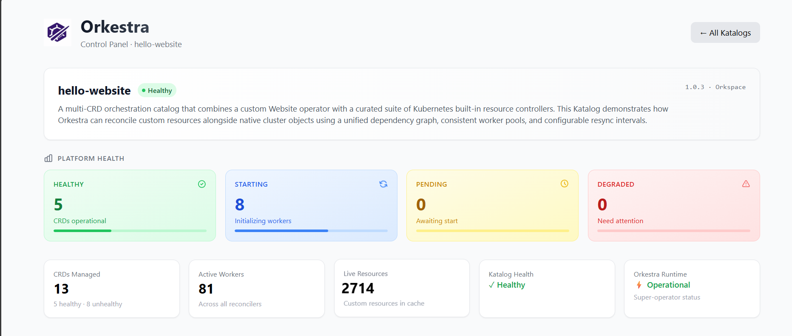

<div align="center">
  

  <h1>Orkestra</h1>
  <p><strong>A runtime for Kubernetes operators.</strong></p>
  <h3><em>Declare. Run.</em></h3>

  <p>
    <a href="https://goreportcard.com/report/github.com/orkspace/orkestra"></a>
    <a href="https://github.com/orkspace/orkestra/releases"></a>
    <a href="https://artifacthub.io/packages/search?repo=orkestra"></a>
    
    
    
  </p>

  <p>
    <a href="https://docs.orkestra.sh/getting-started">Quick Start</a> ·
    <a href="https://docs.orkestra.sh">Docs</a> ·
    <a href="https://github.com/orkspace/orkestra/discussions">Discussions</a>
  </p>
</div>

---

You have a **CRD**. Kubernetes stores it, validates it, and serves it.

The only missing piece is something that **watches** it and **acts** on it.

Traditionally that means **Go**: informers, workqueues, reconcile loops, code generation, Dockerfiles, Helm charts — a software project per operator. Most engineers never start. Teams that do spend weeks before the first CR reconciles.

Orkestra removes that entirely.

---

## Declare

```yaml
apiVersion: orkestra.orkspace.io/v1
kind: Katalog
metadata:
  name: website-operator
spec:
  crds:
    website:
      crdFile: ./crd.yaml
      crFiles: [./cr.yaml]
      operatorBox:
        onCreate:
          deployments:
            - name: "{{ .metadata.name }}"
              image: "{{ .spec.image }}"
              replicas: "{{ .spec.replicas }}"
              reconcile: true
          services:
            - name: "{{ .metadata.name }}-svc"
              port: 80
              targetPort: "{{ .spec.port }}"
              reconcile: true
```

That is the whole operator.

## Run

```console
ork run
```

Orkestra reads the Katalog, applies the CRD and CR, starts the operator, creates the Deployment and Service, sets owner references on both, writes status, emits Kubernetes events, corrects drift, and exposes health, metrics, and a control center.

Not a single line of Go.

*Your CRD is enough. The rest is just a Katalog.*

---

## What every CRD gets

Every CRD declared in a Katalog becomes a complete, isolated operator. Nothing to configure.

| | |
|---|---|
| **Informer** | Watches your exact GVK. In-memory cache. Zero API calls on read. |
| **Workqueue** | Per-CRD. Rate-limited. Deduplicated. Isolated from every other CRD. |
| **Worker pool** | Configurable concurrency. A panic in one CRD does not affect any other. |
| **Drift correction** | `reconcile: true` — desired state is enforced on every cycle. |
| **Owner references** | Child resources deleted when the CR is deleted. No `onDelete` logic needed. |
| **Finalizers** | CRs protected from dirty deletion automatically. |
| **Events** | Every reconcile is a traceable Kubernetes event. |
| **Leader election** | One active instance. Followers hold warm caches. Failover in under 15s. |
| **Status** | `Ready` condition + your own status fields written after every reconcile. |
| **Health API** | `/katalog/{crd}/health`, `/katalog/{crd}/cr`, `/metrics` — per CRD. |
| **Prometheus metrics** | Reconcile totals, queue depth, error rate — labeled by GVK. |
| **Deletion protection** | Orkestra and everything it manages cannot be accidentally `kubectl delete`. |
| **Control Center** | Realtime visibility per CRD, per Katalog, across instances. |

The model is not new. `kube-controller-manager` runs Deployment, StatefulSet, Job, ReplicaSet, and a dozen others in one process with full per-controller isolation. Orkestra brings the same model to your custom resources.

---

## Getting started

```bash
# Install (macOS)
brew install orkspace/tap/ork orkspace/tap/orkcc

# Install (Linux)
curl -sSL https://get.orkestra.sh | bash

# Initialize in the current directory (like terraform init)
ork init

# Or create a new folder
ork init my-operator && cd my-operator

# Run
ork run
```

`ork init` writes a `katalog.yaml`, `crd.yaml`, and `cr.yaml` — a complete, runnable website operator. Edit the CRD to match your domain and you have your first operator.

For working examples across beginner → advanced patterns:

```console
ork init --pack beginner
cd beginner/01-hello-website
ork run
```

---

## Visualize in Control Center

In another terminal:

```console
ork control
```
> → localhost:8081
> 
> username:password → orkestra




Three Katalogs. 15 CRDs. 94 workers. 2,761 live resources. One process.

Multi-instance aggregation: one dashboard for multiple Orkestra runtimes across clusters.

---

## Declarative E2E

Testing operators end-to-end is notoriously hard. A test has to spin up a cluster, apply the CRD, start the operator, apply a CR, assert that child resources appeared in the right state, and verify cleanup when the CR is deleted. Most teams skip it entirely or write brittle shell scripts.

Orkestra makes it declarative:

```yaml
# e2e.yaml
apiVersion: orkestra.orkspace.io/v1
kind: E2E
metadata:
  name: admission-webhooks-e2e
  description: Verify webhooks accept valid CRs and reject invalid ones at apply time

spec:
  katalog: ./katalog.yaml
  crd: ./crd.yaml
  cr: ./cr-valid.yaml

  cluster:
    provider: kind
    name: ork-e2e
    reuse: false

  expect:
    - name: Valid CR accepted — Deployment created
      after: cr-applied
      timeout: 90s
      resources:
        - kind: Deployment
          name: my-platform
          namespace: default
          ready: true

    - name: Invalid CR rejected by webhook
      after: cr-applied
      timeout: 30s
      commands:
        - run: kubectl apply -f ./cr-bad.yaml
          exitCode: 1
          outputContains: "denied the request"

    - name: Deployment removed on delete
      after: cr-deleted
      timeout: 30s
      resources:
        - kind: Deployment
          name: my-platform
          namespace: default
          count: 0
```

```console
ork e2e
```

`commands:` lets you assert on `kubectl` exit codes and output — including that a bad CR was rejected, that a protected CRD cannot be deleted, or that a namespace-protected apply fails with the expected message. Not just "resource exists" — full behavior assertions.

---

## Features

### Status

Orkestra writes the `Ready` condition automatically. Add your own fields with template expressions that resolve against the live CR and its children:

```yaml
operatorBox:
  status:
    fields:
      - path: phase
        value: "Running"
      - path: endpoint
        value: "{{ .metadata.name }}.{{ .metadata.namespace }}.svc.cluster.local"
      - path: allReplicasReady
        value: "{{ allReplicasReady .children.deployment }}"
```

`allReplicasReady` is a [Note](https://docs.orkestra.sh/docs/reference/orkestra-notes) — one of 200+ built-in functions that read live cluster state. The result is written to the CR's `/status` subresource after every reconcile. No `updateStatus` calls. No diff logic.

```console
ork notes              # browse all built-in functions
ork notes search replica
ork notes show allReplicasReady
```

---

### Conditional provisioning

Resources are created only when conditions are met. No if/else in Go. No custom controllers.

```yaml
operatorBox:
  onCreate:
    services:
      - name: "{{ .metadata.name }}-lb"
        type: LoadBalancer
        when:
          - field: spec.tier
            notEquals: free

    configMaps:
      - name: "{{ .metadata.name }}-debug"
        when:
          - field: spec.environment
            notEquals: production
```

Condition operators: `equals`, `notEquals`, `greaterThan`, `lessThan`, `prefix`, `suffix`, `contains`, `exists`, `notExists`.

The LoadBalancer Service exists only when `spec.tier != free`. The debug ConfigMap exists everywhere else. The operator responds to spec changes without redeployment.

---

### Cross-operator IPC

One operator reads another's state explicitly. No shared caches. No hidden coupling. Data comes from the informer cache — zero API calls.

```yaml
operatorBox:
  cross:
    - crd: database
      selector:
        name: "{{ .metadata.name }}-db"
        namespace: "{{ .metadata.namespace }}"
      as: db

  onCreate:
    deployments:
      - name: "{{ .metadata.name }}"
        image: "{{ .spec.image }}"
        env:
          - name: DB_HOST
            value: "{{ .cross.db.status.endpoint }}"
        when:
          - field: "{{ phase .cross.db }}"
            equals: Ready
```

The Deployment is not created until the database CR is `Ready`. The endpoint is injected at reconcile time. No polling. No coordination code.

---

### Validation and mutation

Rules declared in the Katalog. No separate webhook server. No TLS configuration.

```yaml
validation:
  rules:
    - field: spec.image
      prefix: "myorg/"
      message: "images must come from the internal registry"
      action: deny

    - field: spec.environment
      operator: exists
      message: "declare environment for observability"
      action: warn

mutation:
  mutateFirst: true
  rules:
    - field: spec.replicas
      default: "2"
    - field: spec.port
      default: "8080"
```

Each rule enforces at two points: **admission time** (`Gateway` intercepts `kubectl apply`) and **reconcile time** (`Runtime` re-evaluates on every cycle). One declaration. Two enforcement points.

Webhooks are opt-in via `security.webhooks.admission.enabled: true` and enable `gateway` in helm [values](https://github.com/orkspace/orkestra/blob/main/charts/orkestra/values.yaml#L159). Without them, rules still run on every reconcile.

---

### Multi-version CRD conversion

Schema evolves without a separate webhook deployment. No additional TLS.

```yaml
conversion:
  storageVersion: v2
  paths:
    - from: v1
      to: v2
      spec:
        schedule: "{{ cronToMap .spec.schedule }}"
    - from: v2
      to: v1
      spec:
        schedule: "{{ cronFromMap .spec.schedule }}"
```

Orkestra gateway serves the `/convert` endpoint. Kubernetes calls it during version mismatches. Measured average conversion latency: **0.5ms**. [Zero failures](https://cc.orkestra.sh) in production.

---

### State machine

Declarative phase progressions without a single line of Go. `when:` conditions gate each step.

```yaml
operatorBox:
  onCreate:
    jobs:
      - name: "{{ .metadata.name }}-build"
        image: "{{ .spec.builder }}"
        when:
          - field: status.phase
            operator: notExists
        reconcile: false

      - name: "{{ .metadata.name }}-test"
        image: "{{ .spec.image }}"
        when:
          - field: status.phase
            equals: "Running/build"
          - field: "{{ jobSucceeded .children.job }}"
            equals: "true"

  status:
    fields:
      - path: phase
        value: "Running/build"
        when:
          - field: "{{ name .children.job }}"
            hasSuffix: "-build"
      - path: phase
        value: "Succeeded"
        when:
          - field: status.phase
            equals: "Running/test"
          - field: "{{ jobSucceeded .children.job }}"
            equals: "true"
```

Each reconcile advances one step. The queue fires again on the next resync. Level-triggered reconciliation — idempotent by design.

---

### Secrets and environment injection

Create Secrets and ConfigMaps from the CR in the same `operatorBox:` and consume them in Deployments — no extra manifests, no extra controllers.

```yaml
operatorBox:
  onCreate:
    secrets:
      - name: "{{ .metadata.name }}-creds"
        once: true
        rotateAfter: 30d
        data:
          password: "{{ randomAlphanumeric 16 }}"

    deployments:
      - name: "{{ .metadata.name }}"
        image: "{{ .spec.image }}"
        env:
          - name: PASSWORD
            valueFrom:
              secretKeyRef:
                name: "{{ .metadata.name }}-creds"
                key: password
```

`once: true` creates the Secret on first reconcile and never overwrites it. `rotateAfter: 30d` triggers automatic rotation.

---

### forEach — fan-out to N resources

Create one resource per element in a list or map:

```yaml
operatorBox:
  onCreate:
    deployments:
      - name: "{{ .metadata.name }}-{{ .item }}"
        image: "{{ .spec.image }}"
        forEach:
          field: spec.regions
          as: item
```

For `spec.regions: [us-east-1, eu-west-1, ap-southeast-1]`, three Deployments are created. Each bound to the region via `.item`.

---

### External gating

Gate resource creation on an HTTP response. The result is available as `.external.<name>.*` in all templates and conditions.

```yaml
operatorBox:
  onCreate:
    external:
      - name: policy
        url: "{{ .spec.policyUrl }}/allow"
        method: GET
        expectedStatus: 200
        continueOnError: false
        timeout: 5s

    deployments:
      - name: "{{ .metadata.name }}"
        image: "{{ .spec.image }}"
        when:
          - field: external.policy.status
            equals: "200"
```

`continueOnError: false` (default) blocks the entire reconcile if the call fails. `continueOnError: true` lets the rest of the pipeline proceed and makes the error available in `.external.policy.error`.

---

## When declarative isn't enough

Orkestra covers the common case declaratively. For everything else, two escape hatches exist — both are first-class, documented, and production-ready.

### Hooks — typed Go functions

Call Go code from within the GenericReconciler. You write a function; Orkestra calls it at the right point in the reconcile cycle. The runtime still handles informers, workqueue, workers, health, metrics, events and the full orkestra capability set.

```yaml
operatorBox:
  default: true
  hooks:
    location: github.com/myorg/operator/reconciler
    function: DatabaseHooks
    version: v1.0.2
    fetch: true
    resources:
      - statefulsets
      - services
```

Your function receives type-safe access to the CR and can call external APIs, run migrations, orchestrate anything complex. Hookable at `OnReconcile`, and `OnDelete`.

Full example:

```console
ork init hooks-operator --pack advanced
cd hooks-operator/09-hooks
```

---

### Constructors — full custom reconciler

Replace the GenericReconciler entirely. You own the reconcile loop. Orkestra still manages informers, workqueue, workers, health, events and the full orkestra capability set.

```yaml
operatorBox:
  default: false
  constructor:
    location: github.com/myorg/operator/reconciler@v1.0.0
    function: NewPipelineReconciler
    resources:
      - kind: Job
```

```go
func NewPipelineReconciler(
    kube *kubeclient.Kubeclient,
    informer cache.SharedIndexInformer,
    ev *event.Event,
) domain.Reconciler
```

You get the infrastructure. You write the logic.

Full example:

```console
ork init constructor-operator --pack advanced`
cd constructor-operator/10-constructor
```

---

## Composition

### Motif — reusable blueprint

A parameterized set of resource declarations. Write once, import from any Katalog.

```yaml
# postgres-motif.yaml
apiVersion: orkestra.orkspace.io/v1
kind: Motif
metadata:
  name: postgres
  version: v0.1.0

inputs:
  - name: image
    default: "postgres:16"
  - name: storage
    default: "10Gi"

resources:
  onCreate:
    secrets:
      - name: "{{ .metadata.name }}-creds"
        once: true
        data:
          password: "{{ randomAlphanumeric 24 }}"
    statefulSets:
      - image: "{{ .inputs.image }}"
        storage: "{{ .inputs.storage }}"
```

### Katalog — imports Motifs

```yaml
spec:
  crds:
    app:
      crdFile: ./crd.yaml
      operatorBox:
        onCreate:
          deployments:
            - image: "{{ .spec.image }}"
              reconcile: true

    database:
      imports:
        - motif: ./postgres-motif.yaml
          with:
            image: "postgres:16"
            storage: "{{ .spec.dbStorage }}"
```

### Komposer — runs multiple Katalogs as one platform

Pull Katalogs from files, Helm, or OCI registries and run them in a single Orkestra instance. Override any field without touching the source.

```yaml
apiVersion: orkestra.orkspace.io/v1
kind: Komposer
metadata:
  name: platform

imports:
  files:
    - ./app-katalog.yaml
    - ./pipeline-katalog.yaml
  registry:
    - ref: oci://ghcr.io/orkspace/registry/postgres:v14
    - ref: oci://ghcr.io/orkspace/registry/redis:v7
  helm:
    - repo: https://charts.example.com
      chart: platform-crds
      version: 1.0.0

spec:
  crds:
    app:
      workers: 8   # override — everything else inherited from app-katalog.yaml
```

One `ork run` brings up the full platform.

---

## Orkestra Registry

Operators have traditionally been binaries: one per CRD, one deployment per operator, one release cycle to maintain each. The ecosystem grew this way because programs were the only available unit of distribution.

Orkestra changes the unit. Operators are **Katalogs** — YAML patterns packaged as OCI artifacts and distributed through any OCI-compatible registry.

```yaml
imports:
  registry:
    - ref: oci://ghcr.io/orkspace/registry/postgres:v14
    - ref: oci://ghcr.io/orkspace/registry/redis:v7
    - ref: oci://ghcr.io/orkspace/registry/kafka:v3
```

Three complete operators. No binaries. No deployments. One Orkestra process runs all three.

Operators are now assembled from the registry, composed with local overrides, upgraded by changing a version tag, and shared by pushing a Katalog to any OCI registry.

```yaml
spec:
  crds:
    postgres:
      crdFile: ./internal/platform-database-crd.yaml   # your API, not the registry's
```

The registry provides the reconciliation pattern. Your team owns the API contract.
Your users create `PlatformDatabase` CRs, not `Postgres` CRs. The operator behavior
comes from the registry; the schema, naming, and field conventions are yours.

Full documentation: [Orkestra Registry](https://docs.orkestra.sh/orkestra-registry/)

---

## Security

All security features share one certificate. One block. No separate TLS setup.

```yaml
security:
  deletionProtection:
    enabled: true
    cleanupOnShutdown: true

  namespaceProtection:
    enabled: true
    restrictedNamespaces:
      - kube-system
      - kube-public

  webhooks:
    admission:
      enabled: true
    failurePolicy: Fail
    conversion:
      enabled: true
```

**Deletion protection** — a validating webhook rejects `DELETE` on any CRD Orkestra manages, and on the Orkestra deployment itself. Zero configuration.

**Namespace protection** — blocks CRs from being created in restricted namespaces at admission time and at reconcile time. One declaration. Two enforcement points.

**Derived RBAC** — generate minimal permissions from the Katalog. No wildcards.

```console
ork generate bundle -f katalog.yaml -o bundle.yaml
kubectl apply -f bundle.yaml
```

The output contains only the permissions your Katalog actually uses: specific groups, resources, and verbs derived from what you declared.

**Runtime** — build tag `runtime`. Knows how to run operators. Cannot scaffold, enumerate CRDs, or generate RBAC. If it runs in your cluster, that is all it does.

**Gateway** — build tag `gateway`. Knows how to gate the way. Admission webhooks, deletion protection, namespace protection, and TLS cert management. No operator logic. Runs standalone or alongside the runtime.

---

## Numbers

These numbers come from a running instance visible in the Control Center screenshots above.

| | Traditional (15 operators) | Orkestra |
|---|---|---|
| **Processes** | 15 | 1 |
| **Memory** | 750 MB – 3 GB | ~47 MB |
| **CRDs under management** | 15 | 15 |
| **Deployments to manage** | 15 | 1 |
| **First operator** | 3–6 weeks | Under 1 hour |
| **Lines of Go** | 400+ per operator | 0 (hooks and constructors for complex cases) |
| **Conversion webhook** | Separate deployment | Built-in, 0.5ms avg latency |
| **Adding a new CRD** | Days to weeks | Minutes |

**How the process-level memory reduction works:** each traditional operator binary includes the full Kubernetes client-go library, leader election, health server, and metrics server. Orkestra pays that cost once. The per-CRD marginal cost is a goroutine pool and an in-memory cache, not a new binary.

**How per-CRD isolation works without process boundaries:** the same way `kube-controller-manager` isolates Deployment, StatefulSet, Job, and ReplicaSet controllers — each CRD has a dedicated informer, a dedicated workqueue, and a dedicated worker pool. A panic in one is caught by `safeReconcile` and logged; the others keep processing. This is runtime architecture, not convention.

---

## Autoscaler

Scale workers and resync interval dynamically based on metrics. No Go code. No external controller.

```yaml
operatorBox:
  autoscale:
    interval: 15s
    cooldown: 2m

    conditions:
      when:
        - field: metrics.queueDepth
          greaterThan: "80"
        - field: metrics.workersBusyPercent
          greaterThan: "70"

    do:
      workers: 8
      resync: 5s
```

When conditions are true for the cooldown duration, overrides apply. When false again, the CRD's baseline is restored. Reversible. Declarative. No side effects.

Cross-CRD scaling is also supported — scale one operator based on another operator's metrics via `cross.<crd>.metrics.*`.

---

## Production

The same Katalog you ran locally is what runs in production. No build pipeline per operator. No environment-specific configurations. No new binaries to maintain.

Full deployment guide → [orkspace.github.io/orkestra](https://orkspace.github.io/orkestra)

---

## What Orkestra is not

**CRD generation is a starting point, not the source of truth.** `ork generate crd` scaffolds a base CRD from your Katalog to get you started. You own the final schema — add validation rules, printer columns, subresource configuration, and version history to it. `crdFile` just points to whatever CRD file you maintain.

**It does not replace Go for complex logic.** Hooks and constructors exist for exactly this reason. ~90% of operators are declarative structure; ~10% need code. Orkestra handles the 90% and gives the 10% a clean interface.

**External infrastructure providers are in development.** Declaring AWS S3 buckets, MongoDB databases, or cloud DNS directly in a Katalog — alongside the Kubernetes resources that consume them — is on the roadmap. For now, use Crossplane for external infrastructure and Orkestra for the application layer. The two complement each other.

**It does not auto-sync from Git.** Configuration is resolved at startup and locked in. Only cluster state evolves. This is intentional: Katalogs define long-lived API contracts; silently reloading them is dangerous. Use a deployment pipeline like any other runtime change.

**It does not replace cluster-wide policy engines.** Kyverno and OPA Gatekeeper govern all cluster resources. Orkestra's validation governs resources it manages. Use both.

---

## Documentation

| | |
|---|---|
| [Getting Started](https://docs.orkestra.sh/docs/getting-started) | First operator in under an hour |
| [Learning to Orkestrate](https://docs.orkestra.sh/docs/getting-started/learning-to-orkestrate) | Guided examples: beginner → advanced |
| [Katalog Reference](https://docs.orkestra.sh/docs/reference/schema/katalog/) | Complete field reference |
| [Concepts](https://docs.orkestra.sh/concepts) | Architecture and mental model |
| [Registry](https://docs.orkestra.sh/docs/reference/orkestra-registry) | OCI distribution for operators |

---

## Community

[Issues](https://github.com/orkspace/orkestra/issues) · [Discussions](https://github.com/orkspace/orkestra/discussions) · [Contributing](./CONTRIBUTING.md)

---

Apache 2.0 — see [LICENSE](./LICENSE)
