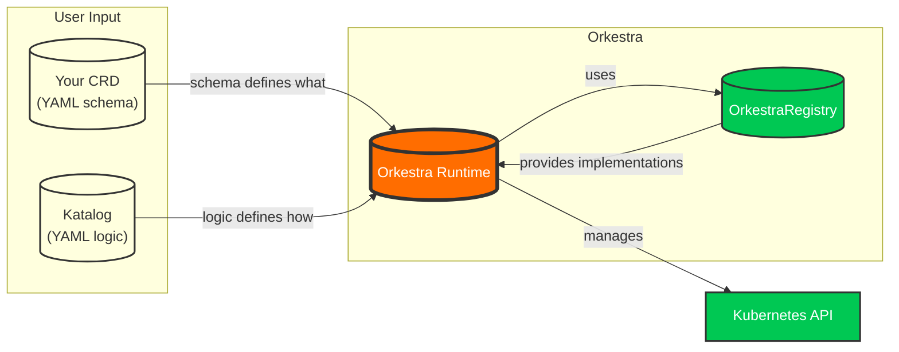

<div align="center">


<br>
          O R K E S T R A

**CRDs in. Operators out.**
<br>
<br>
The Kubernetes operator runtime that needs no Programming Language.
<br>
<br>

[](LICENSE)
[](https://golang.org/)
[](https://kubernetes.io/)
[](https://github.com/orkestra-sh/orkestra/releases)

</div>

---

## What is Orkestra?

Orkestra turns CRDs into operators. You write a **Katalog** YAML describing what you want. Orkestra handles the rest: create, reconcile, drift-correct, delete.

```yaml
# katalog.yaml — a complete operator
apiVersion: orkestra.konductor.io/v1Alpha
kind: Katalog
spec:
  crds:
    - name: website
      apiTypes:
        group: demo.orkestra.io
        version: v1alpha1
        kind: Website
      reconciler:
        default: true
        onCreate:
          deployments:
            - image: "{{ .spec.image }}"
              replicas: "{{ .spec.replicas }}"
              reconcile: true
          services:
            - port: "80"
              targetPort: "{{ .spec.port }}"
              reconcile: true
```

```bash
ork run --katalog katalog.yaml
```

Apply a `Website` CR and Orkestra creates the Deployment and Service. Change the CR, Orkestra reconciles. Delete it, Orkestra cleans up.

> **If you have a CRD, you already have everything you need. The rest is just a Katalog.**

---

## The Orkestra Model

Here is the entire mental model of Orkestra in one diagram:



> **CRD → Katalog → Operator**  
> If Kubernetes can store it, Orkestra can reconcile it.

---

## Features

| Capability | Description |
|------------|-------------|
| **Zero code** | No Go, no Python, no controller boilerplate. Just YAML. |
| **Built‑in resources** | Pods, Deployments, Secrets — Kubernetes knows the rest. |
| **Dependencies** | Declare `dependsOn` — Orkestra starts CRDs in order and shuts down in reverse. |
| **Per‑CRD separation** | Each CRD gets its own informers, workqueue, and worker pool. |
| **Admission policy** | Declare validation and mutation rules in the Katalog. No webhook server, no Go code, no cert management. |
| **Version conversion** | Multi‑version CRDs with declarative conversion paths. No conversion functions to write. |
| **Observability** | Health endpoints, Prometheus metrics, `ork status`. |
| **Composition** | Komposer merges Katalogs from files, Helm, URLs. |
| **Registry** | Reusable operator patterns — the standard Orkestra library for Kubernetes. |

--- 
## Why Orkestra?

Kubernetes made infrastructure declarative — but operators never caught up.  
They still require Go code, controller boilerplate, code generation, and a full software lifecycle.

Orkestra removes that barrier.

- **Your CRD becomes your operator.**  
- **Your YAML becomes your logic.**  
- **Your runtime becomes the controller.**

No SDKs.
No scaffolding.
No rebuilds.
No redeploys.

Orkestra brings operators back to the Kubernetes model:
**declarative, composable, observable, and safe.**

---

## By the numbers

| | Traditional operators | Orkestra |
|---|---|---|
| **First working operator** | 3–6 weeks | < 1 hour |
| **Memory for 15 CRDs** | 750 MB–3 GB | ~47 MB |
| **Conversion latency** | 2–5 ms (external webhook) | 0.5 ms (in-process) |
| **Admission policy** | 1 week (webhook server + Go) | One Katalog rule |
| **Deployment manifests** | 15 (one per operator) | 1 |

---

## Get started

You need a Kubernetes cluster (1.28+) and the `ork` CLI. Orkestra automatically discovers your cluster from your kubeconfig — no extra setup required.

```bash
# Install
brew install iAlexeze/tap/ork
# or
curl -sSL https://raw.githubusercontent.com/orkestra-sh/orkestra/main/install.sh | bash

# Create an operator
ork init my-operator
cd my-operator

# Run it
ork run --katalog examples/website/website-katalog.yaml
```

You now have a running operator. Apply a sample CR:

```bash
kubectl apply -f examples/website/website-cr.yaml
```

See the operator in action:

```bash
ork status -w
curl localhost:8080/katalog/website/health
```

For detailed installation options, GPG verification, and production deployment, see the [Installation Guide](https://orkestra.readthedocs.io/en/latest/guides/user-guide/deployment/#installation).

---

> For a step‑by‑step walkthrough of what happens during reconcile, see  
> 👉 **[Start Here](https://orkestra.readthedocs.io/en/latest/guides/user-guide/getting-started/#what-just-happened)**.


---

## Safety by Design

Orkestra is built to be predictable and resilient:

- **CRD‑level isolation** — A panic in one CRD's reconciler does not crash others. `safeReconcile` recovers and logs the error.
- **Idempotent registry operations** — Resources are created or updated safely. Running the same reconcile twice does not create duplicates.
- **Explicit drift correction** — Templates with `onCreate.reconcile: true` or a separate `onReconcile` block run on every reconcile, correcting manual changes to your resources.
- **Non‑blocking runtime** — The controller starts even if some CRDs are missing. Workers start when CRDs appear.

Full details: [Trust & Failure Model](https://orkestra.readthedocs.io/en/latest/publications/trust-and-failure-model)

---

## Documentation

- **[Start Here](https://orkestra.readthedocs.io/en/latest/guides/user-guide/getting-started)** — Onboarding guide  
- **[Katalog](https://orkestra.readthedocs.io/en/latest/runtime-manual/concepts/katalog)** — Declare operator behavior  
- **[Komposer](https://orkestra.readthedocs.io/en/latest/runtime-manual/concepts/komposer)** — Compose multiple Katalogs  
- **[Full Documentation Index](https://orkestra.readthedocs.io/en/latest)** — All guides, references, and internals  

---

## Community

- [GitHub Issues](https://github.com/orkestra-sh/orkestra/issues)
- [Discussions](https://github.com/orkestra-sh/orkestra/discussions)
- Kubernetes Slack — `#orkestra` _(planned)_

---

## License

[MIT](LICENSE)
