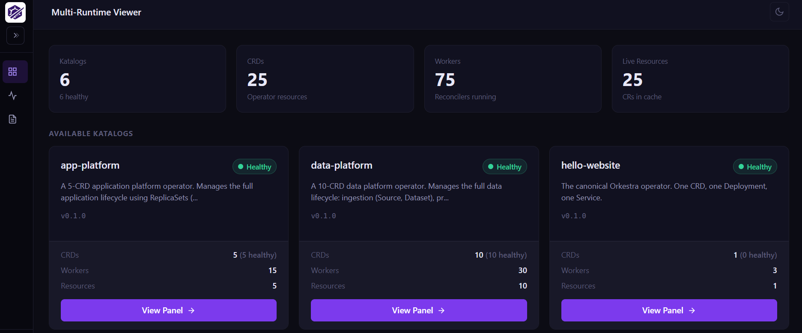
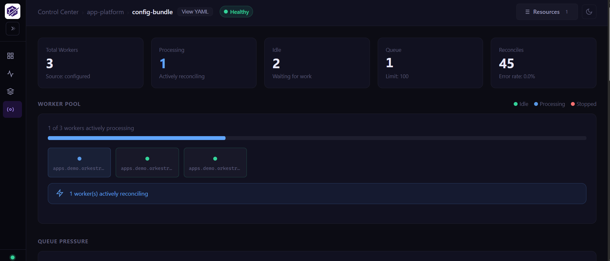
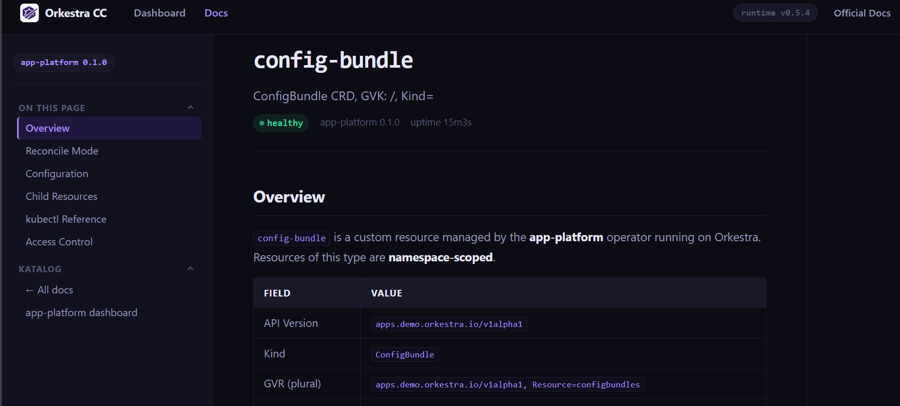

<div align="center">
  

  <h1>Orkestra</h1>
  <p><strong>A runtime for Kubernetes operators.</strong></p>
  <h3><em>Declare. Run.</em></h3>

  <p>
    <a href="https://goreportcard.com/report/github.com/orkspace/orkestra"></a>
    <a href="https://github.com/orkspace/orkestra/releases"></a>
    <a href="https://artifacthub.io/packages/search?repo=orkestra"></a>
    
    
    
  </p>

  <p>
    <a href="https://orkestra.sh/docs/getting-started">Quick Start</a> ·
    <a href="https://orkestra.sh">Docs</a> ·
    <a href="https://github.com/orkspace/orkestra/discussions">Discussions</a> ·
    <a href="https://join.slack.com/t/orkspace-group/shared_invite/zt-42i4idb0h-WYUF6JryDFMkky95ZJWHBg">Early Access Slack</a>
  </p>
</div>

---

You have a **CRD**. Kubernetes stores it, validates it, and serves it.

The only missing piece is something that **watches** it and **acts** on it.

Traditionally that means **Go**: informers, workqueues, reconcile loops, code generation, Dockerfiles, Helm charts — a software project per operator. Most engineers never start. Teams that do spend weeks before the first CR reconciles.

**Orkestra removes that entirely.**

---

## Declare

```yaml
apiVersion: orkestra.orkspace.io/v1
kind: Katalog
metadata:
  name: website-operator
spec:
  crds:
    website:
      crdFile: ./crd.yaml
      crFiles: [./cr.yaml]
      operatorBox:
        onCreate:
          deployments:
            - name: "{{ .metadata.name }}"
              image: "{{ .spec.image }}"
              replicas: "{{ .spec.replicas }}"
              reconcile: true
          services:
            - name: "{{ .metadata.name }}-svc"
              port: 80
              targetPort: "{{ .spec.port }}"
              reconcile: true
```

That is the whole operator.

## Run

```console
ork run
```

Orkestra reads the Katalog, applies the CRD and CR, starts the operator, creates the Deployment and Service, sets owner references on both, writes status, emits Kubernetes events, corrects drift, and exposes health, metrics, and a control center.

Not a single line of Go.

*Your CRD is enough. The rest is just a Katalog.*

---

## What every CRD gets

Every CRD declared in a Katalog becomes a complete, isolated operator. Nothing to configure.

| | |
|---|---|
| **Informer** | Watches your exact GVK. In-memory cache. Zero API calls on read. |
| **Workqueue** | Per-CRD. Rate-limited. Deduplicated. Isolated from every other CRD. |
| **Worker pool** | Configurable concurrency. A panic in one CRD does not affect any other. |
| **Drift correction** | `reconcile: true` — desired state is enforced on every cycle. |
| **Owner references** | Child resources deleted when the CR is deleted. No `onDelete` logic needed. |
| **Finalizers** | CRs protected from dirty deletion automatically. |
| **Events** | Every reconcile is a traceable Kubernetes event. |
| **Leader election** | One active instance. Followers hold warm caches. Failover in under 15s. |
| **Status** | `Ready` condition + your own status fields written after every reconcile. |
| **Health API** | `/katalog/{crd}/health`, `/katalog/{crd}/cr`, `/metrics` — per CRD. |
| **Prometheus metrics** | Reconcile totals, queue depth, error rate — labeled by GVK. |
| **Deletion protection** | Orkestra and everything it manages cannot be accidentally `kubectl delete`. |
| **Control Center** | Realtime visibility per CRD, per Katalog, across instances. Auto-generated operator docs — overview, reconcile mode, child resources, kubectl reference, access control. |

---

## Getting started

### Install
```bash
# Install (macOS)
brew install orkspace/tap/ork orkspace/tap/orkcc

# Install (Linux)
curl -sSL https://get.orkestra.sh | bash
```

> **Windows**
> Download `ork_windows_amd64.zip` and `orkcc_windows_amd64.zip` from the
> [latest release](https://github.com/orkspace/orkestra/releases).  
> Extract the archives and add the folder containing `ork.exe` and `orkcc.exe` to your `PATH`.

### Initialize and run
```console
ork init
ork run
```

> No cluster? Add `--dev` to create a temporary kind cluster. Requires Docker.

`ork init` scaffolds a `katalog.yaml`, `crd.yaml`, and `cr.yaml` in the current directory — like `terraform init`.

**→ [Learning to Orkestrate](https://orkestra.sh/docs/getting-started/learning-to-orkestrate)** — the guided path from first operator to full platform. Every capability has a runnable example.

---

### Control Center

In another terminal:

```console
ork control
```
> → localhost:8081 · username:password → orkestra







Six Runtimes. 75 CRDs. One Control Center.

> Live deployment: [cc.orkestra.sh](https://cc.orkestra.sh)

---

## Numbers

| | Traditional (75 operators) | Orkestra |
|---|---|---|
| **Processes** | 75 | 6 runtimes + 1 control center |
| **Memory** | 3.75 GB – 15 GB | ~79 MB per runtime (measured) |
| **CRDs under management** | 75 | 75 |
| **First operator** | 3–6 weeks | Under 1 hour |
| **Lines of Go** | 400+ per operator | 0 |
| **Adding a new CRD** | Days to weeks | Minutes |

79 MB is a live measurement from a 10-CRD runtime (`process_resident_memory_bytes` from the `/metrics` endpoint — [raw scrape](./documentation/assets/controlcenter/public/metrics.txt)). The memory reduction works because Orkestra pays the cost of client-go, leader election, and health servers once per runtime. Per-CRD cost is a goroutine pool and an in-memory cache. Isolation works the same way `kube-controller-manager` isolates Deployment, StatefulSet, and Job controllers — dedicated informer, queue, and worker pool per CRD. A panic in one is caught by `safeReconcile`; the others keep running. The Control Center aggregates all runtimes into a single dashboard.

---

## What Orkestra is not

**CRD generation is a starting point, not the source of truth.** `ork generate crd` scaffolds a base CRD from your Katalog. You own the final schema — add validation, printer columns, and version history to it. `crdFile` just points to whatever CRD file you maintain.

**It does not replace Go for complex logic.** Hooks and constructors exist for exactly this reason. ~90% of operators are declarative structure; ~10% need code. Orkestra handles the 90% and gives the 10% a clean interface.

**External infrastructure providers are in development.** For AWS, MongoDB, or cloud DNS alongside Kubernetes resources, use Crossplane for external infrastructure and Orkestra for the application layer. The two complement each other.

**It does not auto-sync from Git.** Configuration is resolved at startup and locked in. Katalogs define long-lived API contracts; silently reloading them is dangerous. Use a deployment pipeline like any other runtime change.

---

## Documentation

| | |
|---|---|
| [Why Orkestra](https://orkestra.sh/blog/why-orkestra) | What Orkestra is, how it works, and why it’s different |
| [Foundations](https://orkestra.sh/docs/foundations) | The decisions that shaped the design — and why they hold |
| [Trust and Failure Model](https://orkestra.sh/publications/trust-and-failure-model) | What happens when things go wrong |
| [Getting Started](https://orkestra.sh/docs/getting-started) | First operator in under an hour |
| [Learning to Orkestrate](https://orkestra.sh/docs/getting-started/learning-to-orkestrate) | Every capability, as a runnable example |
| [Katalog Reference](https://orkestra.sh/docs/reference/schema/katalog/) | Complete field reference |
| [Orkestra Registry](https://orkestra.sh/docs/orkestra-registry/) | OCI distribution for operators |
| [Security](https://orkestra.sh/docs/security/) | How Orkestra is secure by default |

---

## Community

[Issues](https://github.com/orkspace/orkestra/issues) · [Discussions](https://github.com/orkspace/orkestra/discussions) · [Contributing](./CONTRIBUTING.md)

---

Apache 2.0 — see [LICENSE](./LICENSE)
