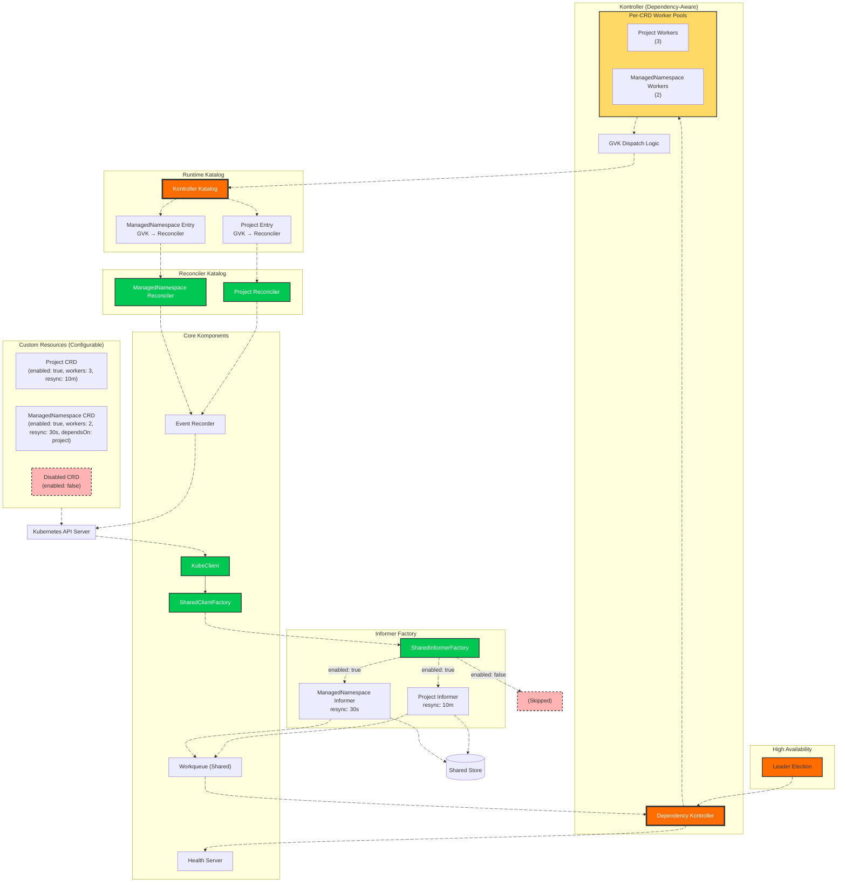

# 🎼 **OrKestra — The Universal CRD Runtime for Kubernetes**  
### *Kompose. Konduct. OrKestrate.*

[](https://golang.org/)
[](https://kubernetes.io/)
[](LICENSE)

**Orkestra** is a **runtime‑composable, dependency‑aware, multi‑CRD operator engine** for Kubernetes.  
It eliminates boilerplate by generating clients, informers, reconcilers, workers, and lifecycle orchestration **dynamically at runtime** — from Go or YAML definitions.

You write **API types** and **reconcilers**.  
Orkestra builds everything else.

It is not just a controller.  
It is a **universal CRD runtime**.

---

# Why Orkestra?

Traditional operator frameworks require:

- hand‑rolled clients  
- hand‑rolled informers  
- repetitive boilerplate  
- static wiring  
- controller‑runtime magic  
- one controller per CRD  

Orkestra replaces all of that with a **declarative katalog** and a **runtime engine** that:

- loads CRDs dynamically (Go or YAML)  
- builds clients and informers automatically  
- constructs a dependency graph  
- assigns per‑CRD workers  
- applies per‑CRD resync intervals  
- dispatches events by GVK  
- orchestrates startup/shutdown in dependency order  
- exposes built‑in metrics  
- runs with high availability  

This is operator engineering without the pain.

---

# Example CRDs

| Resource           | API Group               | Version     | Status |
|-------------------|--------------------------|-------------|--------|
| `Project`          | `platform.orkestra.io`  | `v1alpha1`  | ✅ Production Ready |
| `ManagedNamespace` | `platform.orkestra.io`  | `v1alpha1`  | ✅ Production Ready |

Adding new CRDs takes **minutes**, not days.

---

# Architecture Overview



👉 **See:** [Archtecture Deep Dive](./docs/architectural-deep-dive.md) for a full breakdown.

---

# Key Features

## Multi‑CRD Support with Zero Boilerplate
Each CRD contributes only:

- API types  
- Reconciler  

Everything else is generated dynamically.

## Dependency‑Aware Kontroller
CRDs declare dependencies:

```yaml
dependsOn: ["project"]
```

Orkestra:

- starts CRDs in topological order  
- shuts them down in reverse order  
- ensures correctness across multi‑CRD systems  

## Per‑CRD Resync Intervals
Each CRD can define its own resync:

```yaml
resync: 10m
```

Orkestra applies it automatically when creating informers.

## Per‑CRD Worker Pools
Each CRD defines its own concurrency:

```yaml
workers: 5
```

High‑throughput CRDs scale independently.

## Dual Katalog Architecture (Go + YAML)
Two modes:

### **Go Mode (Typed)**
- full type safety  
- automatic scheme registration  

### **YAML Mode (Dynamic)**
- load CRDs from local or remote YAML  
- GitOps‑friendly  
- perfect for multi‑cluster orchestration  

**👉 See:** [What is a Katalog](./docs/katalog.md) for a full breakdown.

## Built‑in Metrics
Prometheus metrics include:

- queue depth per CRD  
- reconcile duration  
- reconcile totals  
- worker utilization  

## High Availability
- leader election  
- warm caches in all replicas  
- instant failover  

## Graceful Shutdown
- stops accepting new items  
- drains workers  
- shuts down CRDs in dependency order  

**👉 See:** [Startup & Shutdown](./docs/startup-shutdown.md) for a full breakdown)

---

# Quick Start

## 1. Clone and Configure
```bash
git clone https://github.com/ialexeze/orkestra.git
cd orkestra
cp .env.example .env
```

## 2. Choose Your Mode

### Go Mode (default)
```bash
go run ./cmd/
```

### YAML Mode
```bash
export KATALOG_MODE=YAML
export KATALOG_PATH=initialize/crd-katalog.yaml
go run ./cmd/
```

## 3. Install CRDs
```bash
kubectl apply -f crd/config/bases/
```

## 4. Apply Sample Resources
```bash
kubectl apply -f crd/config/samples/
```

## 5. Monitor
```bash
curl localhost:8080/metrics
curl localhost:8080/health
curl localhost:8080/ready
```

---

# 🖥️ **Orkestra CLI**

Orkestra ships with a powerful command‑line interface (`ork`) that lets you explore, visualize, and interact with the Katalog and the running controller runtime.  
It’s designed to feel as natural as `kubectl`, but focused entirely on CRDs, reconcilers, and dependency orchestration.

The CLI supports:

- inspecting the Katalog  
- visualizing dependency graphs  
- exploring CRD metadata  
- listing active controllers  
- understanding how Orkestra wires your CRDs internally  

Full documentation is available in **[Orkestra CLI](./docs/cli.md)**.


# 🔧 Extending Orkestra: Add a New CRD in Minutes

You only write:

1. API types  
2. Reconciler  
3. Katalog entry (Go or YAML)  

Everything else is generated.

**👉 Full guide:** [Extending Orkestra](./docs/extending-orchestra.md)

---

# 🌐 YAML Mode Use Cases

YAML mode unlocks:

- centralized operator marketplaces  
- organization‑wide standardization  
- multi‑cluster fleet management  
- GitOps pipelines  
- canary deployments  
- dynamic worker scaling  
- multi‑tenant isolation  
- compliance & audit trails  
- edge/IoT deployments  
- partner integrations  

**👉 See:** [YAML Mode Use Cases](./docs/yaml-mode-use-cases.md)

---

# 🙏 Acknowledgments

Built on top of the Kubernetes `client-go` libraries and inspired by the patterns used in the Kubernetes controller manager.

---

# 📄 License

MIT License — see [LICENSE](./LICENSE).
