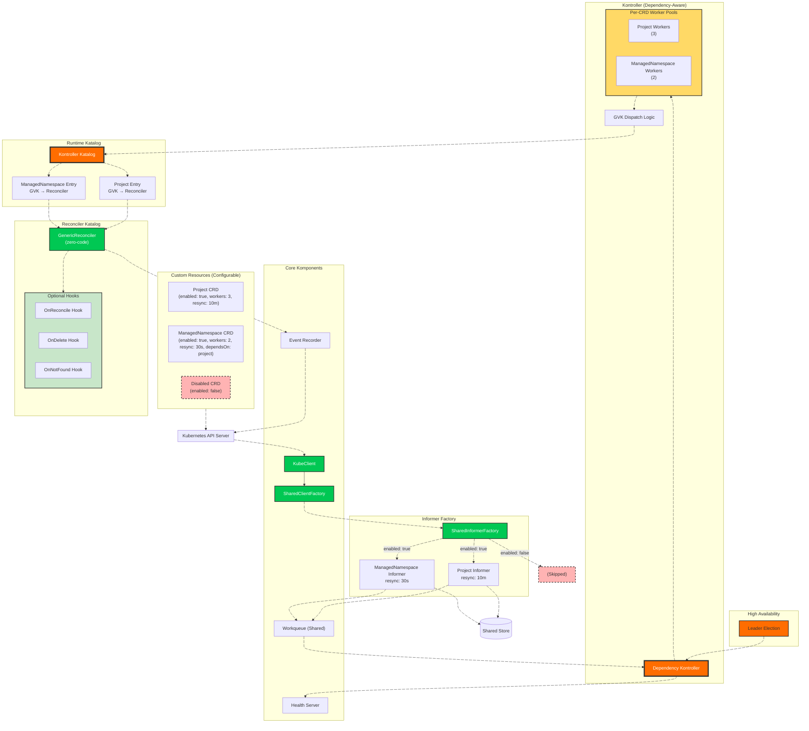

# 🎼 **OrKestra — The Universal CRD Runtime for Kubernetes**  
### *Kompose. Konduct. OrKestrate.*

[](https://golang.org/)
[](https://kubernetes.io/)
[](LICENSE)

**OrKestra** is a **runtime‑composable, dependency‑aware, multi‑CRD operator engine** for Kubernetes.  
It eliminates boilerplate by generating clients, informers, reconcilers, workers, and lifecycle orchestration **dynamically at runtime** — from Go or YAML definitions.

**You write API types. You optionally write hooks.**  
OrKestra builds everything else.

It is not just a controller.  
It is a **universal CRD runtime**.

---

> **What's in a name?**  
> **ORK** = **O**perator **R**untime **K**ontroller  
> **OrKestra** brings it all together — an orchestra of CRDs, conducted by a single runtime.

---

# Why OrKestra?

Traditional operator frameworks require:

- hand‑rolled clients  
- hand‑rolled informers  
- repetitive boilerplate  
- static wiring  
- controller‑runtime magic  
- one controller per CRD  

OrKestra replaces all of that with a **declarative Katalog** and a **runtime engine** that:

- loads CRDs dynamically (Go or YAML)  
- builds clients and informers automatically  
- constructs a dependency graph  
- assigns per‑CRD workers  
- applies per‑CRD resync intervals  
- dispatches events by GVK  
- orchestrates startup/shutdown in dependency order  
- exposes built‑in metrics and health APIs  
- runs with high availability  

**This is operator engineering without the pain.**

---

# ✨ Key Features

## 🔥 **Zero‑Boilerplate CRD Management**
Each CRD contributes only:

- **API types** (generated by controller-gen)  
- **Optional hooks** for business logic  

**Everything else is generated dynamically** — clients, informers, workers, finalizers, events, and lifecycle orchestration.

## 🧠 **The GenericReconciler – Write Nothing, Get Everything**

Set `reconciler.default: true` in your Katalog and OrKestra provides a **fully‑featured reconciler** with zero code:

```yaml
reconciler:
  default: true  # No code required!
```

**What you get for free:**
- ✅ List/Watch from informer cache
- ✅ Finalizer management (add/remove automatically)
- ✅ Kubernetes events for all operations
- ✅ Deep copy safety — never mutate cache
- ✅ Deletion handling with configurable hooks
- ✅ NotFound handling
- ✅ Metrics and health tracking
- ✅ Per‑CRD workers and resync intervals

## 🎣 **Hook‑Based Extensibility**

When you need custom logic, implement **only the hooks you need**:

```go
type ReconcileHooks[T Object] struct {
    OnReconcile func(ctx context.Context, obj T) error  // Create/Update
    OnDelete    func(ctx context.Context, obj T) error  // Deletion cleanup
    OnNotFound  func(ctx context.Context, key string) error // Object missing
}
```

All hooks are **optional**. Implement one, two, or none — the GenericReconciler handles everything else.

**Example: Project hooks**
```go
func ProjectHooks() domain.ReconcileHooks[domain.Object] {
    return domain.ReconcileHooks[domain.Object]{
        OnReconcile: func(ctx context.Context, obj domain.Object) error {
            project := obj.(*projectv1.Project)  // Type-safe after assertion
            // Your business logic here
            return nil
        },
    }
}
```

## 📦 **Remote Hooks & API Types**

Hooks and API types can live in **separate repositories**. OrKestra fetches them at generation time:

```yaml
apiTypes:
  location: github.com/yourorg/your-api/types/yourcrd/v1alpha1

hooks:
  location: github.com/yourorg/your-hooks
  package: hooks.ProjectHooks  # Function reference
```

Run `ork generate registry --katalog your-katalog.yaml` and OrKestra:
1. Fetches the API types (via `go get`)
2. Fetches the hooks package
3. Generates `initialize/registry.go` with everything wired

**If `go mod tidy` is needed, you run it once. Done.**

## 🧩 **Dual Katalog Architecture (Go + YAML)**

### **Go Mode (Typed)**
- full type safety  
- automatic scheme registration  
- ideal for compile‑time guarantees  

### **YAML Mode (Dynamic)**
- load CRDs from local or remote YAML  
- GitOps‑friendly  
- perfect for multi‑cluster orchestration  
- `ork generate registry` creates Go bindings from YAML  

## 📊 **Built‑in Metrics Suite**

Five production‑grade metrics, all per‑CRD:

| Metric | Type | Description |
|--------|------|-------------|
| `controller_resource_count` | Gauge | Live CR count from informer cache (zero API cost) |
| `controller_reconcile_total` | Counter | Success/error outcomes per CRD |
| `controller_reconcile_duration_seconds` | Histogram | Reconciliation latency per CRD |
| `controller_queue_depth` | Gauge | Current queue backlog per CRD |
| `controller_workers_active` | Gauge | Active worker count per CRD |

All metrics use the full GVK string as the `crd` label — consistent and unambiguous.

## 🩺 **Per‑CRD Health API**

Auto‑generated HTTP endpoints for every enabled CRD:

```
GET /katalog                    # All CRDs, dependency graph, health summary
GET /katalog/{crd}              # CRD config + live reconcile stats
GET /katalog/{crd}/health       # 200 healthy | 503 degraded
```

Each endpoint exposes:
- `healthy` — current health state
- `totalReconciles` — cumulative reconcile count
- `errorRate` — failed / total
- `consecutiveFails` — current failure streak
- `lastError` — last error message
- `workers` / `workersSource` — resolved worker count with config source
- `resync` / `resyncSource` — resolved resync with config source
- `resourceCount` — live CR count from informer cache

**Source tracking** (`workersSource`, `resyncSource`) tells operators whether a value came from the Katalog or a default — zero configuration mystery.

## 🧵 **Per‑CRD Worker Pools**
Each CRD defines its own concurrency:

```yaml
workers: 5
```

High‑throughput CRDs scale independently. Worker counts are live‑visible in metrics and the Katalog API.

## 🔁 **Per‑CRD Resync Intervals**
Each CRD can define its own resync:

```yaml
resync: 10m
```

OrKestra applies it automatically when creating informers — no per‑CRD code required.

## 🧠 **Dependency‑Aware Kontroller**
CRDs declare dependencies:

```yaml
dependsOn: ["project"]
```

OrKestra:
- starts CRDs in topological order  
- shuts them down in reverse order  
- ensures correctness across multi‑CRD systems  

## 🛡 **High Availability**
- leader election with `KonductorElection`  
- warm caches in all replicas  
- instant failover  
- banner prints only on the elected leader  

## 🧹 **Graceful Shutdown**
- stops accepting new items  
- drains workers per CRD  
- shuts down CRDs in dependency order  
- waits for in‑flight reconciliations  

## 🖥️ **OrKestra CLI (`ork`)**

A powerful command‑line interface that feels as natural as `kubectl`:

```bash
ork generate registry --katalog <path-or-url>   # Generate Go bindings from YAML
ork katalog list                                 # Inspect the Katalog
ork katalog graph                                 # Visualize dependencies
ork kontroller status                              # List active controllers
```

---

# 🏗️ Architecture Overview



---

# 🎯 Example CRDs

| Resource           | API Group               | Version     | Status | Reconciler Type |
|-------------------|--------------------------|-------------|--------|-----------------|
| `Project`          | `platform.orkestra.io`  | `v1alpha1`  | ✅ Production Ready | Generic (zero‑code) |
| `ManagedNamespace` | `platform.orkestra.io`  | `v1alpha1`  | ✅ Production Ready | Generic + Hooks |
| `Application`      | `platform.orkestra.io`  | `v1alpha1`  | ✅ Production Ready | Generic (zero‑code) |

Adding new CRDs takes **minutes**, not days.

---

# 🚀 Quick Start

## 1. Clone and Configure
```bash
git clone https://github.com/ialexeze/orkestra.git
cd orkestra
cp .env.example .env
# Edit .env with your configuration
```

## 2. Choose Your Mode

### Go Mode (default)
```bash
go run ./cmd/
```

### YAML Mode
```bash
export KATALOG_MODE=YAML
export KATALOG_PATH=initialize/crd-katalog.yaml
go run ./cmd/
```

## 3. Install CRDs
```bash
kubectl apply -f crd/config/bases/
```

## 4. Apply Sample Resources
```bash
kubectl apply -f crd/config/samples/
```

## 5. Monitor
```bash
# Metrics
curl localhost:8080/metrics

# Health checks
curl localhost:8080/health
curl localhost:8080/ready

# Katalog API
curl localhost:8080/katalog
curl localhost:8080/katalog/project/health
```

---

# 🔧 Extending OrKestra: Zero‑Code vs Hooks

## **Option 1: Zero‑Code (reconciler.default: true)**

```yaml
- name: application
  enabled: true
  workers: 2
  reconciler:
    default: true  # No code required!
```

**What you get:** Full reconciler with finalizers, events, metrics, health tracking – **zero Go code**.

## **Option 2: Add Hooks for Business Logic**

```yaml
- name: managednamespace
  enabled: true
  workers: 2
  reconciler:
    default: true
    hooks:
      location: github.com/yourorg/your-hooks
      package: hooks.ManagedNamespaceHooks
```

**Implement only what you need:**

```go
func ManagedNamespaceHooks() domain.ReconcileHooks[domain.Object] {
    return domain.ReconcileHooks[domain.Object]{
        OnReconcile: func(ctx context.Context, obj domain.Object) error {
            ns := obj.(*managednamespacev1.ManagedNamespace)
            // Your business logic here
            return nil
        },
        OnDelete: func(ctx context.Context, obj domain.Object) error {
            ns := obj.(*managednamespacev1.ManagedNamespace)
            // Cleanup external resources
            return nil
        },
        // OnNotFound is optional – skip if not needed
    }
}
```

## **Option 3: Full Custom Reconciler**

```yaml
- name: legacy
  enabled: true
  reconciler:
    default: false  # Use custom reconciler
    constructor: "reconciler.NewLegacyReconciler"
```

**Complete control** – implement the full `domain.Reconciler` interface.

---

# 📊 Production Metrics (Example)

```promql
# HELP controller_resource_count Number of custom resources per CRD
controller_resource_count{crd="platform.orkestra.io/v1alpha1, Kind=Project"} 5
controller_resource_count{crd="platform.orkestra.io/v1alpha1, Kind=Application"} 1

# HELP controller_workers_active Active workers per CRD
controller_workers_active{crd="platform.orkestra.io/v1alpha1, Kind=Project"} 3
controller_workers_active{crd="platform.orkestra.io/v1alpha1, Kind=Application"} 2

# HELP controller_reconcile_duration_seconds Reconciliation latency
controller_reconcile_duration_seconds_sum{crd="platform.orkestra.io/v1alpha1, Kind=Project"} 0.00043s
controller_reconcile_duration_seconds_count{crd="platform.orkestra.io/v1alpha1, Kind=Project"} 5
```

**Memory footprint:** ~45MB RSS for 3 CRDs, 7 workers, full observability.

---

# 📚 Documentation

- [Architecture Deep Dive](./docs/architectural-deep-dive.md)
- [What is a Katalog?](./docs/katalog.md)
- [GenericReconciler & Hooks](./docs/generic-reconciler.md)
- [Extending OrKestra](./docs/extending-orchestra.md)
- [OrKestra CLI](./docs/cli.md)
- [Startup & Shutdown](./docs/startup-shutdown.md)
- [YAML Mode Use Cases](./docs/yaml-mode-use-cases.md)
- [Metrics & Observability](./docs/metrics.md)

---

# 🙏 Acknowledgments

Built on top of the Kubernetes `client-go` libraries and inspired by the patterns used in the Kubernetes controller manager.  

---

# 📄 License

MIT License — see [LICENSE](./LICENSE).