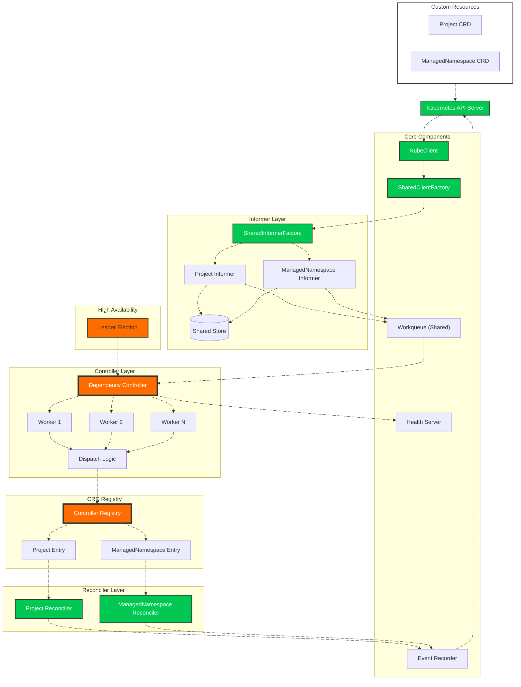

# 🚀 Multi-CRD Kubernetes Controller Framework

[](https://golang.org/)
[](https://kubernetes.io/)
[](LICENSE)

A **production-grade, multi-CRD Kubernetes controller framework** that manages multiple custom resources through a clean, registry-driven architecture. Built from scratch without controller-runtime, demonstrating deep understanding of Kubernetes internals.

Originally inspired by [@martin-helmich](https://github.com/martin-helmich/kubernetes-crd-example), this project has evolved into a **scalable, extensible operator platform** capable of managing any number of CRDs with **zero boilerplate** – just API types and your business logic.

## 🎯 **Current CRDs Supported**

| Resource | API Group | Version | Status |
|----------|-----------|---------|--------|
| `Project` | `platform.ialexeze.io` | `v1alpha1` | ✅ Production Ready |
| `ManagedNamespace` | `platform.ialexeze.io` | `v1alpha1` | ✅ Production Ready |

Adding more CRDs takes **minutes** – no controller rewrites, no code duplication, no manual client or informer implementation.

## 🏗️ **Architecture**



## ✨ **Key Features**

### 🔥 **Multi-CRD Support with Zero Boilerplate**
A **registry-driven design** allows the controller to manage any number of CRDs. Each CRD contributes:
- Its own API types (generated by controller-gen)
- Its own reconciler (your business logic)

**Everything else is automated** – clients, informers, and registration are handled by the framework.

### 🏭 **SharedInformerFactory – The Heart of the Framework**
The `SharedInformerFactory` is the crown jewel of this architecture. It:
- **Automatically creates clients** for any registered CRD via the SharedClientFactory
- **Automatically creates informers** with proper List/Watch functions
- **Maintains a shared store** for all resources
- **Feeds events into a single workqueue** for unified processing
- **Handles cache synchronization** automatically
- **Requires zero per-CRD code** – just register your type and it works

```go
// One factory to rule them all
infFactory := informer.SharedInformerFactory(provider, wq, scheme, namespace, defaultResync)

// Get a fully-configured informer for ANY CRD
inf := infFactory.For(&yourcrdv1.YourCRD{}, ctx, resync)  // That's it!
```

### 🧠 **Dependency Controller**
A single controller processes events from **all CRDs**, respecting dependency order for startup and shutdown:

```yaml
crds:
  - name: managednamespace
    dependsOn: ["project"]  # Starts after project, shuts down before project
```

### 🧩 **Modular Components**
Each subsystem is a standalone, pluggable component:
- **KubeClient** with SharedClientFactory – generic Kubernetes client
- **SharedInformerFactory** – automatic informer generation
- **Event Recorder** – Kubernetes events for visibility
- **Health Server** – liveness and readiness probes
- **Shared Workqueue** – rate-limited event processing with per-CRD metrics
- **CRD Registry** – central source of truth for all CRDs
- **Controller Registry** – maps GVKs to informers and reconcilers
- **Leader Election** – high availability
- **Manager** – orchestrates startup and graceful shutdown

### ⚙️ **Generic KubeClient with SharedClientFactory**
One kubeclient powers **all** CRD operations. The `SharedClientFactory` generates properly configured REST clients for any CRD on demand.

### 📦 **Clean CRD Packages**
Each CRD lives in its own well-organized package – **and that's all you need to write**:

```
api/types/
├── project/
│   └── v1alpha1/
│       ├── groupversion_info.go
│       ├── project_types.go
│       └── zz_generated.deepcopy.go
└── managedNamespace/
    └── v1alpha1/
        ├── groupversion_info.go
        ├── managednamespace_types.go
        └── zz_generated.deepcopy.go
```

**No clientset. No informer. Just your API types.**

### 🔁 **Per-CRD Reconcilers**
Clean separation of reconciliation logic – **the only thing you implement**:

```
pkg/reconciler/
├── helper.go                 # Shared utilities
├── project_reconcile.go      # Project reconciliation (your logic)
├── managed_ns_reconciler.go  # ManagedNamespace reconciliation (your logic)
└── registry.go               # Reconciler factory registry
```

### 🧭 **Dual Registry Architecture**

#### **CRD Registry** (`pkg/registry/crd_registry.go`)
Defines what CRDs exist with **two operation modes**:

**Go Mode (Typed - Default):**
```go
{
    Name:        "project",
    Object:      &projectTypev1.Project{},
    ListObject:  &projectTypev1.ProjectList{},
    Group:       projectTypev1.Group,
    Kind:        projectTypev1.Kind,
    Version:     projectTypev1.Version,
    NamePlural:  projectTypev1.NamePlural,
    Workers:     3,
    Scheme:      projectTypev1.AddToScheme,
    Reconciler:  reconciler.NewProjectReconciler,
}
```

**YAML Mode (Dynamic):**
```yaml
crds:
  - name: project
    group: platform.ialexeze.io
    version: v1alpha1
    kind: Project
    plural: projects
    workers: 3
    dependsOn: []
```

#### **Controller Registry** (`pkg/controller/registry.go`)
Maps GVKs to running informers and reconcilers at runtime:
```go
reg.Register(gvk, crd, informer, reconciler)
```

This separation ensures that **adding a new CRD is just data** – no code changes to the core.

### 📊 **Built-in Prometheus Metrics**
```
# HELP controller_queue_depth Current queue depth per CRD
# HELP controller_reconcile_duration_seconds Duration of reconciliations
# HELP controller_reconcile_total Total number of reconciliations
# HELP controller_workers_active Number of active workers per CRD
```

### 🔄 **Graceful Shutdown with Dependency Order**
```logs
shutting down managednamespace  # Depends on project → shuts down first
shutting down project           # Root dependency → shuts down last
```

## 🚀 **Quick Start**

### 1. Clone and Configure
```bash
git clone https://github.com/ialexeze/multi-crd-controller.git
cd multi-crd-controller
cp .env.example .env
# Edit .env with your configuration
```

### 2. Choose Your Mode

**Go Mode (Default):**
```bash
# Just run - uses built-in CRD registry
go run ./cmd/
```

**YAML Mode:**
```bash
export CRD_REGISTRY_MODE=YAML
export CRD_REGISTRY=initialize/crd-registry.yaml  # local file
# or
export CRD_REGISTRY=https://raw.githubusercontent.com/.../my-crds.yaml  # remote URL
go run ./cmd/
```

### 3. Install CRDs
```bash
kubectl apply -f crd/config/bases/
```

### 4. Create Resources
```bash
# Create projects and managed namespaces
kubectl apply -f crd/config/samples/
```

### 5. Monitor
```bash
# Metrics endpoint
curl localhost:8080/metrics

# Health checks
curl localhost:8080/health
curl localhost:8080/ready
```

### 6. Deploy to Production
```bash
kubectl apply -f deployment/
```

## 🔧 **Extending the Controller: Add a New CRD in Minutes**

This is where the framework truly shines. Adding a new CRD requires **zero boilerplate** – just your API types and reconciler.

### **Step 1: Generate API Types**

Create the API package structure:

```
api/types/yourcrd/v1alpha1/
├── groupversion_info.go
├── yourcrd_types.go
└── zz_generated.deepcopy.go
```

**groupversion_info.go:**
```go
package v1alpha1

import (
    metav1 "k8s.io/apimachinery/pkg/apis/meta/v1"
    "k8s.io/apimachinery/pkg/runtime"
    "k8s.io/apimachinery/pkg/runtime/schema"
)

var (
    Group      = "yourgroup.example.com"
    Version    = "v1alpha1"
    APIPath    = "/apis"
    Kind       = "YourCRD"
    NamePlural = "yourcrds"

    GroupVersion = schema.GroupVersion{
        Group:   Group,
        Version: Version,
    }

    SchemeBuilder = runtime.NewSchemeBuilder(addKnownTypes)
    AddToScheme   = SchemeBuilder.AddToScheme
)

func addKnownTypes(scheme *runtime.Scheme) error {
    scheme.AddKnownTypes(GroupVersion,
        &YourCRD{},
        &YourCRDList{},
    )

    scheme.AddKnownTypes(schema.GroupVersion{
        Group:   Group,
        Version: runtime.APIVersionInternal,
    },
        &YourCRD{},
        &YourCRDList{},
    )

    metav1.AddToGroupVersion(scheme, GroupVersion)
    return nil
}
```

**yourcrd_types.go:**
```go
package v1alpha1

import (
    metav1 "k8s.io/apimachinery/pkg/apis/meta/v1"
)

// +genclient
// +k8s:deepcopy-gen:interfaces=k8s.io/apimachinery/pkg/runtime.Object

type YourCRD struct {
    metav1.TypeMeta   `json:",inline"`
    metav1.ObjectMeta `json:"metadata,omitempty"`
    Spec              YourCRDSpec   `json:"spec"`
    Status            YourCRDStatus `json:"status,omitempty"`
}

type YourCRDSpec struct {
    Replicas int `json:"replicas"`
}

type YourCRDStatus struct {
    Phase string `json:"phase,omitempty"`
}

// +k8s:deepcopy-gen:interfaces=k8s.io/apimachinery/pkg/runtime.Object

type YourCRDList struct {
    metav1.TypeMeta `json:",inline"`
    metav1.ListMeta `json:"metadata,omitempty"`
    Items           []YourCRD `json:"items"`
}
```

Generate deepcopy code:
```bash
controller-gen object paths=./api/types/yourcrd/...
```

---

### **Step 2: Create Your Reconciler**

This is the **only Go code you write** — your business logic.

```go
// pkg/reconciler/yourcrd_reconciler.go
package reconciler

import (
    "context"

    "github.com/ialexeze/multi-crd-controller/pkg/config/pkg/event"
    "github.com/ialexeze/multi-crd-controller/pkg/config/pkg/logger"
    "k8s.io/client-go/tools/cache"
)

type YourCRDReconciler struct {
    events *event.Event
}

func NewYourCRDReconciler(inf cache.SharedIndexInformer, events *event.Event) *YourCRDReconciler {
    return &YourCRDReconciler{
        events: events,
    }
}

func (r *YourCRDReconciler) Reconcile(ctx context.Context, key string) error {
    namespace, name, err := cache.SplitMetaNamespaceKey(key)
    if err != nil {
        return err
    }

    logger.Info().Msgf("Reconciling %s/%s", namespace, name)
    // Your business logic here
    return nil
}
```

---

### **Step 3: Register Your Reconciler**

If you are using **YAML mode**, you must register your reconciler by name:

```go
// pkg/reconciler/registry.go
func RegisterReconcilers() map[string]NewReconcilerFunc {
    return map[string]NewReconcilerFunc{
        "project": func(kube *kubeclient.Kubeclient, inf cache.SharedIndexInformer, ev *event.Event) domain.Reconciler {
            return NewProjectReconciler(inf, ev)
        },
        "yourcrd": func(kube *kubeclient.Kubeclient, inf cache.SharedIndexInformer, ev *event.Event) domain.Reconciler {
            return NewYourCRDReconciler(inf, ev)
        },
    }
}
```

The key (`"yourcrd"`) must match the CRD name in your YAML registry.

---

### **Step 4: Register Your CRD**

You now have **two options**:

---

### 🟦 **Option A — Go Mode (Typed - Default)**

Add your CRD to the Go registry:

```go
// pkg/registry/crd_registry.go
func buildCRDs() []CRDEntry {
    return []CRDEntry{
        {
            Name:        "yourcrd",
            Object:      &yourcrdv1.YourCRD{},
            ListObject:  &yourcrdv1.YourCRDList{},
            Group:       yourcrdv1.Group,
            Kind:        yourcrdv1.Kind,
            Version:     yourcrdv1.Version,
            APIPath:     yourcrdv1.APIPath,
            NamePlural:  yourcrdv1.NamePlural,
            Namespace:   "default",
            Namespaced:  false,
            Workers:     3,
            Resync:      10 * time.Minute,
            Scheme:      yourcrdv1.AddToScheme,
            Reconciler: func(kube *kubeclient.Kubeclient, inf cache.SharedIndexInformer, ev *event.Event) domain.Reconciler {
                return reconciler.NewYourCRDReconciler(inf, ev)
            },
        },
    }
}
```

**Go mode gives you:**
- ✅ Full Go structs with type safety
- ✅ No manual scheme registration
- ✅ IDE autocompletion
- ✅ Compile-time safety

---

### 🟩 **Option B — YAML Mode (Dynamic)**

Set the environment variable:

```bash
export CRD_REGISTRY_MODE=YAML
export CRD_REGISTRY=initialize/crd-registry.yaml
```

Example YAML:

```yaml
# initialize/crd_registry.yaml
crds:
  - name: project
    group: platform.ialexeze.io
    version: v1alpha1
    kind: Project
    plural: projects
    workers: 3           # Concurrency control
    dependsOn: []        # Dependencies
    namespace: default   # Target namespace
    namespaced: true     # Scope
    # No resync → uses default
    
  - name: managednamespace
    group: platform.ialexeze.io
    version: v1alpha1
    kind: ManagedNamespace
    plural: managednamespaces
    workers: 2
    resync: 10m            # Resync period
    dependsOn: [project]   # Optional dependencies for startup/shutdown order
    namespace: default
    # No namespace → cluster-scoped, namespaced is false by default
```

**YAML mode gives you:**
- ✅ Dynamic CRD loading without recompilation
- ✅ Support for local files OR remote URLs
- ✅ Dependency declarations
- ✅ Perfect for multi-team orchestration
- ✅ GitOps friendly

---

### **Step 4b: Register Your Scheme (YAML Mode Only)**

If using **YAML mode**, you must register your scheme:

```go
// initialize/scheme_registry.go
func RegisterScheme(scheme *runtime.Scheme) (*runtime.Scheme, error) {
    if err := projectTypev1.AddToScheme(scheme); err != nil {
        return nil, fmt.Errorf("failed to register Project scheme: %v", err)
    }
    if err := yourcrdv1.AddToScheme(scheme); err != nil {
        return nil, fmt.Errorf("failed to register YourCRD scheme: %v", err)
    }
    return scheme, nil
}
```

**Go mode does not require this step** – it's handled automatically.

---

## 🎉 **Step 5: Done!**

That's it. The framework automatically:
- ✅ Creates scheme with your API types
- ✅ Creates the client using SharedClientFactory
- ✅ Creates the informer using SharedInformerFactory
- ✅ Registers with the workqueue
- ✅ Adds per-CRD metrics
- ✅ Registers with the controller registry
- ✅ Integrates with leader election
- ✅ Handles graceful shutdown in dependency order

**No clientset. No informer. No interfaces. Just your API types and reconciler.**

## 📋 **What You Get**

- ✅ **Zero boilerplate** – No manual clients, informers, or interfaces
- ✅ **Auto-generated everything** – SharedInformerFactory handles it all
- ✅ **Type safety** – Each CRD maintains its own types
- ✅ **Dependency management** – Automatic startup/shutdown ordering
- ✅ **Per-CRD workers** – Fine-grained concurrency control
- ✅ **Production metrics** – Prometheus endpoints built-in
- ✅ **Dual-mode operation** – Go for type safety, YAML for dynamic config
- ✅ **Remote YAML support** – Load CRD configs from URLs
- ✅ **Scalability** – Add dozens of CRDs without performance impact
- ✅ **Maintainability** – Each reconciler is independent
- ✅ **Testability** – Each reconciler can be tested in isolation
- ✅ **Production ready** – Leader election, health checks, graceful shutdown

## 📊 **Code Reduction**

| Component | Traditional Approach | This Framework | Reduction |
|-----------|---------------------|----------------|-----------|
| Client | 120+ lines | 0 (auto) | 100% |
| Informer | 100+ lines | 0 (auto) | 100% |
| Interfaces | 80+ lines | 0 (auto) | 100% |
| GVK Implementation | 30+ lines | 0 (auto) | 100% |
| Worker Management | 50+ lines | 0 (auto) | 100% |
| Dependency Logic | 100+ lines | 0 (auto) | 100% |
| Registration | 30+ lines | 3 lines | 90% |
| **TOTAL per CRD** | **~510 lines** | **~50 lines (reconciler)** | **90%** |


---

## 🌐 YAML Mode Use Cases & Real‑World Scenarios

YAML mode isn’t just an alternative configuration mechanism — it unlocks an entirely different operational model for this framework. If you want to understand **why YAML mode exists**, **when to use it**, and **how it enables large‑scale platform engineering**, check out the full set of use cases:

👉 **See: [YamlModeUseCases.md](./docs/yaml-use-cases.md)**  
*A deep dive into real‑world applications including GitOps, multi‑cluster management, canary rollouts, partner integrations, compliance workflows, and more.*

This section covers:

- Centralized operator marketplaces  
- Organization‑wide standardization  
- Multi‑cluster fleet management  
- GitOps pipelines  
- Canary deployments  
- Dynamic worker scaling  
- Multi‑tenant team isolation  
- Compliance & audit trails  
- Edge/IoT deployments  
- Partner/customer integrations  
- Versioning strategies  
- Security models  
- Offline/air‑gapped environments  
- Progressive delivery  
- Observability patterns  

If you’re evaluating whether YAML mode is right for your environment, this guide will give you a clear picture of its power and flexibility.

---

## 🙏 **Acknowledgments**

This project builds upon the excellent work of:
- [**@martin-helmich**](https://github.com/martin-helmich) – for the foundational CRD example
- **Kubernetes community** – for the client-go libraries and patterns

## 📄 **License**

MIT License – see [LICENSE](LICENSE)

---

**Built with ❤️ and a deep understanding of Kubernetes internals**
