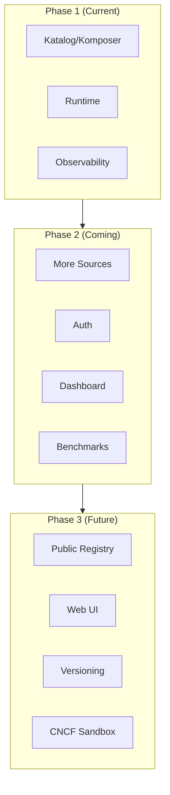

# Roadmap

## Orkestra Project Roadmap

*Last updated: March 2026*

This document outlines the planned development trajectory for Orkestra. It's a living document that evolves with community feedback and project priorities.

---

## 🎯 **Vision**

Orkestra aims to become the standard runtime for declarative operators — making Kubernetes extensibility accessible to everyone, regardless of their Go or programming proficiency.

---

## 📊 **Roadmap Phases**

### Phase 1: Foundation (Current) — Q1–Q2 2026

**Goal:** Stable core with complete operator lifecycle

| Feature | Status |
|---------|--------|
| Katalog CRD declaration | ✅ Complete |
| Komposer multi-source composition | ✅ Complete |
| File, URL, Helm, Git sources | ✅ Complete |
| Dependency graph & ordering | ✅ Complete |
| Per‑CRD workers & queues | ✅ Complete |
| Health API (`/katalog/*`) | ✅ Complete |
| Prometheus metrics | ✅ Complete |
| OrkestraRegistry (Deployments, Services, Secrets, ConfigMaps, etc.) | ✅ Complete |
| Dynamic template reconciliation | ✅ Complete |
| CLI (`ork run`, `validate`, `template`) | ✅ Complete |
| Zero‑code operators | ✅ Complete |

**Focus now:** Polish, documentation, and real‑world testing

---

### Phase 2: Adoption — Q3–Q4 2026

**Goal:** Make Orkestra easy to adopt, extend, and operate

| Feature | Priority | Status |
|---------|----------|--------|
| Helm chart for Orkestra itself | High | ⏳ Planned |
| More source types (S3, GCS, Azure Blob, ConfigMap) | Medium | ⏳ Planned |
| Webhook validation for Katalogs | Medium | ⏳ Planned |
| Performance benchmarks | Medium | ⏳ Planned |
| Stress testing (100+ CRDs) | High | ⏳ Planned |
| OperatorHub integration | Low | 💭 Future |
| `ork dashboard` command (visualize running operators) | Medium | ⏳ Planned |
| Authentication for remote sources | High | ⏳ Planned |
| Rate limiting per source | Low | 💭 Future |

---

### Phase 3: Ecosystem — 2027

**Goal:** Build a community around declarative operators

| Feature | Priority | Status |
|---------|----------|--------|
| Public registry of reusable Katalogs | High | 💭 Future |
| `ork registry` commands (search, pull, publish) | High | 💭 Future |
| Katalog versioning and dependencies | Medium | 💭 Future |
| Web UI for cluster operator management | Low | 💭 Future |
| Commercial support options | Low | 💭 Future |
| CNCF Sandbox submission | High | ⏳ Q1 2027 target |

---

## 🚀 **Feature Deep Dives**

### Phase 2 Highlights

#### **More Source Types**

```yaml
sources:
  s3:
    - bucket: my-org-katalogs
      key: platform/crds.yaml
      region: us-east-1
      credentialsFrom: $AWS_CREDS  # optional
      
  gcs:
    - bucket: my-org-katalogs
      object: platform/crds.yaml
      
  configMap:
    - name: crds-config
      namespace: orkestra-system
      key: katalog.yaml
```

#### **Authentication for Remote Sources**

```yaml
sources:
  files:
    - name: https://private.gitlab.com/org/crds.yaml
      auth:
        type: token
        fromEnv: GITLAB_TOKEN
```

#### **`ork dashboard`**

A terminal UI showing:
- Live CRD health
- Queue depths
- Worker utilization
- Recent errors
- Dependency graphs

---

### Phase 3 Highlights

#### **Public Katalog Registry**

```bash
# Search for a PostgreSQL operator
ork registry search postgres

# Use it directly
ork run --from registry/postgres@v14

# Publish your own
ork registry publish ./my-katalog.yaml --name my-org/postgres
```

#### **Katalog Versioning**

```yaml
name: postgres
version: 14.5.0
dependencies:
  - storage-class@v1
  - monitoring@>=2.0
```

---

## 🏗️ **Architecture Evolution**



---

## 🤝 **How You Can Help**

| Area | How to Contribute |
|------|-------------------|
| **Testing** | Run Orkestra in your environment, report issues |
| **Documentation** | Improve guides, add examples |
| **Features** | Pick a Phase 2 item and implement it |
| **Community** | Answer questions, spread the word |
| **Sponsorship** | Support development financially |

See [CONTRIBUTING.md](CONTRIBUTING.md) for details.

---

## 📅 **Release Schedule**

| Version | Target | Focus |
|---------|--------|-------|
| v0.9.x | Q2 2026 | Bug fixes, polish |
| v1.0.0 | Q3 2026 | Production readiness |
| v1.1.x | Q4 2026 | More sources, auth |
| v1.2.x | Q1 2027 | Dashboard, benchmarks |
| v2.0.0 | 2027 | Registry, versioning |

---

## 💬 **Feedback**

This roadmap is a living document. If you have ideas, suggestions, or want to prioritize something differently:

- Open a [GitHub issue](https://github.com/ialexeze/orkestra/issues)
- Start a [Discussion](https://github.com/ialexeze/orkestra/discussions)
- Reach out on Kubernetes Slack (#orkestra)

---

**Let's build the future of declarative operators together.** 🎼