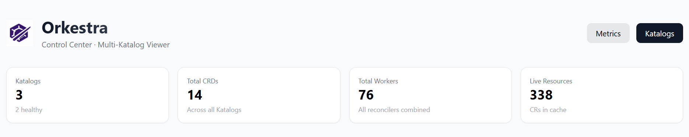
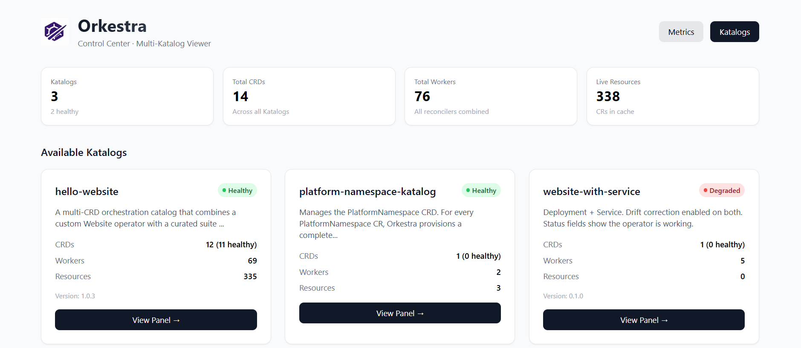
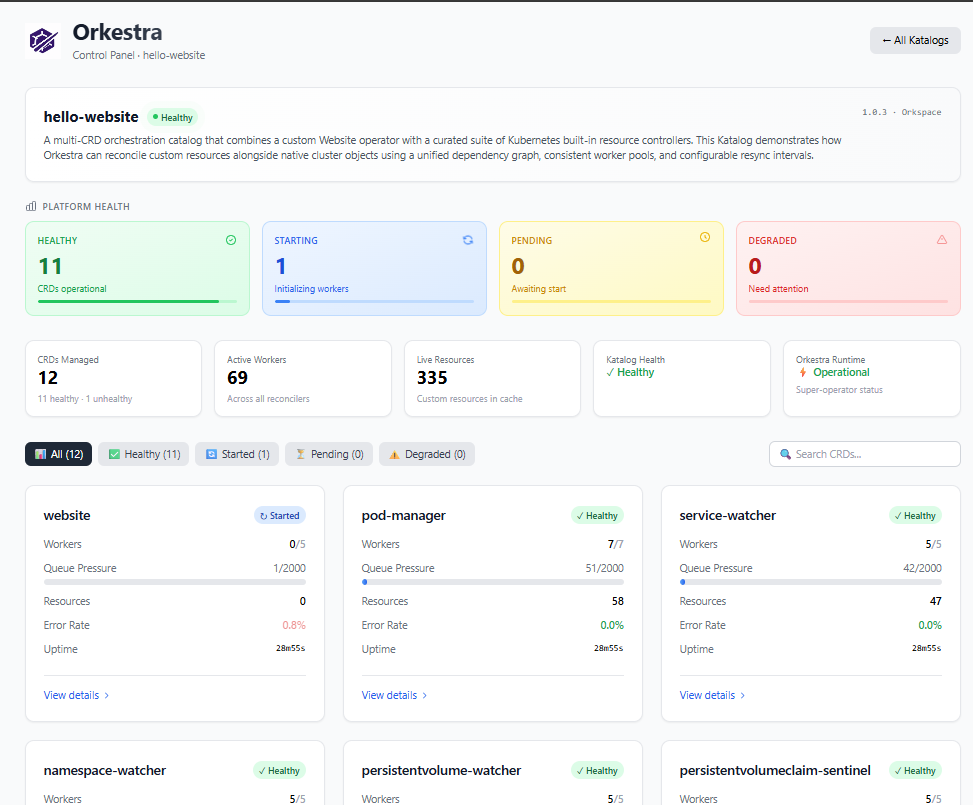
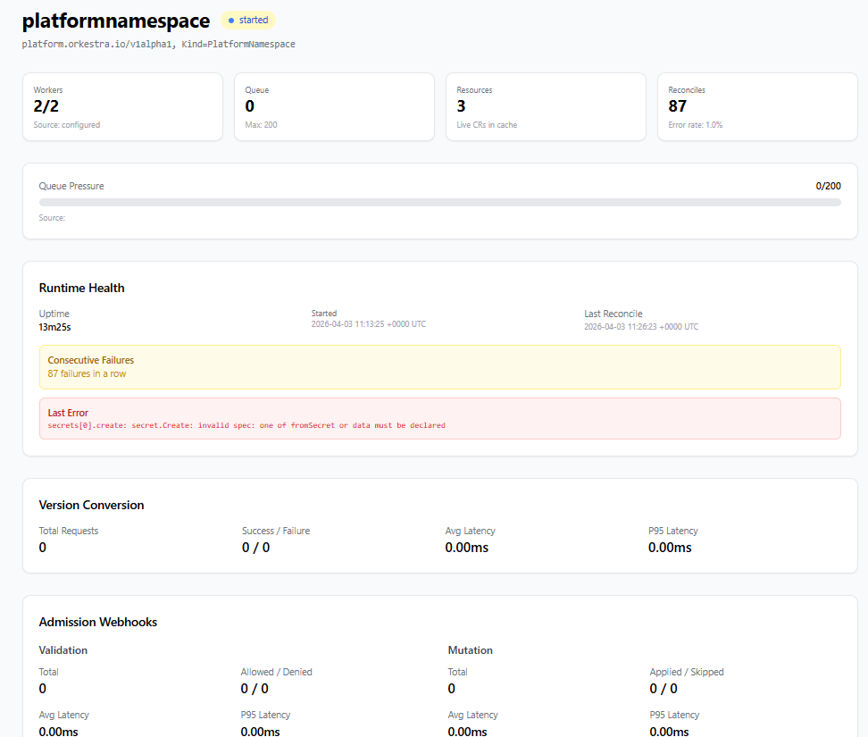

# Orkestra Control Center

[](https://opensource.org/licenses/MIT)
[](https://golang.org/)
[](https://kubernetes.io/)

A unified web-based control center for managing multiple Orkestra runtime instances. Monitor all your Katalogs, CRDs, and operator health from a single dashboard.



## Overview

Orkestra Control Center provides a consolidated UI for all your Orkestra instances. Whether you're running Orkestra in multiple clusters, environments, or namespaces, the Control Center aggregates health metrics, CRD status, and operator details into one view.

### What It Does

- **Multi-Instance Aggregation** – Monitor multiple Orkestra runtimes from a single interface
- **Katalog Overview** – View all your Katalogs across all instances with health status
- **CRD Health Dashboard** – Drill into each CRD to see worker counts, queue depth, error rates, and uptime
- **Admission & Conversion Stats** – See validation, mutation, and version conversion metrics
- **Zero Configuration** – Control center is built into the `ork` CLI – no separate binary needed

## Built With

- [Go](https://golang.org/) 1.23+ – Core backend and HTTP server
- [TailwindCSS](https://tailwindcss.com/) – Modern, responsive UI styling
- [Embedded Templates](https://pkg.go.dev/embed) – Single-binary deployment with no external dependencies
- [Prometheus Metrics](https://prometheus.io/) – Metrics aggregation from Orkestra instances (future)

## Architecture

The Control Center acts as a reverse-proxy aggregator:

```
┌─────────────────────────────────────────────────────────────┐
│                    Browser / User                           │
└─────────────────────────────────────────────────────────────┘
                              │
                              ▼
┌─────────────────────────────────────────────────────────────┐
│                  Orkestra Control Center                    │
│                  (Port 8090 by default)                     │
│                                                             │
│  ┌─────────────┐  ┌─────────────┐  ┌─────────────┐          │
│  │ Katalog A   │  │ Katalog B   │  │ Katalog C   │          │
│  │ (Instance 1)│  │ (Instance 2)│  │ (Instance 3)│          │
│  └─────────────┘  └─────────────┘  └─────────────┘          │
└─────────────────────────────────────────────────────────────┘
         │                  │                  │
         ▼                  ▼                  ▼
   ┌─────────┐        ┌─────────┐        ┌─────────┐
   │Orkestra │        │Orkestra │        │Orkestra │
   │Runtime 1│        │Runtime 2│        │Runtime 3│
   │:8080    │        │:8081    │        │:8082    │
   └─────────┘        └─────────┘        └─────────┘
```

## Installation

### Prerequisites

Install the `ork` CLI – the control center is built right in.

```bash
# macOS
brew tap orkspace/tap && brew install ork

# Linux
curl -sSL https://raw.githubusercontent.com/orkspace/orkestra/main/install.sh | bash

# Verify installation
ork version
```

> 📖 See the full [Orkestra Installation Guide](https://github.com/orkspace/orkestra#installation) for details.

### Starting the Control Center

Once the `ork` CLI is installed, start the control center with:

```bash
# Single Orkestra runtime (default)
ork control start

# Multiple runtimes
ork control start -u "http://localhost:8080,http://localhost:8082,http://orkestra-prod:8080"

# Custom port
ork control start -p 8090 -u "http://localhost:8080,http://localhost:8082"

# With debug logging
ork control start --log-level debug
```

The control center will be available at `http://localhost:8090/controlcenter`

### Using Helm

Enable the Control Center in your Orkestra Helm chart:

```yaml
# values.yaml
controlCenter:
  enabled: true
  orkestraURLs:
    - http://orkestra-cluster1:8080
    - http://orkestra-cluster2:8080
    - http://orkestra-staging:8080
  port: 8090
  refreshInterval: 10s
  resources:
    requests:
      cpu: 50m
      memory: 64Mi
    limits:
      cpu: 200m
      memory: 256Mi
  ingress:
    enabled: true
    className: nginx
    hosts:
      - host: controlcenter.orkestra.io
        paths:
          - path: /
            pathType: Prefix
```

Then deploy:

```bash
helm upgrade --install orkestra orkestra/orkestra -f values.yaml
```

### Docker

```bash
docker run -d \
  --name orkestra-cc \
  -p 8090:8090 \
  ghcr.io/orkspace/orkestra-cc:latest \
  -u "http://host.docker.internal:8080,http://host.docker.internal:8081"
```

## Usage

### Command Line Flags

| Flag | Default | Description |
|------|---------|-------------|
| `-u`, `--urls` | `http://localhost:8080` | Comma-separated list of Orkestra runtime URLs |
| `-p`, `--port` | `8090` | Port to serve the control center on |
| `--refresh` | `10s` | Interval for fetching Katalog data from instances |
| `--log-level` | `info` | Log level (debug, info, warn, error) |
| `--version` | - | Show version information |

### Landing Page – The Control Center



The landing page is your central hub showing:
- All discovered Katalogs across configured instances
- Health status of each Katalog (Healthy/Degraded)
- Summary statistics (total CRDs, workers, resources)
- Quick navigation to each Katalog's control panel

### Katalog Control Panel



Each Katalog has its own control panel displaying:
- Katalog metadata (name, version, author, description)
- Platform health cards (Healthy, Started, Pending, Degraded counts)
- Key metrics (CRDs managed, active workers, live resources)
- CRD grid with individual health status
- Queue pressure indicators with warnings
- Error rates and uptime

### CRD Detail View



Drill into any CRD to see:
- Runtime health (uptime, start time, last reconcile)
- Errors and warnings
- Queue visualization with progress bar
- Version conversion metrics (if enabled)
- Admission webhook statistics (validation + mutation)
- Reconciler configuration details
- Dependencies graph

## Use Cases

### Multi-Cluster Observability

Monitor Orkestra runtimes running in different Kubernetes clusters:

```bash
ork control start -u "https://cluster1.example.com:8080,https://cluster2.example.com:8080,https://cluster3.example.com:8080"
```

### Development vs Production

Track both development and production instances simultaneously:

```bash
ork control start -u "http://localhost:8080,http://orkestra-prod.internal:8080"
```

### Staging Canary

Monitor staging and canary deployments side-by-side:

```bash
ork control start -u "http://orkestra-stable:8080,http://orkestra-canary:8080"
```

## Configuration

### Environment Variables

| Variable | Description |
|----------|-------------|
| `ORK_CC_PORT` | Override the default port (8090) |
| `ORK_CC_REFRESH` | Override refresh interval |
| `LOG_LEVEL` | Set log level (debug, info, warn, error) |

### Health Checks

The Control Center exposes its own health endpoints:

```bash
# Health check
curl http://localhost:8090/controlcenter/health

# Readiness probe
curl http://localhost:8090/controlcenter/ready

# Version info
curl http://localhost:8090/controlcenter/version
```

## Development

### Prerequisites

- Go 1.23 or later
- Node.js (for TailwindCSS development, optional)

### Building from Source

```bash
git clone https://github.com/orkspace/orkestra.git
cd orkestra
go build -o ork ./cmd/orkestra/

# Start the control center
./ork control start -u "http://localhost:8080" -p 8090
```

<!-- ### Running with Hot Reload (using Air)

```bash
# Install Air
go install github.com/cosmtrek/air@latest

# Run with hot reload
air
``` -->

## Contributing

We welcome contributions! See [CONTRIBUTING.md](CONTRIBUTING.md) for details.

## License

Apache license – see [LICENSE](LICENSE) file for details.

## Related Projects

- [Orkestra Runtime](https://github.com/orkspace/orkestra) – The declarative operator runtime
- [Orkestra Registry](https://github.com/orkspace/orkestra-registry) – OCI/Git-based pattern registry
