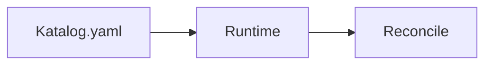
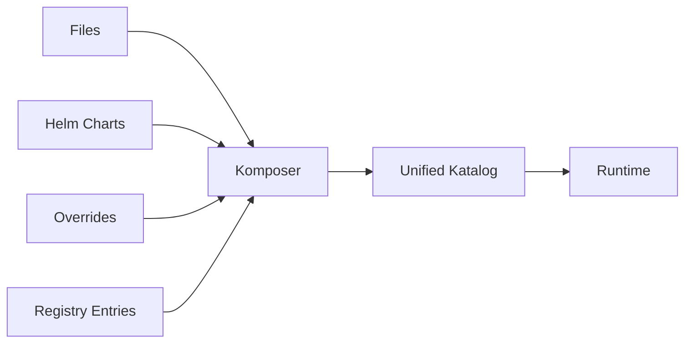

# Choosing Between Katalog and Komposer
### *How to decide which Orkestra input model is right for your operator*

Orkestra supports two ways to define operator behavior:

- **Katalog** — a single declarative file containing one or more CRDs  
- **Komposer** — a merge engine that combines multiple sources into one Katalog  

You never use both at the same time.  
Komposer *produces* a Katalog.  
The runtime *consumes* a Katalog.

This guide helps you choose the right model for your use case.

---

# 1. Use Katalog when…

Katalog is the simplest and most direct way to define operator behavior.

Choose **Katalog** if:

- You have a single operator  
One CRD or multiple CRDs in one file.

- You want a single source of truth  
Everything lives in one YAML file.

- You don’t need to merge multiple sources  
No Helm charts, no external files, no layering.

- You want the fastest iteration loop  
Edit → `ork run` → done.

### Typical examples

- A Website operator with Deployment + Service  
- A Namespace operator with RBAC + Quotas  
- A Database operator with StatefulSet + Secret  
- A CRD that owns 2–5 resources  

### Mental model

```
Katalog.yaml → Runtime → Reconcile
```

If you can fit everything into one file, **use Katalog**.

---

# 2. Use Komposer when…

Komposer is for **multi‑source**, **multi‑environment**, or **multi‑team** setups.

Choose **Komposer** if:

- You have multiple Katalogs  
You want to combine several operators into one runtime.

- You want to merge Helm charts  
Komposer can ingest Helm output and turn it into a Katalog.

- You want environment‑specific layering  
Different values for dev, staging, prod.

- You want overrides  
Inline patches, file-based overrides, or environment overrides.

- You want to consume registry entries  
(e.g., `platform-workflow@v2.45` from the OrkestraRegistry)

### Typical examples

- A platform runtime composed of:
  - namespace operator  
  - monitoring operator  
  - ingress operator  
  - website operator  
  - secrets operator  

- A team that wants:
  - base Katalog from Git  
  - Helm chart from vendor  
  - environment overrides  
  - inline patches  

### Mental model

```
(files + helm + overrides + registry) → Komposer → Unified Katalog → Runtime
```

If you have **multiple sources**, **use Komposer**.

---

# 3. Quick Decision Table

| Situation | Use Katalog | Use Komposer |
|----------|-------------|--------------|
| One operator | ✅ | |
| One file | ✅ | |
| Multiple CRDs in one file | ✅ | |
| Multiple Katalogs | | ✅ |
| Merge Helm charts | | ✅ |
| Environment layering | | ✅ |
| Inline overrides | | ✅ |
| Registry entries | | ✅ |
| Want a single final Katalog | Both work | Komposer recommended |

---

# 4. The Golden Rule

> **If you have one source → use Katalog.  
> If you have more than one source → use Komposer.**

That’s the entire decision.

---

# 5. Visual Summary

## Katalog Path



## Komposer Path



---

# 6. FAQ

### **Can I run multiple Katalogs without Komposer?**  
Yes, but it’s not recommended.  
You risk duplicate CRDs, conflicting definitions, and unclear layering.

### Does Komposer run inside the runtime?
No.  
Komposer is a **build step**.  
The runtime only ever sees **one Katalog**.

### Can I mix Katalog and Komposer?
No.  
Komposer outputs a Katalog.  
You run the runtime on that output.

### Is Komposer required?  
No.  
Many operators will never need it.

---

# 7. Final Recommendation

- **Start with Katalog** — simplest, fastest, cleanest.  
- **Adopt Komposer** when your operator ecosystem grows.  

This mirrors how teams grow:

- Start with one operator  
- Add more  
- Add environments  
- Add overrides  
- Add registry entries  
- Move to Komposer  

Orkestra supports both paths cleanly.

**Whats Next?**
  - See [Use Cases](../../use-cases/index.md) to learn more.