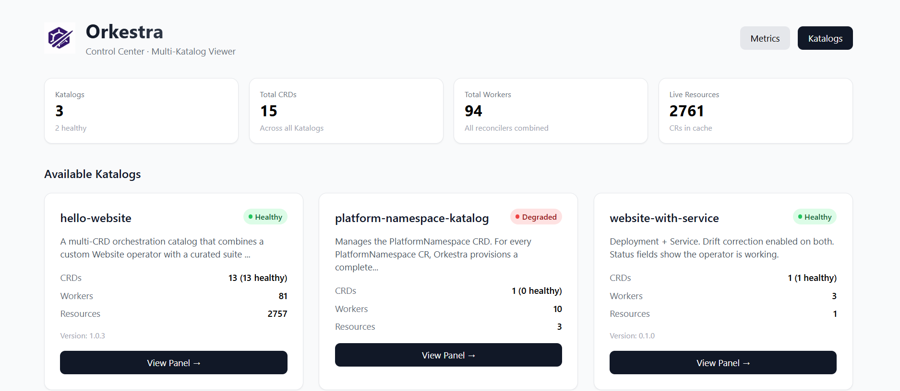
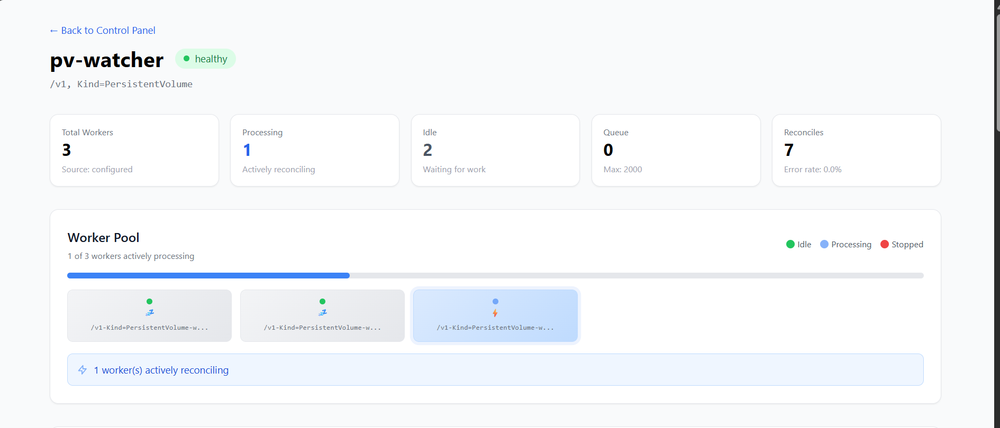

# The Observability Model

Orkestra provides a unified observability interface for every CRD it manages — without custom instrumentation, without writing dashboards, without configuration. This document assembles the full picture: the Control Center UI, the live API, the Prometheus metrics, and how they relate to each other.

---

## The Design Principle

Every CRD managed by Orkestra contributes to the same observability surface. There is no per-CRD monitoring setup. There is one Control Center, one health server, one metrics endpoint, one CLI interface. The data is identical whether Orkestra manages two CRDs or twenty.

**Observability is free. It's built in. It's always on.**

The observability stack has three tiers:

| Tier | Interface | Purpose | Persistence |
|------|-----------|---------|-------------|
| **Control Center** | Web UI (`/controlcenter`) | Human-readable visualization | Live only |
| **Live API** | `/katalog` endpoints | Structured JSON for automation | Live only |
| **Prometheus** | `/metrics` endpoint | Historical trends, alerting | Persistent |

---

## The Control Center

The Control Center is the primary observability interface. It visualizes everything the live API provides, organized for human consumption.

### Landing Page (`/controlcenter`)

Shows every Katalog discovered across all configured Orkestra instances:



- All Katalogs with health status badges
- Summary statistics (total CRDs, workers, resources)
- Quick navigation to each Katalog's Control Panel

### Katalog Control Panel (`/controlcenter/katalog/{name}`)

Per-Katalog deep dive:


- **Platform Health Cards** — Healthy, Started, Pending, Degraded counts
- **Key Metrics** — CRDs managed, active workers, live resources
- **CRD Grid** — Each CRD as a card with real-time state
- **Queue Pressure** — Visual progress bar with color-coded warnings
- **Error Rates** — Per-CRD error percentage with color coding

### CRD Detail View (`/controlcenter/katalog/{name}/crd/{crd}`)

Complete visibility into a single CRD:



- **Worker Pool Visualization** — Every worker goroutine shown as a card:
  - ⚡ **Processing** — Blue, pulsing — actively reconciling
  - 💤 **Idle** — Green — waiting for work
  - ⛔ **Stopped** — Red — CRD deactivated
- **Queue Pressure** — Progress bar with formatted large numbers (e.g., "15.2K / 50K")
- **Runtime Health** — Uptime, start time, last reconcile, consecutive failures
- **Version Conversion** — Request counts, latencies, success/failure rates
- **Admission Webhooks** — Validation and mutation statistics
- **Dependencies** — Health status of every dependency, clickable
- **RBAC Permissions** — Derived permissions table (auditable by security teams)

### Metrics Page (`/controlcenter/metrics`)

Preview of what's coming in v2.0: historical graphs, time-series trends, and alerting configuration. Currently shows the planned roadmap.

---

## The Live API

The `/katalog` endpoint powers the Control Center. It's also available directly for automation.

### `GET /katalog`

Returns the aggregate state of all managed CRDs:

```json
{
  "name": "platform-katalog",
  "healthy": false,
  "OrkReady": true,
  "degradedReason": "3 degraded, 6 started",
  "statusCounts": {
    "healthy": 4,
    "degraded": 3,
    "started": 6,
    "pending": 0
  },
  "crds": [
    {
      "name": "website",
      "state": "started",
      "healthy": false,
      "workers": 3,
      "workersProcessing": 2,
      "workersIdle": 1,
      "workerDetails": {
        "website-worker-0": "processing",
        "website-worker-1": "processing",
        "website-worker-2": "idle"
      },
      "queueDepth": 0,
      "maxQueueDepth": 2000,
      "errorRate": 0.73,
      "resourceCount": 47,
      "totalReconciles": 8312,
      "rbacCount": 3,
      "dependencies": ["postgres", "redis"],
      "conversion": {
        "enabled": true,
        "total": 62,
        "success": 62,
        "failures": 0,
        "avgLatencyMs": 0.5,
        "p95LatencyMs": 1.2
      },
      "admission": {
        "webhooksEnabled": true,
        "validationTotal": 1204,
        "validationAllowed": 1195,
        "validationDenied": 9,
        "mutationTotal": 387,
        "mutationApplied": 387
      }
    }
  ]
}
```

### `GET /katalog/{crd}`

Full detail for one CRD, including RBAC rules and reconciler configuration.

### `GET /katalog/{crd}/health`

Returns `200 OK` if the CRD is healthy, `503 Service Unavailable` otherwise. Used by external monitoring systems.

### `GET /katalog/{crd}/metrics`

Prometheus-style metrics for a single CRD (useful for focused debugging).

**`ork status` is the `/katalog` endpoint rendered for the terminal.** The data is the same; the format differs.

```bash
$ ork status
CRD                   State     Workers  Queue  Errors   Uptime
website               started   2/3      0      0.73%    4h23m
postgres              healthy   3/3      0      0%       4h23m
redis                 healthy   2/2      0      0%       4h23m
namespace-manager     started   5/5      12     0%       4h23m
```

**`ork describe <crd>`** shows full CRD detail including worker pool state and dependencies.

---

## The Prometheus Metrics

Six metric families. Each tells a distinct operational story. All are automatically exposed at `/metrics` without configuration.

### `controller_reconcile_total{crd, result}`

The most important metric. Total reconcile cycles, by outcome.

```
controller_reconcile_total{crd="demo.orkestra.io/v1alpha1, Kind=Website",result="success"} 8309
controller_reconcile_total{crd="demo.orkestra.io/v1alpha1, Kind=Website",result="error"}   3
```

**Alert:** Error rate above 5% sustained for more than 2 minutes.

```promql
rate(controller_reconcile_total{result="error"}[5m])
  / rate(controller_reconcile_total[5m]) > 0.05
```

### `controller_reconcile_duration_seconds{crd}`

Reconcile duration histogram. p95 and p99 tell you whether reconciles are taking longer than expected — which usually indicates API server latency, slow external calls in hooks, or queue backlog.

**Alert:** p99 above 5 seconds.

```promql
histogram_quantile(0.99,
  rate(controller_reconcile_duration_seconds_bucket[5m])
) > 5
```

### `controller_queue_depth{crd}`

Current items waiting in the workqueue. A persistently non-zero queue depth means workers cannot keep up with the event rate. The solution is increasing `workers` in the Katalog.

**Alert:** Queue depth above 100 for more than 5 minutes.

```promql
controller_queue_depth > 100
```

### `controller_workers_processing{crd}` and `controller_workers_idle{crd}`

Current worker states. The Control Center visualizes these per worker. Use Prometheus to track utilization over time:

```promql
# Worker utilization over time
controller_workers_processing / (controller_workers_processing + controller_workers_idle)
```

**Alert:** All workers processing for more than 10 minutes with queue depth > 0.

### `controller_workers_total{crd}`

Configured worker count per CRD. Compare against processing/idle to understand capacity.

### `controller_resource_count{crd}`

Number of custom resources in the informer cache. Use this to track growth over time.

**Alert:** Resource count growing faster than expected.

### `controller_admission_validation_total{crd, result, source}`

Admission and reconcile-time validation outcomes. The `source` label is the operationally critical dimension.

```
source="admission"   — call from /validate (kubectl apply time)
source="reconcile"   — call from the reconcile loop
```

**The diagnostic alert:**

```promql
# CRs are being denied at reconcile time but NOT at admission time
# Means ENABLE_ADMISSION_WEBHOOK is not set or the webhook is not intercepting
rate(controller_admission_validation_total{result="denied",source="reconcile"}[5m]) > 0
  AND
rate(controller_admission_validation_total{result="denied",source="admission"}[5m]) == 0
```

### `controller_admission_mutation_total{crd, result, source}`

Mutation outcomes. High `applied` rate at `source="admission"` means users frequently omit fields that your defaults cover — a signal that documentation or client tooling should improve.

---

## The Relationship Between Interfaces

```
┌─────────────────────────────────────────────────────────────────────────────┐
│                              OBSERVABILITY                                  │
├─────────────────────────────────────────────────────────────────────────────┤
│                                                                             │
│  ┌─────────────────┐    ┌─────────────────┐    ┌─────────────────────────┐ │
│  │  Control Center │    │   Live API      │    │     Prometheus          │ │
│  │                 │    │                 │    │                         │ │
│  │  Human-readable │    │  Machine-readable│    │  Historical             │ │
│  │  Real-time      │    │  Real-time      │    │  Alertable              │ │
│  │  Visual         │    │  Structured     │    │  Queryable              │ │
│  └────────┬────────┘    └────────┬────────┘    └───────────┬─────────────┘ │
│           │                      │                         │               │
│           ▼                      ▼                         ▼               │
│  ┌─────────────────────────────────────────────────────────────────────┐   │
│  │                        Orkestra Runtime                             │   │
│  │                                                                     │   │
│  │  • Worker pools (14 workers)                                        │   │
│  │  • Workqueues (per CRD)                                             │   │
│  │  • Informer caches (170+ resources)                                 │   │
│  │  • Reconciliation loops (4,200+ ops)                                │   │
│  └─────────────────────────────────────────────────────────────────────┘   │
│                                                                             │
└─────────────────────────────────────────────────────────────────────────────┘
```

**What each interface is for:**

| Question | Control Center | Live API | Prometheus |
|----------|---------------|----------|------------|
| "Is my operator healthy right now?" | ✅ Visual status | ✅ `healthy` field | ❌ Too slow |
| "Why is this CRD degraded?" | ✅ Worker pool view | ✅ `state` field | ❌ No context |
| "Is queue depth increasing over time?" | ⏳ Current only | ⏳ Current only | ✅ Historical |
| "How many errors per hour?" | ⏳ Current rate | ⏳ Current rate | ✅ Historical |
| "Did that change cause more errors?" | ❌ No history | ❌ No history | ✅ Compare before/after |
| "What permissions does this CRD need?" | ✅ RBAC table | ✅ `rbac` field | ❌ N/A |
| "Which dependency is failing?" | ✅ Dependency health | ✅ `dependencies` | ❌ N/A |

---

## Building a Dashboard

The Control Center **is** the dashboard. For most users, no additional visualization is needed.

For integration with existing monitoring stacks:

**Option 1: Embed the Control Center** — Iframe or reverse proxy into your existing portal. The Control Center is a standalone web app.

**Option 2: Scrape the JSON API** — `GET /katalog` returns structured data. Any dashboard tool that can fetch JSON can build panels.

**Option 3: Use Prometheus** — For long-term trends and alerting, scrape `/metrics`. The metric names and label conventions are stable.

**Out-of-the-box Grafana dashboards** are planned for a future release. The API is already stable — the dashboard is a renderer, not a new data source.

---

## The Status API as Observability

The CR's own `/status` subresource is part of the observability model. After every successful reconcile, Orkestra writes:

```yaml
status:
  conditions:
    - type: Ready
      status: "True"
      reason: ReconcileSucceeded
  observedGeneration: 4
  phase: Running
  readyReplicas: "3"
```

This makes `kubectl get websites` itself informative. External tools — ArgoCD health checks, custom controllers, monitoring scripts — can watch for `Ready=True` on CRs without knowing anything about Orkestra's internal health model.

The CR's status is the **user-facing** observability layer. Prometheus is the **platform-facing** observability layer. The Control Center and `/katalog` API are the **operator-facing** observability layer. All three are available without any configuration.

---

## Summary

| What you need to know | Where to look |
|-----------------------|---------------|
| Is my operator working right now? | Control Center → Katalog health |
| Why is this CRD degraded? | Control Center → Worker pool view → Last error |
| Are workers keeping up with demand? | Control Center → Queue pressure bar |
| What permissions does this CRD have? | Control Center → RBAC table |
| Is this dependency causing the problem? | Control Center → Dependencies section |
| How many errors per hour? | Prometheus → `controller_reconcile_total` |
| Is reconciliation getting slower? | Prometheus → `controller_reconcile_duration_seconds` |
| Are admission rules being enforced? | Control Center → Admission webhooks section |

**Observability is not an add-on. It's built into the runtime.**

---

- [Metrics Reference](../../reference/metrics.md)
- [Runtime Documentation](./runtime.md)
- [Katalog Schema](../../reference/katalog-schema.md)
- [Komposer Schema](../../reference/komposer-schema.md)