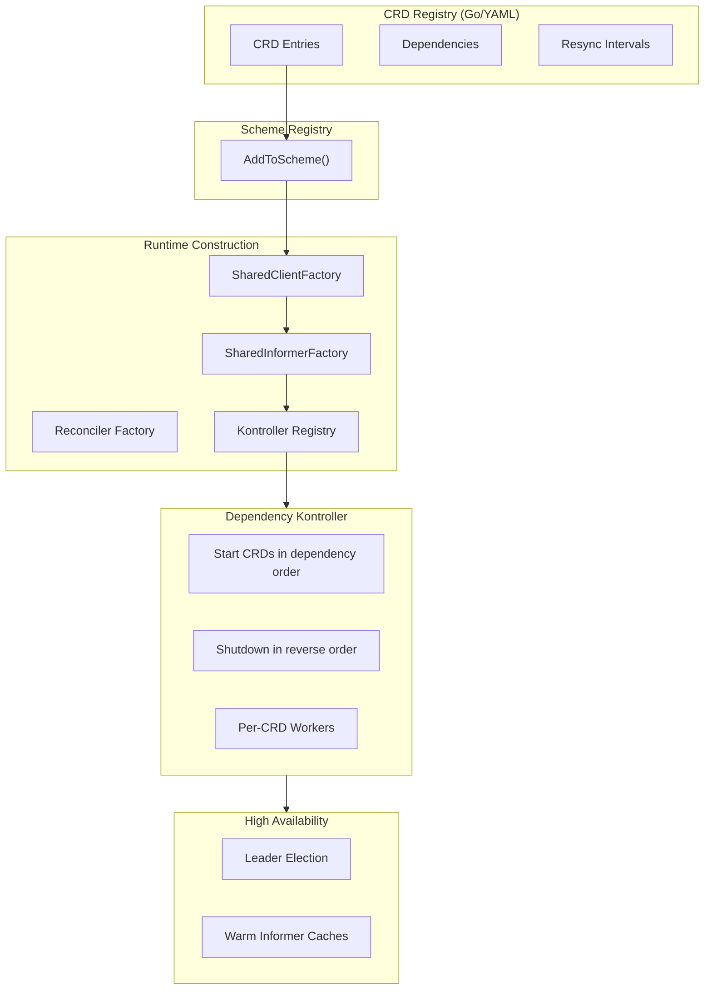

# 🧱 **Architectural Deep Dive (New Edition)**  
### *A Runtime‑Composable, Multi‑CRD Kubernetes Operator Framework*

This document provides a complete, modern overview of the internal architecture of the Multi‑CRD Kontroller Framework. It explains how CRDs are loaded (Go or YAML), how dependency graphs shape kontroller lifecycle, how informers and clients are generated dynamically, and how Orkestra achieves high availability, observability, and zero‑boilerplate extensibility.

This is not a traditional operator.  
It is a **universal operator runtime**.

---

# 🧠 **Core Design Principles**

The framework is built on four foundational ideas:

### **1. CRDs Are Data, Not Code**
CRDs are defined declaratively (Go or YAML).  
Orkestra runtime constructs everything else dynamically.

### **2. Runtime Composition**
Clients, informers, reconcilers, workers, and resync intervals are all created at runtime based on registry entries.

### **3. Dependency‑Aware Lifecycle**
CRDs declare dependencies.  
Orkestra starts and stops them in topological order.

### **4. Zero Boilerplate**
No clientsets.  
No informers.  
No wiring.  
Just API types + your reconciler.

---

# 🧩 **High‑Level Architecture**



---

# 📦 **1. CRD Registry (Go Mode + YAML Mode)**

The CRD Registry is the **source of truth** for all CRDs Orkestra manages.

It supports two modes:

---

## **Go Mode (Typed, Default)**

CRDs are defined in Go:

```go
{
    Name:       "project",
    Object:     &projectv1.Project{},
    ListObject: &projectv1.ProjectList{},
    Group:      projectv1.Group,
    Version:    projectv1.Version,
    Kind:       projectv1.Kind,
    Plural:     projectv1.NamePlural,
    Workers:    3,
    Resync:     0, // uses default
    Scheme:     projectv1.AddToScheme,
    Reconciler: reconciler.NewProjectReconciler,
}
```

### Benefits
- Full type safety  
- No manual scheme registration  
- IDE autocompletion  

---

## **YAML Mode (Dynamic)**

CRDs are loaded from a YAML file (local or remote):

```yaml
crds:
  - name: project
    group: platform.orkestra.io
    version: v1alpha1
    kind: Project
    plural: projects
    workers: 3
    resync: 10m
    dependsOn: []
```

### Benefits
- No recompilation  
- GitOps‑friendly  
- Multi‑cluster Orkestration  
- Canary rollouts  
- Partner integrations  

---

# 🧬 **2. Dependency Graph**

Each CRD may declare dependencies:

```yaml
dependsOn: ["project"]
```

The framework builds a **directed acyclic graph (DAG)** and validates:

- No cycles  
- All dependencies exist  
- No self‑dependencies  

### Why this matters
- CRDs start in correct order  
- Shutdown happens in reverse order  
- Reconcilers never run before their prerequisites  
- Multi‑CRD operators behave predictably  

---

# 🔁 **3. Dynamic Resync Per CRD**

Each CRD can define its own resync interval:

```yaml
resync: 10m
```

If omitted, Orkestra uses the global default.

### What this enables
- High‑frequency reconciliation for volatile CRDs  
- Low‑frequency reconciliation for stable CRDs  
- Environment‑specific tuning (dev vs prod)  
- Fine‑grained performance control  

Logs clearly show the behavior:

```
processing informer for Project with resync duration: 10m0s
processing informer for ManagedNamespace with default resync duration: 30s
```

---

# 🧱 **4. Scheme Registry**

The Scheme Registry builds the runtime scheme:

- In Go mode: automatic  
- In YAML mode: user registers schemes manually  

This ensures:
- REST clients know how to encode/decode CRDs  
- Informers can deserialize objects  
- Events and status updates work correctly  

---

# 🧩 **5. SharedClientFactory**

A generic factory that creates REST clients for **any CRD**:

- Uses CRD metadata (group, version, plural, API path)  
- Configures serializers from the scheme  
- Produces typed or unstructured clients  

This is the foundation for dynamic CRD support.

---

# 🔍 **6. SharedInformerFactory**

The heart of the framework.

For each CRD, it:

1. Creates a ListWatch  
2. Builds a SharedIndexInformer  
3. Applies the CRD’s resync interval  
4. Registers event handlers  
5. Enqueues events into the shared workqueue with GVK attached  

This is how Orkestra achieves **zero boilerplate**.

---

# 🧭 **7. Kontroller Registry**

At runtime, the framework registers:

- The informer  
- The reconciler  
- The CRD metadata  

Mapped by GVK.

This allows Orkestra to dispatch events dynamically:

```go
reconciler := registry.Get(item.GVK)
```

---

# 🔄 **8. Dependency‑Aware Kontroller**

Orkestra is no longer a simple loop.  
It is a **dependency‑aware Orkestrator**.

### Startup
- Topologically sorted CRDs start first  
- Informers run  
- Caches sync  
- Workers start per CRD  

### Shutdown
- Reverse dependency order  
- Workers drain  
- Informers stop  
- Leader election releases lease  

This ensures correctness across multi‑CRD systems.

---

# 🧵 **9. Per‑CRD Workers**

Each CRD defines its own worker count:

```yaml
workers: 5
```

Workers are isolated per GVK:

- No CRD starves another  
- No CRD overloads the queue  
- High‑throughput CRDs scale independently  

---

# 🛡 **10. High Availability Model**

The framework uses Kubernetes leader election:

- All pods run informers  
- Only the leader runs workers  
- Followers maintain warm caches  
- Failover is instant  

This is the same model used by kube‑controller‑manager.

---

# 📊 **11. Observability**

Built‑in Prometheus metrics:

- Queue depth per CRD  
- Worker count per CRD  
- Reconcile duration histogram  
- Reconcile total counter  
- Error rate per GVK  

This enables:
- Canary analysis  
- Performance tuning  
- Capacity planning  

---

# 🧹 **12. Graceful Shutdown**

On SIGTERM or leadership loss:

1. Stop accepting new items  
2. Drain workers  
3. Shutdown CRDs in reverse dependency order  
4. Release leader lease  
5. Exit cleanly  

No partial reconciliations.  
No double processing.

---

# 🧪 **13. Why This Architecture Works**

This architecture gives you:

| Feature | How |
|--------|-----|
| Multi‑CRD support | Registry + dynamic factories |
| Zero boilerplate | Auto‑generated clients/informers |
| High availability | Leader election + warm caches |
| Extensibility | CRDs are data, not code |
| Performance | Per‑CRD workers + resync |
| Safety | Dependency graph + ordered lifecycle |
| GitOps | YAML mode + remote registries |
| Observability | Built‑in metrics |

---

# 🏁 **Conclusion**

This framework is no longer just a controller.  
It is a **runtime‑composable operator platform** that:

- Loads CRDs dynamically  
- Builds clients and informers automatically  
- Orkestrates CRDs through dependency graphs  
- Supports per‑CRD resync and workers  
- Runs with high availability  
- Provides deep observability  
- Requires zero boilerplate  

Adding a new CRD is now:

1. Write API types  
2. Write reconciler  
3. Add registry entry (Go or YAML)  
4. Done  

Everything else — clients, informers, workers, lifecycle, metrics — is handled by the runtime.