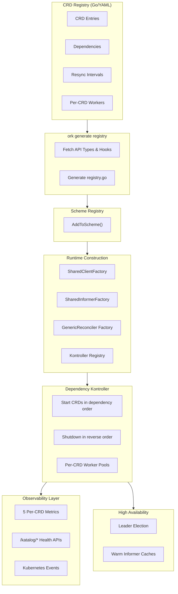
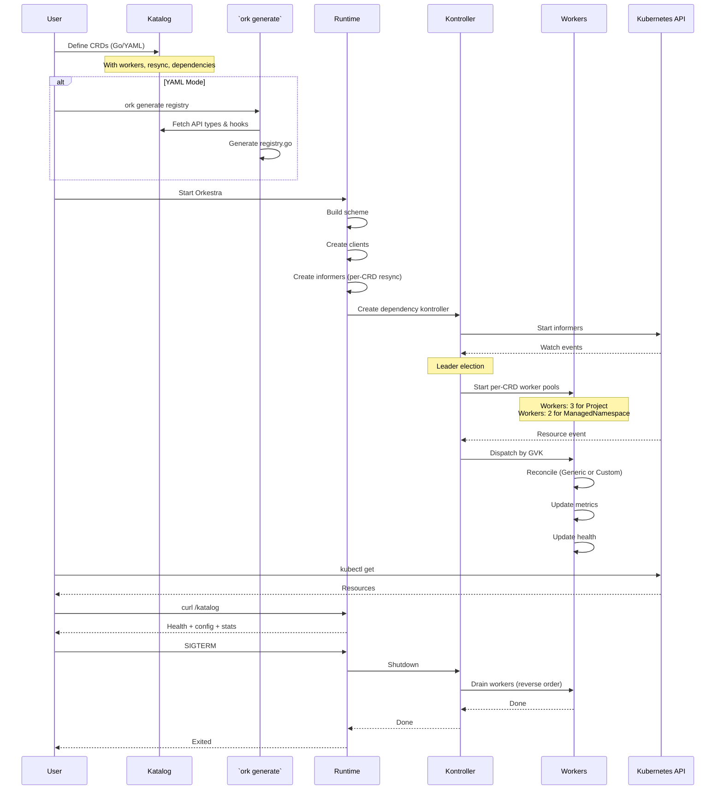

# **Architectural Deep Dive (New Edition)**  
### *A Runtime‑Composable, Multi‑CRD Kubernetes Operator Framework*

This document provides a complete, modern overview of the internal architecture of Orkestra — a runtime‑composable, multi‑CRD Kubernetes operator framework. It explains how CRDs are loaded (Go or YAML), how dependency graphs shape kontroller lifecycle, how informers and clients are generated dynamically, how the GenericReconciler with hooks eliminates boilerplate, and how Orkestra achieves high availability, observability, and zero‑code extensibility.

This is not a traditional operator.  
It is a **universal operator runtime**.

---

# **Core Design Principles**

The framework is built on five foundational ideas:

### **1. CRDs Are Data, Not Code**
CRDs are defined declaratively (Go or YAML).  
Orkestra runtime constructs everything else dynamically.

### **2. Runtime Composition**
Clients, informers, reconcilers, workers, and resync intervals are all created at runtime based on registry entries.

### **3. Dependency‑Aware Lifecycle**
CRDs declare dependencies.  
Orkestra starts and stops them in topological order.

### **4. Zero‑Code by Default, Hooks When Needed**
The `GenericReconciler` provides a full reconciler with **zero Go code**.  
When custom logic is required, implement **only the hooks you need**.

### **5. Remote Everything**
API types and hooks can live in separate repositories. Orkestra fetches them at generation time.

---

# **High‑Level Architecture**



---

# **1. CRD Registry (Go Mode + YAML Mode)**

The CRD Registry is the **source of truth** for all CRDs Orkestra manages.

It supports two modes:

---

## **Go Mode (Typed, Default)**

CRDs are defined in Go with full type safety:

```go
{
    Name:       "project",
    Object:     &projectv1.Project{},
    ListObject: &projectv1.ProjectList{},
    Group:      projectv1.Group,
    Version:    projectv1.Version,
    Kind:       projectv1.Kind,
    Plural:     projectv1.NamePlural,
    Workers:    3,
    Resync:     10 * time.Minute,
    Scheme:     projectv1.AddToScheme,
    ReconcilerConfig: reconciler.Config{
        Default: true,  // Zero‑code reconciler
    },
}
```

### Benefits
- Full type safety  
- No manual scheme registration  
- IDE autocompletion  
- Compile‑time validation  

---

## **YAML Mode (Dynamic)**

CRDs are loaded from a YAML file (local or remote URL):

```yaml
crds:
  - name: project
    enabled: true
    group: platform.orkestra.io
    version: v1alpha1
    kind: Project
    plural: projects
    workers: 3
    resync: 10m
    dependsOn: []
    
    apiTypes:
      location: github.com/yourorg/your-api/types/project/v1alpha1
    
    reconciler:
      default: true  # Zero code required!
```

### Benefits
- No recompilation  
- GitOps‑friendly  
- Multi‑cluster orchestration  
- Canary rollouts  
- Partner integrations  
- Easy to enable/disable CRDs without code changes  

---

# **2. The `ork generate registry` Command**

This is the **magic step** that makes YAML mode possible:

```bash
ork generate registry --katalog initialize/crd-katalog.yaml
```

**What it does:**
1. Reads all enabled CRDs from the Katalog
2. For each CRD with `apiTypes.location`, runs `go get` to fetch the package
3. For each CRD with `hooks.location`, runs `go get` to fetch the hooks
4. Generates `initialize/registry.go` containing:
   - `RegisterRuntimeObjects()` – object factories for all CRDs
   - `RegisterScheme()` – scheme registration for all CRDs
5. Wires everything together

**If `go mod tidy` is needed, run it once. Done.**

This means API types and hooks can live in **completely separate repositories**, versioned independently, and Orkestra consumes them as first‑class Go modules.

---

# **3. Dependency Graph**

Each CRD may declare dependencies:

```yaml
dependsOn: ["project", "managednamespace"]
```

The framework builds a **directed acyclic graph (DAG)** and validates:

- No cycles  
- All dependencies exist  
- No self‑dependencies  

### Why this matters
- CRDs start in correct order  
- Shutdown happens in reverse order  
- Reconcilers never run before their prerequisites  
- Multi‑CRD operators behave predictably  

---

# **4. Dynamic Resync Per CRD**

Each CRD can define its own resync interval:

```yaml
resync: 10m
```

If omitted, Orkestra uses the global default.

### What this enables
- High‑frequency reconciliation for volatile CRDs  
- Low‑frequency reconciliation for stable CRDs  
- Environment‑specific tuning (dev vs prod)  
- Fine‑grained performance control  

Logs clearly show the behavior:

```
processing informer for Project with resync duration: 10m0s
processing informer for ManagedNamespace with default resync duration: 30s
```

---

# **5. Per‑CRD Worker Pools**

Each CRD defines its own concurrency:

```yaml
workers: 5
```

Workers are isolated per GVK:

- No CRD starves another  
- No CRD overloads the queue  
- High‑throughput CRDs scale independently  

**Worker counts are live‑visible** in metrics and the Katalog API:

```json
{
  "workers": 3,
  "workersSource": "configured",
  "workersActive": 3
}
```

The `workersSource` field tells operators whether the value came from the Katalog or a default — zero configuration mystery.

---

# **6. Scheme Registry**

The Scheme Registry builds the runtime scheme:

- In Go mode: **automatic** from CRD definitions  
- In YAML mode: calls generated `RegisterScheme()` from `ork generate`

This ensures:
- REST clients know how to encode/decode CRDs  
- Informers can deserialize objects  
- Events and status updates work correctly  

---

# **7. SharedClientFactory**

A generic factory that creates REST clients for **any CRD**:

```go
client, err := kube.NewClient(listObject, kubeclient.CRDInfo{
    Kind:       crd.APITypes.Kind,
    Group:      crd.APITypes.Group,
    Version:    crd.APITypes.Version,
    APIPath:    crd.APITypes.APIPath,
    Plural:     crd.APITypes.Plural,
    Namespace:  crd.Namespace,
    Namespaced: crd.Namespaced,
})
```

- Uses CRD metadata (group, version, plural, API path)  
- Configures serializers from the scheme  
- Produces typed clients for any CRD  

This is the foundation for dynamic CRD support.

---

# **8. SharedInformerFactory**

The heart of the framework. For each CRD, it:

1. Creates a ListWatch using the client provider  
2. Builds a SharedIndexInformer  
3. Applies the CRD's **per‑CRD resync** interval  
4. Registers event handlers that enqueue with GVK  
5. Caches informers for reuse  
6. Starts all informers when `Start()` is called  

```go
infFactory := informer.SharedInformerFactory(
    provider,
    queueRegistry,
    defaultWq,
    scheme,
    namespace,
    defaultResync,
)

inf := infFactory.For(object, ctx, informer.Options{
    Resync: crd.Resync,  // Per‑CRD resync!
    Wq:     perCRDQueue, // Per‑CRD or shared queue
})
```

**This eliminates all informer boilerplate.**

---

# **9. Kontroller Registry**

At runtime, the framework registers:

- The informer  
- The reconciler factory  
- The CRD metadata  

Mapped by GVK:

```go
ktrlRegistry := kontroller.NewKontrollerRegistry()
ktrlRegistry.Register(gvk, crd, inf, reconcilerFactory)
```

This allows Orkestra to dispatch events dynamically:

```go
reconciler := registry.GetReconciler(item.GVK)
if reconciler != nil {
    reconciler.Reconcile(ctx, item.Key)
}
```

---

# **10. The GenericReconciler – Zero‑Code by Default**

The `GenericReconciler` is the **crown jewel** of Orkestra's zero‑boilerplate design.

```go
type GenericReconciler[T domain.Object] struct {
    informer cache.SharedIndexInformer
    event    *event.Event
    kube     *kubeclient.Kubeclient
    hooks    domain.ReconcileHooks[T]
    crd      CRDInfo
}
```

**Features provided automatically:**

| Feature | Implementation |
|---------|---------------|
| **Cache reads** | From informer store (zero API cost) |
| **Type safety** | Generic type parameter + factory |
| **Deep copies** | Never mutates cached objects |
| **Finalizers** | Auto‑add/remove based on CRD config |
| **Events** | Emitted for all major operations |
| **Deletion handling** | Calls `OnDelete` hook if provided |
| **NotFound handling** | Calls `OnNotFound` hook if provided |
| **Metrics** | All 5 metrics recorded automatically |
| **Health tracking** | Updates per‑CRD health state |

**All hooks are optional** – implement only what you need.

---

## **Three Levels of Reconciler Involvement**

### 🟢 **Level 1: Zero‑Code (reconciler.default: true)**
```yaml
reconciler:
  default: true
```
- Full reconciler provided by `GenericReconciler`
- Includes finalizers, events, metrics, health tracking
- **No Go code required!**

### 🟡 **Level 2: Hook‑Based**
```yaml
reconciler:
  default: true
  hooks:
    location: github.com/yourorg/your-hooks
    package: hooks.ProjectHooks
```
Implement only the hooks you need:

```go
func ProjectHooks() domain.ReconcileHooks[domain.Object] {
    return domain.ReconcileHooks[domain.Object]{
        OnReconcile: func(ctx context.Context, obj domain.Object) error {
            project := obj.(*projectv1.Project)  // Type-safe after assertion
            // Your business logic here
            return nil
        },
        OnDelete: func(ctx context.Context, obj domain.Object) error {
            project := obj.(*projectv1.Project)
            // Cleanup external resources
            return nil
        },
        // OnNotFound is optional – skip if not needed
    }
}
```

### 🔴 **Level 3: Full Custom**
```yaml
reconciler:
  default: false
  constructor: "reconciler.NewCustomReconciler"
```
Implement the entire `domain.Reconciler` interface for complete control.

---

# **11. Dependency‑Aware Kontroller**

Orkestra is no longer a simple loop.  
It is a **dependency‑aware orchestrator**.

### Startup Sequence
1. Compute topological order from dependency graph
2. For each CRD in order:
   - Create worker pool (`workers` from Katalog)
   - Start informer (already running via factory)
   - Wait for cache sync
   - Signal readiness to dependents

### Worker Pools
Each CRD has its own isolated worker pool with:
- Configurable size (`workers`)
- Metrics (`controller_workers_active`)
- Health tracking

### Dispatch Logic
```go
func (c *DependencyKontroller) processNextItem(ctx context.Context) bool {
    item, shutdown := c.queue.Get()
    if shutdown {
        return false
    }
    defer c.queue.Done(item)

    reconciler := c.registry.GetReconciler(item.GVK)
    if reconciler == nil {
        c.queue.Forget(item)
        return true
    }

    // safeReconcile wraps the actual reconcile with:
    // - panic recovery
    // - metrics recording
    // - health state updates
    if err := c.safeReconcile(ctx, reconciler, item); err != nil {
        c.queue.AddRateLimited(item)
        return true
    }

    c.queue.Forget(item)
    return true
}
```

### Shutdown
- Stops accepting new items
- Drains workers in reverse dependency order
- Waits for in‑flight reconciliations
- Releases leader lease

---

# **12. Observability Layer**

## **Prometheus Metrics**

Five production‑grade metrics, all per‑CRD:

| Metric | Type | Description |
|--------|------|-------------|
| `controller_resource_count` | Gauge | Live CR count from informer cache (zero API cost) |
| `controller_reconcile_total` | Counter | Success/error outcomes per CRD |
| `controller_reconcile_duration_seconds` | Histogram | Reconciliation latency per CRD |
| `controller_queue_depth` | Gauge | Current queue backlog per CRD |
| `controller_workers_active` | Gauge | Active worker count per CRD |

All metrics use the full GVK string as the `crd` label — consistent and unambiguous.

## **Katalog Health API**

Auto‑generated HTTP endpoints for every enabled CRD:

| Endpoint | Purpose |
|----------|---------|
| `/katalog` | All CRDs + dependency graph + health summary |
| `/katalog/{crd}` | CRD config + live reconcile stats |
| `/katalog/{crd}/health` | 200 healthy \| 503 degraded |

Each endpoint exposes:
- `healthy` — current health state
- `totalReconciles` — cumulative reconcile count
- `errorRate` — failed / total
- `consecutiveFails` — current failure streak
- `lastError` — last error message
- `workers` / `workersSource` — resolved worker count with config source
- `resync` / `resyncSource` — resolved resync with config source
- `resourceCount` — live CR count from informer cache

**Source tracking** (`workersSource`, `resyncSource`) tells operators whether a value came from the Katalog or a default — zero configuration mystery.

---

# **13. High Availability Model**

The framework uses Kubernetes leader election:

- **All pods** run informers (warm caches)  
- **Only leader** runs workers  
- **Instant failover** – followers already have synced caches  
- **Lease released** on graceful shutdown  
- **Events emitted** for leadership transitions  

```go
leader := leader.NewKonductorElection(
    kube,
    ev,
    func(ctx context.Context) { ktrl.Run(ctx) },
    leader.Options{
        Namespace:     cfg.Cluster().Namespace,
        LeaseDuration: cfg.Leader().LeaseDuration,
        RenewDeadline: cfg.Leader().RenewDeadline,
        RetryPeriod:   cfg.Leader().RetryPeriod,
    })
```

---

# **14. Graceful Shutdown**

On SIGTERM or leadership loss:

1. Stop accepting new items  
2. Drain workers in **reverse dependency order**  
3. Shutdown informers  
4. Release leader lease  
5. Exit cleanly  

**Shutdown order (reverse of startup):**
```
managednamespace (depends on project)
project (root dependency)
```

No partial reconciliations.  
No double processing.  
No orphaned resources.

---

# **15. Why This Architecture Works**

This architecture gives you:

| Feature | How It's Achieved |
|---------|------------------|
| **Multi‑CRD support** | Dynamic registries + GVK dispatch |
| **Zero‑code reconcilers** | GenericReconciler with hooks |
| **Dependency ordering** | DAG + dependency kontroller |
| **Per‑CRD tuning** | Workers + resync per CRD |
| **Remote API types** | `apiTypes.location` fetched at generation |
| **Remote hooks** | `hooks.location` fetched at generation |
| **GitOps** | YAML + remote URLs |
| **HA** | Leader election + warm caches |
| **Observability** | 5 metrics + Katalog API + events |
| **Extensibility** | CRDs are data, not code |

---

# **The Complete Flow**



---

# **What 50 Lines of Code Gets You**

When you add a new CRD to Orkestra, you write:

| Component | Lines of Code |
|-----------|---------------|
| API types | ~30 (generated) |
| Optional hooks | ~20 (your logic) |
| Katalog entry | ~10 (Go or YAML) |
| **Total** | **~60 lines** |

**What Orkestra generates for you:**

| Generated Component | Lines |
|--------------------|-------|
| Clients | 120+ |
| Informers | 100+ |
| Worker pools | 50+ |
| Finalizer logic | 80+ |
| Event emission | 40+ |
| Metrics | 60+ |
| Health APIs | 70+ |
| **Total** | **~520 lines** |

**You write ~60 lines. Orkestra generates ~520 lines of runtime behavior.**

That's the power of a **universal operator runtime**.

---

# **Conclusion**

This framework is no longer just a controller.  
It is a **runtime‑composable operator platform** that:

- Loads CRDs dynamically from Go or YAML  
- Fetches API types and hooks from remote repositories  
- Builds clients and informers automatically  
- Orchestrates CRDs through dependency graphs  
- Provides zero‑code reconcilers with optional hooks  
- Supports per‑CRD workers and resync intervals  
- Runs with high availability  
- Offers deep observability (metrics + health APIs)  
- Requires **zero boilerplate**

**Adding a new CRD is now:**

1. Write API types (controller-gen)
2. Write optional hooks (your business logic)
3. Add Katalog entry (Go or YAML)
4. Run `ork generate registry` (YAML mode only)
5. Done!

**Everything else — clients, informers, workers, finalizers, events, metrics, health, lifecycle — is handled by the runtime.** 🚀