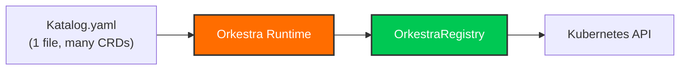
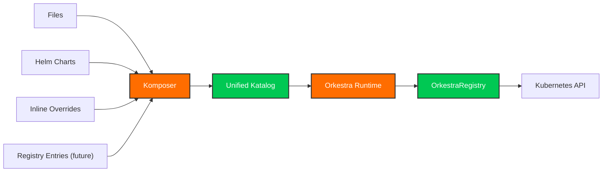
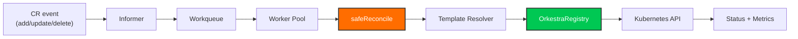
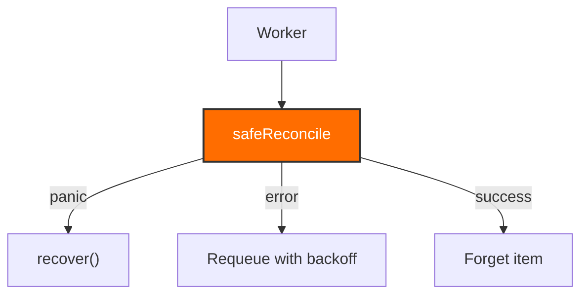
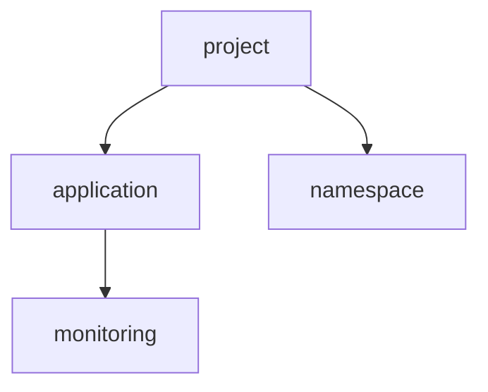
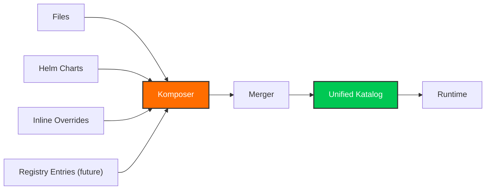
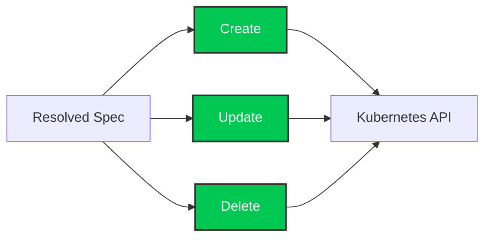
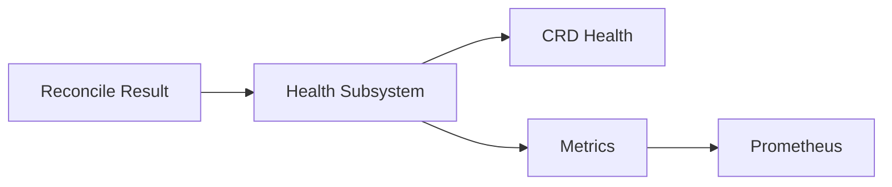
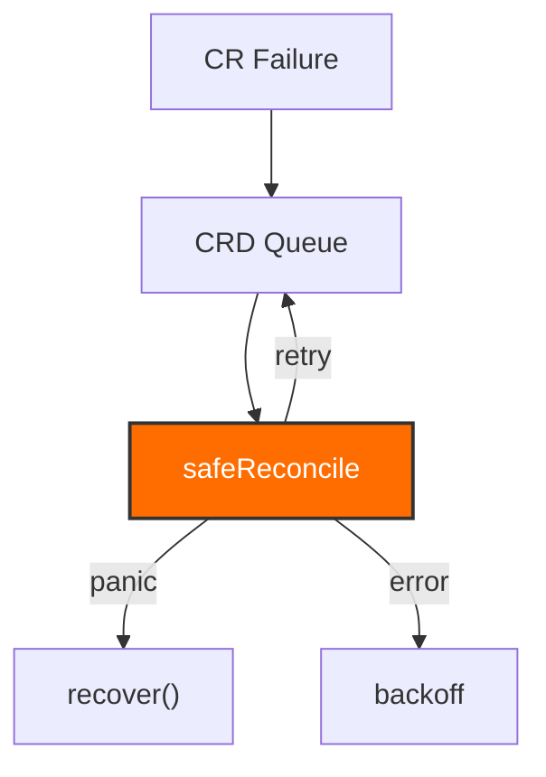
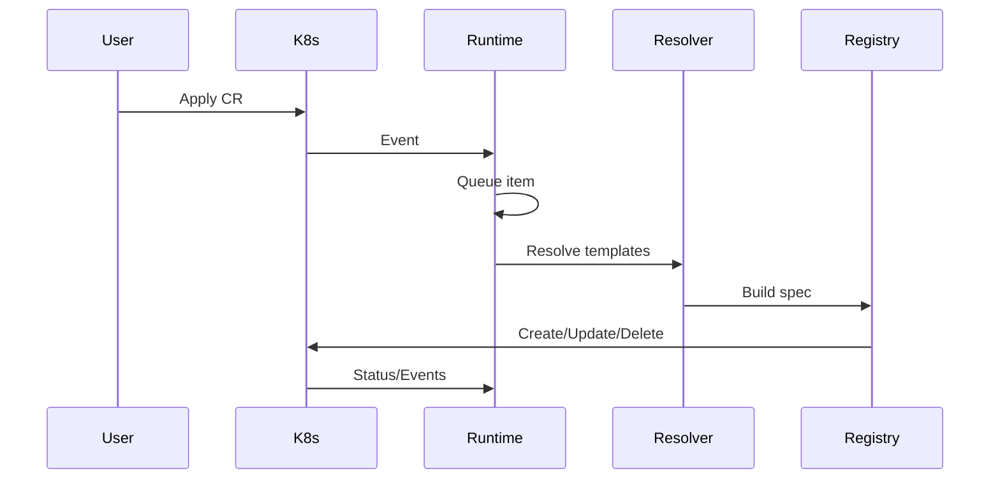

# Orkestra Architecture Diagrams 
### A visual guide to the internal components of the Orkestra runtime

This document provides a complete, visual overview of how Orkestra works internally.  
It complements the [Architecture](./architecture.md), [Trust Model, and Failure Modes](./trust-and-failure-model.md) documents by showing  
**how the pieces fit together**.

---

## 1. High‑Level Architecture (Two Modes)

Orkestra supports two ways to supply operator definitions:

---

### 1A. Direct Katalog → Runtime (simple mode)

This is the simplest and most common mode.

---

### 1B. Komposer → Unified Katalog → Runtime (multi‑source mode)

**Komposer is a build step, not part of the runtime.**  
It produces a single Katalog that the runtime consumes.

---

## 2. Reconcile Loop (per CRD)**

**Key properties:**

- Each CRD has its own queue  
- Each CRD has its own workers  
- `safeReconcile` isolates panics  
- Registry operations are idempotent  

---

## **3. safeReconcile — Fault Isolation**

**Guarantee:**  
A panic in one CR **cannot** crash the worker or the runtime.

---

## 4. Dependency Engine

**Rules:**

- Dependencies must be healthy before dependents start  
- Missing dependencies retry in background  
- Healthy CRDs never block  

---

## 5. Komposer Merge Pipeline (multi‑source mode)

**Features:**

- Deduplication  
- Override rules  
- Environment‑specific layering  
- Version pinning  

---

## 6. Template Resolution

**Resolver responsibilities:**

- Evaluate `{{ .spec.* }}`  
- Apply defaults  
- Enforce namespace rules  
- Resolve labels, slices, maps  

---

## 7. OrkestraRegistry Flow

**Registry guarantees:**

- Idempotent  
- Safe to retry  
- Safe to reapply  
- Owner references always set  

---

## 8. Health & Metrics Pipeline

Metrics include:

- reconcile duration  
- reconcile count  
- queue depth  
- worker activity  
- CRD activation latency  

---

## 9. Failure Containment Model

**Isolation boundaries:**

- CR-level  
- CRD-level  
- Worker-level  
- Runtime-level  

---

## 10. End-to-End Flow

---

## Summary

This document provides a complete visual map of:

- the two supported input modes (Katalog vs Komposer)  
- the reconcile loop  
- the dependency engine  
- the Komposer pipeline  
- the registry  
- the resolver  
- the health subsystem  
- the failure isolation model  

It is the **single most important reference** for understanding Orkestra’s internals.

**Whats Next?**
  - [Trust and Failure Model](../trust-and-failure-model.md)