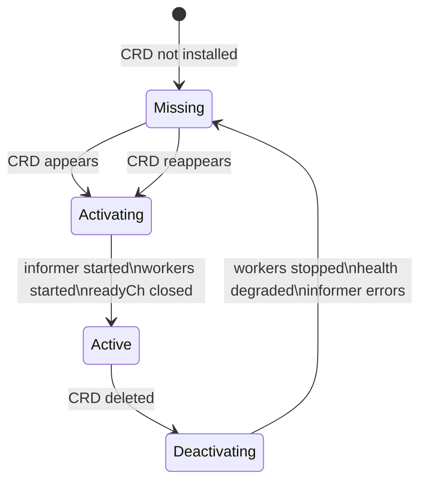

# CRD Lifecycle in Orkestra
How Orkestra activates, deactivates, and reactivates CRDs — automatically and safely.

This document complements the [Runtime Flow](./runtime-flow.md) by explaining how Orkestra manages CRDs over time.

---

## 1. Lifecycle Overview



---

## 2. Missing → Activating

A CRD is **Missing** when:

- it is declared in the Katalog  
- but not installed on the cluster  

The retry loop checks for missing CRDs using:

```
utils.WaitForCRD()
```

When the CRD appears:

- informer starts  
- workers start  
- readyCh closes  
- dependents unblock  
- health flips to “started”  

---

## 3. Active → Deactivating

A CRD becomes **Deactivating** when:

- the CRD is deleted from the cluster  
- the informer reflector begins logging 404 errors  

Orkestra:

- stops workers  
- drains in‑flight reconciles  
- marks CRD as missing  
- health flips to degraded  
- informer continues running (reflector errors expected)  

---

## 4. Deactivating → Missing

Once workers stop:

- the CRD returns to the Missing state  
- retry loop will attempt activation again  

---

## 5. Missing → Activating (Reactivation)

When the CRD is reinstalled:

- informer resumes  
- workers restart  
- readyCh is already closed (safe)  
- dependents become healthy again  

This is how Orkestra achieves **self‑healing**.

---

## What’s Next?

Learn *why* Orkestra is designed this way in the **Design Philosophy**.

👉 [Design Philosophy →](./design-philosophy.md)