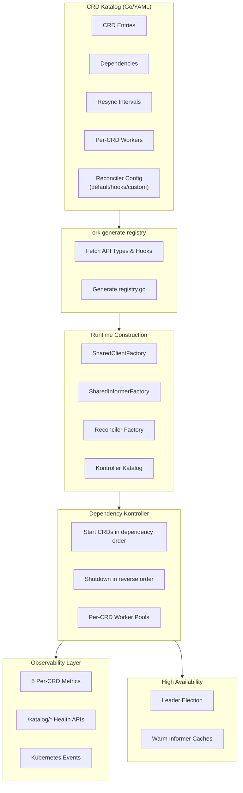
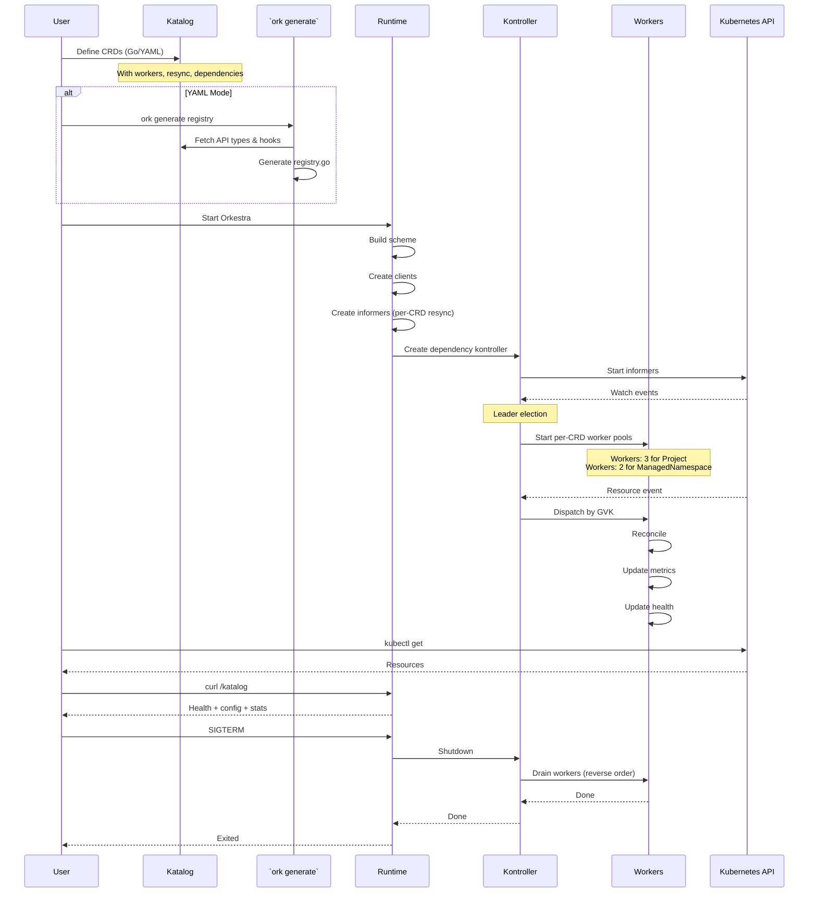

# **Komponent Deep Dive**  
### *Inside the Runtime‑Composable, Dependency‑Aware Multi‑CRD Kontroller Framework*

This document provides a detailed breakdown of every major komponent in the Multi‑CRD Kontroller Framework. It explains how each subsystem contributes to a **dynamic, dependency‑aware, zero‑boilerplate operator runtime** capable of managing any number of CRDs through Go or YAML configuration.

---

# **Architecture Overview**

The framework is built around **runtime composition**. CRDs are defined as data (Go or YAML), and the runtime constructs:

- clients  
- informers  
- reconcilers (generic, hook‑based, or custom)  
- per‑CRD worker pools  
- dependency graph  
- lifecycle orchestration  

…all dynamically.

Here's the high‑level flow:



---

# **Komponent Index**

| Komponent | Package | Responsibility |
|----------|----------|----------------|
| [1. Configuration](#1-configuration) | `pkg/config` | Loads env + YAML Katalog mode |
| [2. Health Server](#2-health-server) | `pkg/health` | Liveness/readiness + Katalog API |
| [3. KubeClient](#3-kubeclient) | `pkg/kubeclient` | Generic client + SharedClientFactory |
| [4. Workqueue](#4-workqueue) | `pkg/queue` | Per‑CRD queues + GVK routing |
| [5. Event Recorder](#5-event-recorder) | `pkg/event` | Kubernetes events |
| [6. Katalog](#6-katalog) | `pkg/katalog` | CRD definitions (Go/YAML) |
| [7. Scheme Registry](#7-scheme-registry) | `pkg/katalog` | Builds runtime scheme |
| [8. Dependency Graph](#8-dependency-graph) | `pkg/katalog` | DAG validation + ordering |
| [9. Client Provider](#9-client-provider) | `pkg/kubeclient` | Creates CRD clients |
| [10. SharedInformerFactory](#10-sharedinformerfactory) | `pkg/informer` | Auto‑creates informers with per‑CRD resync |
| [11. Kontroller Katalog](#11-kontroller-katalog) | `pkg/kontroller` | Maps GVK → runtime komponent |
| [12. Reconcilers](#12-reconcilers) | `pkg/reconciler` | Business logic (generic, hooks, custom) |
| [13. GenericReconciler](#13-genericreconciler) | `pkg/reconciler` | Zero‑code reconciler with hooks |
| [14. Dependency‑Aware Kontroller](#14-dependency-aware-kontroller) | `pkg/kontroller` | Per‑CRD workers + dispatch |
| [15. Leader Election](#15-leader-election) | `pkg/leader` | HA model |
| [16. Manager](#16-manager) | `pkg/manager` | Orchestrates lifecycle |

---

# 1. **Configuration**

Supports two modes with environment‑based switching:

### **Go Mode** (default)
- Uses built‑in katalog  
- Full type safety  
- No generation required  

### **YAML Mode**
```bash
export KATALOG_MODE=YAML
export KATALOG_PATH=initialize/crd-katalog.yaml   # local or remote URL
```

- Loads CRDs from local or remote YAML  
- Requires `ork generate registry` once  
- Supports:
  - dependencies  
  - per‑CRD workers  
  - per‑CRD resync intervals  
  - namespaced/cluster‑scoped  
  - plural names  
  - remote API type locations  
  - remote hook locations  

---

# 2. **Health Server**

Provides both standard Kubernetes probes and the **Katalog API**:

| Endpoint | Purpose |
|----------|---------|
| `/health` | Liveness probe (200 when running) |
| `/ready` | Readiness probe (200 after all components ready) |
| `/metrics` | Prometheus metrics endpoint |
| `/katalog` | All CRDs + dependency graph + health summary |
| `/katalog/{crd}` | CRD config + live reconcile stats |
| `/katalog/{crd}/health` | 200 healthy \| 503 degraded |

**Features:**
- Silent in production (no log spam)
- First to start, last to stop
- Per‑CRD health tracking with source visibility (`workersSource`, `resyncSource`)

---

# 3. **KubeClient**

A generic Kubernetes client that powers all CRD operations:

```go
kube := kubeclient.NewKubeclient(kubeclient.Config{
    Kubeconfig: cfg.Cluster().KubekonfigPath,
    Masterurl:  cfg.Cluster().MasterURL,
    Scheme:     scheme,
})
```

**Capabilities:**
- `RESTClient()` – configured with complete scheme
- `DynamicClient()` – for unstructured operations
- `Clientset()` – for built‑in types
- `SharedClientFactory()` – generates clients for any CRD on demand
- `RuntimeParameterCodec()` – consistent query encoding
- `PatchFinalizers()` – helper for finalizer management

**CRD‑agnostic** – works for any CRD defined at runtime.

---

# 4. **Workqueue & Queue Registry**

Per‑CRD queues with a shared fallback:

```go
queueRegistry := queue.NewQueueRegistry()
wq := queueRegistry.Register(gvk, maxQueueDepth)
```

**Features:**
- Exponential backoff
- Key deduplication
- Shutdown‑aware draining
- Per‑GVK metrics (`controller_queue_depth`)
- `queue.default: true` uses shared queue
- `queue.default: false` uses dedicated per‑CRD queue

**Queue item structure:**
```go
type QueueItem struct {
    Key string        // namespace/name
    GVK string        // GroupVersionKind for dispatch
}
```

---

# 5. **Event Recorder**

Broadcasts Kubernetes events for controller visibility:

```go
ev := event.NewEvent(kube)
```

**Usage:**
- Leader election emits leadership events
- Reconcilers emit resource events (`kubectl describe`)
- Finalizer operations emit status events
- Appears in `kubectl get events --watch`

---

# 6. **Katalog**

The **source of truth** for all CRDs. Supports two modes:

### **Go Mode** (static)
CRDs defined in `initialize/crd-katalog.go` with full type safety.

### **YAML Mode** (dynamic)
CRDs defined in YAML with remote type fetching:

```yaml
crds:
  - name: project
    enabled: true
    group: platform.orkestra.io
    version: v1alpha1
    kind: Project
    plural: projects
    workers: 3
    resync: 10m
    dependsOn: []
    
    apiTypes:
      location: github.com/ialexeze/orkestra/example-crds/api/types/project/v1alpha1
    
    reconciler:
      default: true  # Zero code!
```

**Each CRD entry includes:**
- `enabled` – runtime switch (disabled CRDs are ignored)
- `workers` – concurrency per CRD
- `resync` – reconcile frequency
- `dependsOn` – startup/shutdown dependencies
- `apiTypes.location` – Go package path for API types
- `reconciler` – default, hooks, or custom

---

# 7. **Scheme Registry**

Builds the runtime scheme from the Katalog:

```go
scheme, err := katalog.NewSchemeRegistry(crdKatalog)
```

**Process:**
1. Creates new runtime scheme
2. Adds Kubernetes core types
3. For each enabled CRD:
   - In Go mode: uses built‑in `AddToScheme`
   - In YAML mode: calls generated `RegisterScheme()` from `ork generate`

---

# 8. **Dependency Graph**

CRDs declare dependencies:

```yaml
dependsOn: ["project", "managednamespace"]
```

The framework builds a DAG and:

- validates all dependencies exist
- detects cycles
- computes topological order
- provides startup/shutdown sequences

Used by the Dependency Kontroller to orchestrate CRD lifecycle.

---

# 9. **Client Provider**

Maps CRD types → client factories:

```go
provider := kube.ClientProvider()
provider.Register(object, func(k *kubeclient.Kubeclient) (informer.GenericClient, error) {
    return k.NewClient(list, crdInfo)
})
```

Used by SharedInformerFactory to create ListWatch clients dynamically.

---

# 10. **SharedInformerFactory**

The heart of the framework. For each CRD, it:

- creates a ListWatch using the client provider
- builds a SharedIndexInformer
- applies **per‑CRD resync** interval
- registers event handlers that enqueue with GVK
- caches informers for reuse
- starts all informers when `Start()` is called

```go
infFactory := informer.SharedInformerFactory(
    provider,
    queueRegistry,
    defaultWq,
    scheme,
    namespace,
    defaultResync,
)

inf := infFactory.For(object, ctx, informer.Options{
    Resync: crd.Resync,  // Per‑CRD resync!
    Wq:     perCRDQueue, // Per‑CRD queue!
})
```

**This eliminates all informer boilerplate.**

---

# 11. **Kontroller Katalog**

Runtime registry that maps:

- GVK → informer instance
- GVK → reconciler factory
- GVK → CRD metadata

```go
ktrlRegistry := kontroller.NewKontrollerRegistry()
ktrlRegistry.Register(gvk, crd, inf, reconcilerFactory)
```

Used by the Dependency Kontroller to dispatch events and manage workers.

---

# 12. **Reconcilers**

Three levels of reconciler implementation:

### 🟢 **Level 1: Zero‑Code (reconciler.default: true)**
```yaml
reconciler:
  default: true
```
- Full reconciler provided by `GenericReconciler`
- Includes finalizers, events, metrics, health tracking
- **No Go code required!**

### 🟡 **Level 2: Hook‑Based**
```yaml
reconciler:
  default: true
  hooks:
    location: github.com/yourorg/your-hooks
    package: hooks.ProjectHooks
```
Implement only the hooks you need:

```go
func ProjectHooks() domain.ReconcileHooks[domain.Object] {
    return domain.ReconcileHooks[domain.Object]{
        OnReconcile: func(ctx context.Context, obj domain.Object) error {
            // Your business logic
            return nil
        },
        OnDelete: func(ctx context.Context, obj domain.Object) error {
            // Cleanup external resources
            return nil
        },
        // OnNotFound is optional
    }
}
```

### 🔴 **Level 3: Full Custom**
```yaml
reconciler:
  default: false
  constructor: "reconciler.NewCustomReconciler"
```
Implement the entire `domain.Reconciler` interface for complete control.

---

# 13. **GenericReconciler**

The **zero‑code reconciler** that powers Level 1 and Level 2:

```go
type GenericReconciler[T domain.Object] struct {
    informer cache.SharedIndexInformer
    event    *event.Event
    kube     *kubeclient.Kubeclient
    hooks    domain.ReconcileHooks[T]
    crd      CRDInfo
}
```

**Features provided automatically:**

| Feature | Implementation |
|---------|---------------|
| **Cache reads** | From informer store (zero API cost) |
| **Type safety** | Generic type parameter + factory |
| **Deep copies** | Never mutates cached objects |
| **Finalizers** | Auto‑add/remove based on CRD config |
| **Events** | Emitted for all major operations |
| **Deletion handling** | Calls `OnDelete` hook if provided |
| **NotFound handling** | Calls `OnNotFound` hook if provided |
| **Metrics** | All 5 metrics recorded automatically |
| **Health tracking** | Updates per‑CRD health state |

**All hooks are optional** – implement only what you need.

---

# 14. **Dependency‑Aware Kontroller**

This is the upgraded kontroller model that orchestrates all CRDs.

### **Startup Sequence**
1. Compute topological order from dependency graph
2. For each CRD in order:
   - Create worker pool (`workers` from Katalog)
   - Start informer (already running via factory)
   - Wait for cache sync
   - Signal readiness to dependents

### **Worker Pools**
Each CRD has its own isolated worker pool:

```yaml
workers: 5  # 5 dedicated workers for this CRD
```

### **Resync Intervals**
Each CRD has its own resync:

```yaml
resync: 10m  # Reconcile every 10 minutes
```

### **Dispatch Logic**
```go
func (c *DependencyKontroller) processNextItem(ctx context.Context) bool {
    item, shutdown := c.queue.Get()
    if shutdown {
        return false
    }
    defer c.queue.Done(item)

    reconciler := c.registry.GetReconciler(item.GVK)
    if reconciler == nil {
        c.queue.Forget(item)
        return true
    }

    if err := reconciler.Reconcile(ctx, item.Key); err != nil {
        c.queue.AddRateLimited(item)
        return true
    }

    c.queue.Forget(item)
    return true
}
```

### **Shutdown**
- Stops accepting new items
- Drains workers per CRD
- Shuts down CRDs in reverse dependency order
- Waits for in‑flight reconciliations

---

# 15. **Leader Election**

Ensures only one instance runs workers:

- **All pods** run informers (warm caches)
- **Only leader** runs workers
- **Instant failover** – followers already have synced caches
- **Lease released** on graceful shutdown
- **Events emitted** for leadership transitions

```go
leader := leader.NewKonductorElection(
    kube,
    ev,
    func(ctx context.Context) { ktrl.Run(ctx) },
    leader.Options{
        Namespace:     cfg.Cluster().Namespace,
        LeaseDuration: cfg.Leader().LeaseDuration,
        RenewDeadline: cfg.Leader().RenewDeadline,
        RetryPeriod:   cfg.Leader().RetryPeriod,
    })
```

---

# 16. **Manager**

The orchestrator that brings everything together:

```go
o := ork.NewOrkestra(cfg.Cluster().DefaultResync, cfg.App().LogLevel)
o.Register(komponents)
o.Start(ctx)
o.Wait()
```

**Responsibilities:**
- Registers all komponents (health, kube, queues, factory, kontroller, leader)
- Starts them in correct dependency order
- Runs post‑start hooks (leader election)
- Marks health server ready when all komponents running
- Handles graceful shutdown on SIGINT/SIGTERM
- Shuts down in **reverse order** (leader election first!)

**Shutdown order:**
```
1. Kontroller (stops workers, drains queues)
2. SharedInformerFactory (stops informers)
3. Queues
4. Event Recorder
5. KubeClient
6. Health Server (last)
```

---

# **What This Architecture Enables**

| Feature | How It's Achieved |
|---------|------------------|
| **Multi‑CRD support** | Dynamic registries + GVK dispatch |
| **Zero boilerplate** | Auto‑generated clients/informers |
| **Zero‑code reconcilers** | GenericReconciler with hooks |
| **Dependency ordering** | DAG + dependency kontroller |
| **Per‑CRD tuning** | Workers + resync per CRD |
| **YAML mode** | Remote/local katalog + `ork generate` |
| **Remote API types** | `apiTypes.location` fetched at generation |
| **Remote hooks** | `hooks.location` fetched at generation |
| **GitOps** | YAML + remote URLs |
| **HA** | Leader election + warm caches |
| **Observability** | 5 metrics + Katalog API + events |
| **Extensibility** | CRDs are data, not code |

---

# **The Complete Flow**



---

# **Conclusion**

This framework is a **runtime‑composable operator platform** that:

- Loads CRDs dynamically from Go or YAML
- Fetches API types and hooks from remote repositories
- Builds clients and informers automatically
- Orchestrates CRDs through dependency graphs
- Supports per‑CRD workers and resync intervals
- Provides zero‑code reconcilers with optional hooks
- Runs with high availability
- Offers deep observability (metrics + health APIs)
- Requires **zero boilerplate**

**Adding a new CRD is now:**

1. Write API types (controller-gen)
2. Write optional hooks (your business logic)
3. Add Katalog entry (Go or YAML)
4. Run `ork generate registry` (YAML mode only)
5. Done!

**Everything else is handled by the runtime.** 🚀