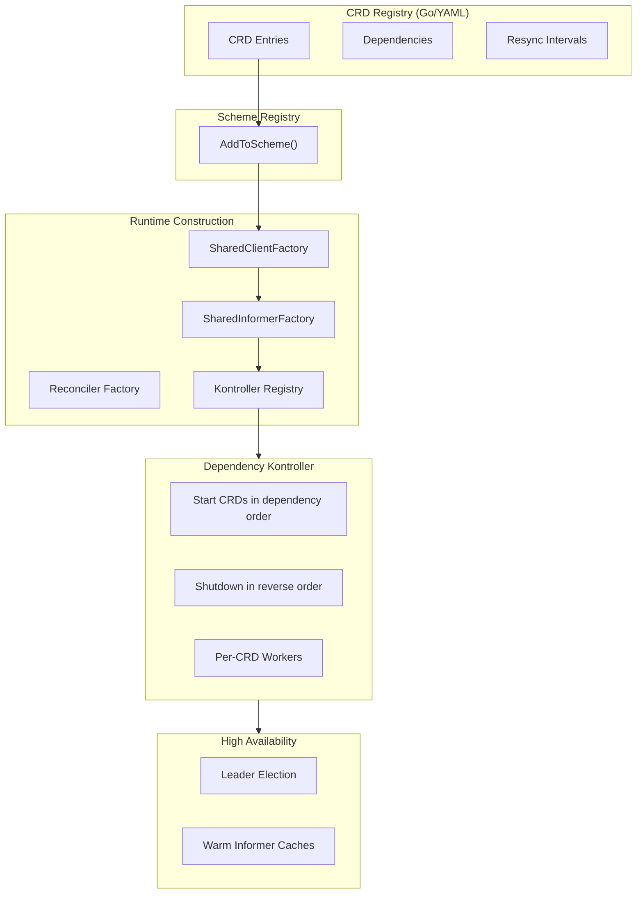

# 🏗️ **Component Deep Dive**  
### *Inside the Runtime‑Composable, Dependency‑Aware Multi‑CRD Kontroller Framework*

This document provides a detailed breakdown of every major component in the Multi‑CRD Kontroller Framework. It explains how each subsystem contributes to a **dynamic, dependency‑aware, zero‑boilerplate operator runtime** capable of managing any number of CRDs through Go or YAML configuration.

---

# 🧩 **Architecture Overview**

The framework is built around **runtime composition**. CRDs are defined as data (Go or YAML), and the runtime constructs:

- clients  
- informers  
- reconcilers  
- workers  
- dependency graph  
- lifecycle Orkestration  

…all dynamically.

Here’s the high‑level flow:



---

# 📋 **Component Index**

| Component | Package | Responsibility |
|----------|----------|----------------|
| [1. Configuration](#1-configuration) | `pkg/config` | Loads env + YAML registry mode |
| [2. Health Server](#2-health-server) | `pkg/health` | Liveness/readiness |
| [3. KubeClient](#3-kubeclient) | `pkg/kubeclient` | Generic client + SharedClientFactory |
| [4. Workqueue](#4-workqueue) | `pkg/queue` | Shared queue with GVK routing |
| [5. Event Recorder](#5-event-recorder) | `pkg/event` | Kubernetes events |
| [6. CRD Registry](#6-crd-registry) | `pkg/registry` | CRD definitions (Go/YAML) |
| [7. Scheme Registry](#7-scheme-registry) | `pkg/registry` | Builds runtime scheme |
| [8. Dependency Graph](#8-dependency-graph) | `pkg/registry` | DAG validation + ordering |
| [9. Client Provider](#9-client-provider) | `pkg/kubeclient` | Creates CRD clients |
| [10. SharedInformerFactory](#10-sharedinformerfactory) | `pkg/informer` | Auto‑creates informers |
| [11. Kontroller Registry](#11-kontroller-registry) | `pkg/kontroller` | Maps GVK → runtime components |
| [12. Reconcilers](#12-reconcilers) | `pkg/reconciler` | Business logic |
| [13. Dependency‑Aware Kontroller](#13-dependency-aware-kontroller) | `pkg/kontroller` | Per‑CRD workers + dispatch |
| [14. Leader Election](#14-leader-election) | `pkg/leader` | HA model |
| [15. Manager](#15-manager) | `pkg/manager` | Orkestrates lifecycle |

---

# 1. **Configuration**

Supports two modes:

### **Go Mode**
- Uses built‑in CRD registry  
- Full type safety  

### **YAML Mode**
- Loads CRDs from local or remote YAML  
- Supports:
  - dependencies  
  - workers  
  - resync intervals  
  - namespaced/cluster‑scoped  
  - plural names  
  - API paths  

Example:

```yaml
crds:
  - name: project
    workers: 3
    resync: 10m
    dependsOn: []
```

---

# 2. **Health Server**

- `/health` – always 200 when running  
- `/ready` – only 200 after all components start  
- Silent in production  
- First to start, last to stop  

---

# 3. **KubeClient**

A generic Kubernetes client with:

- RESTClient  
- DynamicClient  
- Clientset  
- SharedClientFactory  
- RuntimeParameterCodec  

It is CRD‑agnostic — works for any CRD defined at runtime.

---

# 4. **Workqueue**

A shared, rate‑limited queue that carries:

```go
type QueueItem struct {
    Key string
    GVK string
}
```

Features:
- Exponential backoff  
- Deduplication  
- Shutdown‑aware draining  
- Per‑GVK metrics  

---

# 5. **Event Recorder**

Used by:
- leader election  
- reconcilers  
- lifecycle events  

Appears in `kubectl describe`.

---

# 6. **CRD Registry**

The **source of truth** for all CRDs.

Supports:

### **Go Mode**
Static entries in Go.

### **YAML Mode**
Dynamic entries loaded from YAML.

Each entry includes:
- Object + ListObject  
- Group/Version/Kind  
- Plural  
- Namespace  
- Namespaced flag  
- Workers  
- Resync  
- Dependencies  
- Reconciler factory  

---

# 7. **Scheme Registry**

Builds the runtime scheme:

- Adds Kubernetes core types  
- Adds CRD types (Go mode)  
- Adds user‑registered schemes (YAML mode)  

---

# 8. **Dependency Graph**

CRDs may declare:

```yaml
dependsOn: ["project"]
```

The framework builds a DAG and validates:

- no cycles  
- all dependencies exist  
- correct ordering  

Used by the Dependency Kontroller to Orkestrate startup/shutdown.

---

# 9. **Client Provider**

Maps CRD types → client factories.

Used by SharedInformerFactory to create ListWatch clients dynamically.

---

# 10. **SharedInformerFactory**

The heart of the framework.

For each CRD, it:

- creates a ListWatch  
- builds a SharedIndexInformer  
- applies **per‑CRD resync**  
- registers event handlers  
- enqueues events with GVK  
- caches informers  

This eliminates all informer boilerplate.

---

# 11. **Kontroller Registry**

Maps:

- GVK → informer  
- GVK → reconciler  
- GVK → CRD metadata  

Used by Orkestra to dispatch events.

---

# 12. **Reconcilers**

Your business logic.

Framework provides:
- informer store  
- event recorder  
- GVK routing  
- retries  
- metrics  

You implement:

```go
Reconcile(ctx, key string) error
```

---

# 13. **Dependency‑Aware Kontroller**

This is the upgraded kontroller model.

### **Startup**
- CRDs start in dependency order  
- Informers run  
- Caches sync  
- Workers start per CRD  

### **Workers**
Each CRD has its own worker pool:

```yaml
workers: 5
```

### **Resync**
Each CRD has its own resync interval:

```yaml
resync: 10m
```

### **Dispatch**
Events are routed by GVK:

```go
reconciler := registry.Get(item.GVK)
```

---

# 14. **Leader Election**

- All pods run informers  
- Only leader runs workers  
- Followers maintain warm caches  
- Failover is instant  
- Lease released on shutdown  

---

# 15. **Manager**

The Orkestrator.

### Responsibilities:
- Register components  
- Start components in order  
- Run post‑start hooks (leader election)  
- Mark health server ready  
- Handle SIGTERM  
- Shutdown in reverse dependency order  

---

# 🎯 **What This Architecture Enables**

| Feature | How |
|--------|-----|
| Multi‑CRD support | Dynamic registries |
| Zero boilerplate | Auto‑generated clients/informers |
| Dependency ordering | DAG + dependency kontroller |
| Per‑CRD tuning | Workers + resync |
| YAML mode | Remote/local registry |
| GitOps | YAML + remote URLs |
| HA | Leader election + warm caches |
| Observability | Metrics + events |
| Extensibility | CRDs are data, not code |

---

# 🏁 **Conclusion**

This framework is a **runtime‑composable operator platform** that:

- Loads CRDs dynamically  
- Builds clients and informers automatically  
- Orkestrates CRDs through dependency graphs  
- Supports per‑CRD workers and resync  
- Runs with high availability  
- Provides deep observability  
- Requires zero boilerplate  

Adding a new CRD is now:

1. Write API types  
2. Write reconciler  
3. Add registry entry (Go or YAML)  
4. Done  

Everything else is handled by the runtime.