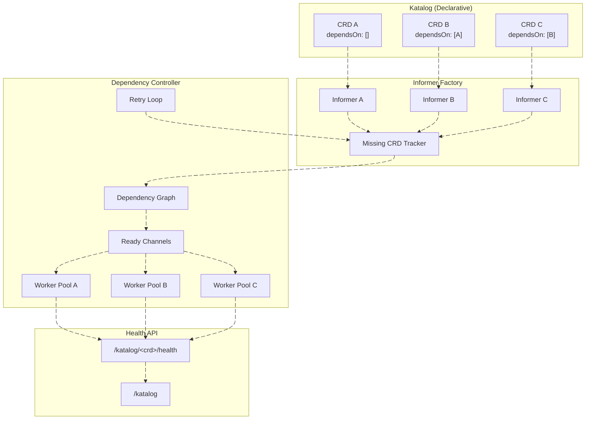

# 📘 **Orkestra Dependency Model**

### *Declarative, Dynamic, and Self-Healing CRD Orchestration*

---

## 🎯 **Overview**

Orkestra's dependency system ensures that CRDs start in the correct order, wait for their dependencies, and automatically recover when missing CRDs appear later. It's designed to be:

- **Declarative** – Dependencies are defined in the Katalog, not in code
- **Dynamic** – CRDs can appear after startup and still be activated
- **Self-healing** – When a missing CRD appears, dependents automatically start
- **Observable** – Health API shows exactly why a CRD isn't ready

---

## 🏗️ **Architecture**



---

## 🔧 **How It Works**

### **1. Dependency Declaration**

In your Katalog, CRDs declare dependencies by name:

```yaml
crds:
  - name: orkapp
    # ... other fields

  - name: website
    dependsOn:
      - orkapp   # website waits for orkapp
```

This creates an implicit dependency graph: `orkapp → website`

### **2. Startup Order**

Orkestra computes a topological order from the dependency graph:

```
Startup order: orkapp → website
Shutdown order: website → orkapp (reverse)
```

### **3. Readiness Signaling**

For each CRD, Orkestra creates a **ready channel**:

```go
readyCh := make(chan struct{})
```

- **If CRD exists** at startup → channel closed immediately
- **If CRD missing** → channel remains open until CRD appears

Dependents wait on this channel:

```go
for _, dep := range crd.DependsOn {
    <-k.readyCh[dep]  // Blocks until dependency is ready
}
```

### **4. Worker Activation**

Once all dependencies are ready, Orkestra starts workers for the CRD:

```go
workers := k.katalog.GetWorkers(gvk)
k.startCRDWorkers(ctx, gvk, workers)
```

### **5. Dynamic CRD Activation**

If a CRD is missing at startup, Orkestra's **retry loop** periodically checks for it:

```go
func (k *DependencyKontroller) retryMissingCRDs(ctx context.Context) {
    ticker := time.NewTicker(PostStartRetryInterval)
    
    for range ticker.C {
        missing := k.informerFactory.Missing()
        for _, entry := range missing {
            if utils.CRDExists(entry.GVK) {
                k.activateCRD(ctx, entry)  // ✨ CRD appears!
            }
        }
    }
}
```

When a missing CRD appears:
1. Informer is created dynamically
2. Workers start
3. Ready channel closes
4. Dependents automatically unblock and start

**No restart required. Zero downtime.**

---

## 📊 **Health API**

The health API provides full visibility into dependency status.

### **Per-CRD Health Endpoint**

```bash
curl localhost:8080/katalog/website/health
```

```json
{
  "name": "website",
  "healthy": false,
  "started": false,
  "message": "website degraded",
  "lastError": "CRD not found",
  "uptime": "not started",
  "status": 503
}
```

| Field | Description |
|-------|-------------|
| `started` | Workers are running |
| `healthy` | All dependencies satisfied and reconciliation successful |
| `lastError` | Why the CRD is degraded (e.g., "CRD not found") |
| `message` | Human-readable status |

### **Katalog Summary Endpoint**

```bash
curl localhost:8080/katalog
```

Shows all CRDs with their dependency relationships and health status.

---

## 🔄 **Complete Lifecycle Example**

### **Initial State: CRD Missing**

```
website (depends on orkapp) → readyCh open → workers NOT started
orkapp (missing) → readyCh open → workers NOT started
```

### **orkapp CRD Appears**

```
1. Retry loop detects orkapp
2. activateCRD() called for orkapp
   → Informer created
   → Workers started
   → readyCh[orkapp] closed
3. website's dependency loop unblocks
4. website workers start
```

### **Health Evolution**

| Time | orkapp health | website health |
|------|---------------|----------------|
| t0 (missing) | `started: false, healthy: false` | `started: false, healthy: false` |
| t1 (orkapp appears) | `started: true, healthy: false` | `started: false, healthy: false` |
| t2 (orkapp reconciles) | `started: true, healthy: true` | `started: false, healthy: false` |
| t3 (website starts) | `started: true, healthy: true` | `started: true, healthy: false` |
| t4 (website reconciles) | `started: true, healthy: true` | `started: true, healthy: true` |

---

## 🧠 **Design Philosophy**

Orkestra's dependency system is built on three key insights:

### **1. The Informer Factory Knows Everything**

The informer factory already tracks which CRDs exist. Instead of duplicating state with channels, Orkestra simply asks:

```go
if !k.informerFactory.IsMissing(gvk) {
    // CRD exists, start workers
}
```

### **2. Ready Channels Are Simple**

A channel that never closes is a bug. A channel that always closes eventually is reliable.

```go
// Good: channel always closes
if !k.informerFactory.IsMissing(gvk) {
    close(k.readyCh[name])  // Immediate if exists
}
// Later, if missing CRD appears:
activateCRD() → close(k.readyCh[name])  // Eventually
```

### **3. Self-Healing Is Built-in**

The retry loop runs continuously, not just at startup. This means:
- CRDs can be installed **after** Orkestra starts
- Dependents automatically activate when dependencies appear
- No manual intervention required

---

## 🎯 **Key Benefits**

| Feature | Benefit |
|---------|---------|
| **Declarative dependencies** | Define relationships in YAML, not code |
| **Topological ordering** | CRDs start and stop in the right order |
| **Dynamic activation** | CRDs can appear after startup |
| **Self-healing** | Missing CRDs are retried automatically |
| **No deadlocks** | Ready channels always close eventually |
| **Full observability** | Health API shows exactly why CRDs are degraded |
| **Zero boilerplate** | Just `dependsOn` in your Katalog |

---

## 📝 **Example Katalog**

```yaml
crds:
  - name: orkapp
    workers: 3
    resync: 10m
    dependsOn: []  # No dependencies

  - name: website
    workers: 2
    resync: 30s
    dependsOn:
      - orkapp   # website waits for orkapp

  - name: database
    workers: 1
    resync: 5m
    dependsOn:
      - orkapp
      - website  # database waits for both
```

Orkestra automatically computes the startup order: `orkapp → website → database`

---

## 🏁 **Summary**

Orkestra's dependency system is:

- ✅ **Simple** – Just `dependsOn` in your Katalog
- ✅ **Reliable** – Channels always close, no deadlocks
- ✅ **Dynamic** – CRDs can appear after startup
- ✅ **Observable** – Full health visibility
- ✅ **Self-healing** – Missing CRDs are automatically retried

**It's the kind of system that just works – and when it doesn't, you can see exactly why.** 🚀