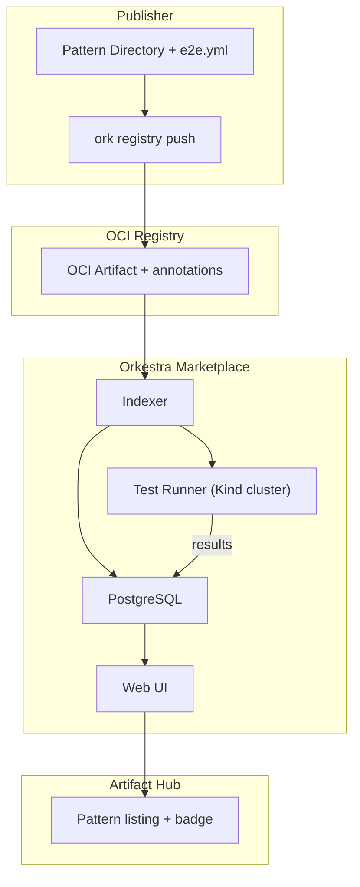

# Orkestra Marketplace – Design Document

## Vision

The Orkestra Marketplace is not just a registry of OCI artifacts. It is a **trust platform** for Kubernetes operators. Every pattern published carries proof that it works — via an `e2e.yml` definition that runs in a clean Kind cluster. The platform runs those E2E tests periodically, displays results, and awards an **E2E Verified** badge.

This turns a static list of packages into a **live, tested, and verifiable** operator ecosystem – a first in the operator world.

---

## Core Concepts

| Concept | Description |
|---------|-------------|
| **Pattern** | A directory containing `katalog.yaml` + `crd.yaml` (optional: `cr.yaml`, `README.md`, `e2e.yml`) |
| **E2E Verified** | A badge awarded to patterns whose `e2e.yml` passes when run by the marketplace CI |
| **Marketplace** | A web UI (and API) that indexes patterns, shows test results, and provides `ork registry` integration |

---

## Layer 1 – The `e2e.yml` Specification

A pattern can include an `e2e.yml` file that defines how to test the operator. This file is **optional** but strongly encouraged. It describes:

- Which CRD and Katalog files to use
- Which custom resources to apply
- Any post‑deployment checks (e.g., `kubectl wait`, custom commands)

**Minimal example (`e2e.yml`):**

```yaml
# e2e.yml
apiVersion: orkestra.orkspace.io/v1
kind: E2ETest
metadata:
  name: website-e2e
spec:
  katalog: katalog.yaml
  crd: crd.yaml
  crFiles:
    - cr.yaml
  postDeploy:
    commands: 
        - kubectl wait --for=condition=available deployment/my-site --timeout=60s
        - kubectl get service/my-site-svc
  timeout: 2m
```

**Advanced example (with overrides and multiple CRs):**

```yaml
spec:
  katalog: katalog.yaml
  crd: crd.yaml
  overrides:
    crds:
      website:
        workers: 1
        operatorBox:
          onCreate:
            deployments:
              - image: custom/nginx:test
  crFiles:
    - cr-staging.yaml
    - cr-production.yaml
  postDeploy:
    commands: 
        - kubectl get pods -l app=myapp -o wide
        - ./verify.sh
```

The marketplace CI (and the local `ork e2e` command) understands this format.

---

## Layer 2 – `ork e2e` CLI Command

Developers can run the same test locally before publishing, using the **same `e2e.yml`**.

```bash
# Uses current kubecontext (or spins up Kind if none exists)
ork e2e run # automatically reads the e2e.yaml or e2e.yml file file
```

**Behaviour:**

1. Check for a reachable Kubernetes cluster. If none, create a temporary Kind cluster.
2. Apply CRDs (`crd.yaml` or `crdFiles`).
3. Generate the operator bundle (`ork generate bundle`).
4. Install Orkestra via Helm (or deployment?).
5. Apply all CR files from `crFiles` (or overridden CRs).
6. Execute `postDeploy` commands in order.
7. If all commands succeed, exit 0; otherwise fail.
8. On success, print **“✅ E2E test passed”** and optionally suggest publishing.

This command will be used both locally and in the marketplace CI.

---

## Layer 3 – Integration with `ork registry push`

When a user pushes a pattern with `ork registry push`, the CLI:

1. Checks for an `e2e.yml` file in the pattern directory.
2. If found, runs `ork e2e` **before pushing**.
3. If the E2E test fails, the push is aborted (unless `--force` is used).
4. If it passes, the pattern is pushed, and the **E2E test definition** is included as an OCI annotation (e.g., `io.orkestra.e2e.config` containing the serialised `e2e.yml`).
5. The registry stores the test configuration as part of the artifact metadata.

This ensures that every `E2E Verified` pattern has a recorded test definition that can be re‑run by the marketplace.

**Force flag:**  
`ork registry push --force ./my-pattern` – skips local E2E test but still includes the `e2e.yml` file (if present). The marketplace will still run its own test.

---

## Layer 4 – Artifact Hub Integration

Artifact Hub (artifacthub.io) already supports OCI artifacts. Orkestra will:

- Submit a **verifier** to Artifact Hub that recognises `application/vnd.orkestra.pattern.v1+tar+gzip` and extracts the `e2e.yml` from the artifact annotations.
- Display the **E2E Verified** badge on the pattern’s Artifact Hub page if the marketplace has successfully run the test.
- Show additional metadata: which CRDs are provided, required providers (AWS, GCP, etc.), and a link to the marketplace page.

**Benefits:** Immediate visibility in the largest cloud‑native artifact catalog.

---

## Layer 5 – The Marketplace Central Platform

A dedicated web application (e.g., `marketplace.orkestra.sh`) that provides:

### 5.1 Pattern Discovery

- Search/filter by name, tags, provider, E2E status.
- Each pattern shows:
  - Name, description, author, version
  - Number of successful / failed test runs
  - Last test execution timestamp
  - **E2E Verified** badge
  - Link to the OCI registry location
  - `ork registry pull` command + Komposer snippet

### 5.2 Automated Testing Pipeline

For every published pattern (or when a new version is pushed):

1. The marketplace spins up a **clean Kind cluster** (sandboxed, ephemeral).
2. It runs `ork e2e` using the `e2e.yml` embedded in the OCI annotations.
3. The result (pass/fail, duration, logs) is stored and displayed on the pattern’s page.
4. A cron job re‑runs the test periodically (e.g., weekly) to detect regressions.

**Resource constraints:** Each test run has a hard timeout (e.g., 5 minutes). Unauthenticated runs are rate‑limited. Users can pay for higher quotas or private test runs.

### 5.3 “Test It Now” Button

Users can request an on‑demand test run of any pattern version directly from the marketplace. The platform runs the E2E test and returns the result – no local setup required.

### 5.4 Publisher Dashboard

- Publishers can register via GitHub OAuth.
- They can see all their patterns, test histories, and usage stats.
- They can manually trigger a re‑test after updating a pattern.

---

## Architecture Diagram



---

## Implementation Roadmap

| Phase | Deliverable | Estimated Effort |
|-------|-------------|------------------|
| **1** | `ork e2e` CLI command (supports `e2e.yml` and inline flags) | 2 weeks |
| **2** | Extend `ork registry push` to run `e2e.yml` and store test config as annotation | 1 week |
| **3** | Basic marketplace web UI (list patterns, pull instructions) | 2 weeks |
| **4** | Automated test runner (Kind + `ork e2e` per pattern) | 3 weeks |
| **5** | Artifact Hub verifier + badge integration | 1 week |
| **6** | Publisher dashboard + “Test It Now” button | 2 weeks |

**Total:** ~3 months for v1 of the marketplace.

---

## Success Metrics

- Number of patterns with **E2E Verified** badge
- Percentage of patterns that pass tests on first push
- Time from `ork registry push` to marketplace visibility (< 1 minute)
- User adoption of `ork e2e` (measured via telemetry, opt‑in)

---

## Future Possibilities

- **Paid tiers** – higher rate limits, private test runs, Slack/Teams notifications.
- **GitHub integration** – run tests on PRs that update a pattern.
- **Multi‑cluster tests** – test patterns that require federation.
- **Performance benchmarks** – track reconciliation times over versions.

---

## Conclusion

The Orkestra Marketplace transforms the OCI registry from a passive storage system into an **active trust platform**. By requiring an `e2e.yml` definition and running it in an isolated Kind cluster, we give users confidence that a pattern actually works. The `ork e2e` CLI makes the same test reproducible locally, and the marketplace makes results publicly visible. This is a unique value proposition in the operator ecosystem – and a strong differentiator for Orkestra.

**Let’s build it.** 🚀