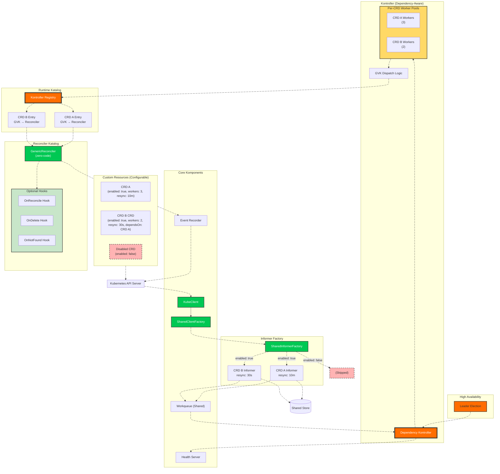

# Orkestra Full Architecture Overview

```mermaid
flowchart TB
 subgraph CRDs["Custom Resources (Configurable)"]
        P["CRD A<br/>(enabled: true, workers: 3, resync: 10m)"]
        M["CRD B CRD<br/>(enabled: true, workers: 2, resync: 30s, dependsOn: CRD A)"]
        D["Disabled CRD<br/>(enabled: false)"]
  end
 subgraph API["Kubernetes API Server"]
  end
 subgraph Core["Core Komponents"]
        KC["KubeClient"]
        FC["SharedClientFactory"]
        EV["Event Recorder"]
        HS["Health Server"]
        WQ["Workqueue (Shared)"]
  end
 subgraph Informers["Informer Factory"]
    direction LR
        SIF["SharedInformerFactory"]
        PI["CRD A Informer<br/>resync: 10m"]
        MI["CRD B Informer<br/>resync: 30s"]
  end
 subgraph Katalog["Runtime Katalog"]
        REG["Kontroller Registry"]
        R1["CRD A Entry<br/>GVK → Reconciler"]
        R2["CRD B Entry<br/>GVK → Reconciler"]
  end
 subgraph Workers["Per-CRD Worker Pools"]
        W1["CRD A Workers<br/>(3)"]
        W2["CRD B Workers<br/>(2)"]
  end
 subgraph Kontroller["Kontroller (Dependency-Aware)"]
    direction LR
        C["Dependency Kontroller"]
        Workers
        DISPATCH["GVK Dispatch Logic"]
  end
 subgraph Reconcilers["Reconciler Katalog"]
        direction TB
        GR["GenericReconciler<br/>(zero-code)"]
        subgraph Hooks["Optional Hooks"]
            H1["OnReconcile Hook"]
            H2["OnDelete Hook"]
            H3["OnNotFound Hook"]
        end
  end
 subgraph HA["High Availability"]
        LE["Leader Election"]
  end
    CRDs --> API
    API --> KC
    KC --> FC
    FC --> SIF
    SIF -.->|enabled: true| PI & MI
    SIF -.->|enabled: false| DI["(Skipped)"]
    PI --> STORE[("Shared Store")] & WQ
    MI --> STORE & WQ
    WQ --> C
    C --> Workers & HS
    Workers --> DISPATCH
    DISPATCH --> REG
    REG --> R1 & R2
    R1 -.-> GR
    R2 -.-> GR
    GR -.-> Hooks
    GR --> EV
    LE --> C
    EV --> API

    style D fill:#FFB3B3,stroke:#333,stroke-width:2px
    style DI fill:#FFB3B3,stroke:#333,stroke-width:2px,stroke-dasharray: 5 5
    style KC fill:#00C853,stroke:#333,stroke-width:2px,color:#FFFFFF
    style FC fill:#00C853,stroke:#333,stroke-width:2px,color:#FFFFFF
    style SIF fill:#00C853,stroke:#333,stroke-width:2px,color:#FFFFFF
    style REG fill:#FF6D00,stroke:#333,stroke-width:4px,color:#FFFFFF
    style C fill:#FF6D00,stroke:#333,stroke-width:4px,color:#FFFFFF
    style Workers fill:#FFD966,stroke:#333,stroke-width:2px
    style GR fill:#00C853,stroke:#333,stroke-width:2px,color:#FFFFFF
    style LE fill:#FF6D00,stroke:#333,stroke-width:2px
    style Hooks fill:#C8E6C9,stroke:#333,stroke-width:2px
    classDef disabled fill:#FFB3B3,stroke:#333,stroke-width:2px,stroke-dasharray: 5 5
    class D,DI disabled

    L_CRDs_API_0@{ animation: fast } 
    L_API_KC_0@{ animation: fast } 
    L_FC_SIF_0@{ animation: fast } 
    L_SIF_PI_0@{ animation: fast } 
    L_SIF_MI_0@{ animation: fast } 
    L_SIF_DI_0@{ animation: fast } 
    L_PI_STORE_0@{ animation: fast } 
    L_PI_WQ_0@{ animation: fast } 
    L_MI_STORE_0@{ animation: fast } 
    L_MI_WQ_0@{ animation: fast } 
    L_WQ_C_0@{ animation: fast } 
    L_C_Workers_0@{ animation: fast } 
    L_C_HS_0@{ animation: fast } 
    L_Workers_DISPATCH_0@{ animation: fast } 
    L_DISPATCH_REG_0@{ animation: fast } 
    L_REG_R1_0@{ animation: fast } 
    L_REG_R2_0@{ animation: fast } 
    L_R1_GR_0@{ animation: slow } 
    L_R2_GR_0@{ animation: slow } 
    L_GR_Hooks_0@{ animation: slow } 
    L_GR_EV_0@{ animation: fast } 
    L_LE_C_0@{ animation: fast } 
    L_EV_API_0@{ animation: fast }
```
