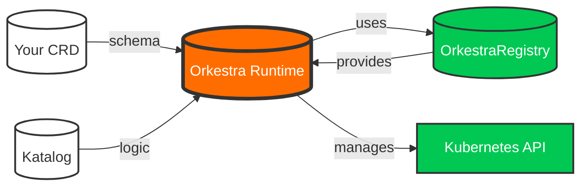

# Getting Started

Welcome to Orkestra — the Kubernetes operator framework that needs no programming language.

This guide will help you understand the core concepts and get your first operator running in minutes.

---

## What is Orkestra?

Orkestra turns CRDs into operators. You write a **Katalog** YAML describing what you want. Orkestra handles the rest: create, reconcile, drift-correct, delete.

No Go. No code generation. No controller boilerplate.

---

## The Mental Model

```
CRD → Katalog → Orkestra → Kubernetes
```

<!-- - **CRD** defines *what* your resource is (the schema)
- **Katalog** defines *how* it should behave (the logic)
- **Orkestra** reconciles it (the runtime)
- **Kubernetes** stores it (the platform) -->


This is the simplest operator model ever created.

---

## Installation

### macOS (Homebrew)

```bash
brew tap iAlexeze/tap
brew install ork
```

### Linux / macOS (curl)

```bash
curl -sSL https://raw.githubusercontent.com/konduktor-io/orkestra/main/install.sh | bash
```

### Verify Installation

```bash
ork version
```

For advanced installation options — GPG verification, custom directory, version pinning — see the [Installation Guide](../guides/deployment.md#installation).


---

## Your First Operator

Let's build an operator for a `Website` CRD. This operator will create a Deployment and Service for every `Website` resource.

### Step 1: Scaffold the Project

```bash
ork init my-operator
cd my-operator
```

This creates a clean workspace with examples ready to run.

### Step 2: Install the CRD

```bash
kubectl apply -f examples/website/website-crd.yaml
```

### Step 3: Run Orkestra

```bash
ork run --katalog examples/website/website-katalog.yaml
```

### Step 4: Apply a Custom Resource

```bash
kubectl apply -f examples/website/website-cr.yaml
```

### Step 5: Watch It Work

```bash
kubectl get deployments
kubectl get services
```

You'll see a Deployment and Service created for your `Website` resource.

### Step 6: Explore the Built‑in Endpoints

```bash
# Health endpoint
curl localhost:8080/katalog/website/health | jq

# Info endpoint
curl localhost:8080/katalog/website | jq

# All CRDs
curl localhost:8080/katalog | jq

# Prometheus metrics
curl localhost:8080/metrics
```

---

## What Just Happened?

When you applied your `Website` CR:

1. Kubernetes notified Orkestra
2. Orkestra queued the reconcile event
3. The CR was loaded from the informer cache
4. Finalizers were added to protect the CR
5. Templates were resolved (e.g., `{{ .spec.image }}` → `nginx:1.25`)
6. A Deployment and Service were created
7. Drift correction was enabled (`reconcile: true`)
8. Metrics and events were emitted

All from a single YAML file.

---

## Next Steps

Now that you have a working operator, you can:

- Learn how to **write your own Katalog** with custom CRDs and templates
- Explore **hooks** for Go‑level control when needed
- Write **custom reconcilers** for complete flexibility
- **Test your operators** with the built‑in testing framework

---

Continue to the **Writing Your First Katalog** guide to understand how to define your own CRDs and templates.

👉 [Writing Your First Katalog →](./writing-your-first-katalog.md)


---