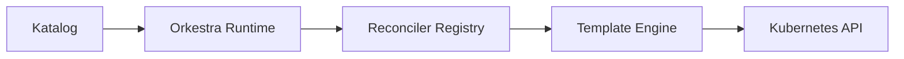

# 🌌 **Orkestra**  
### *A Declarative Operator Runtime for Kubernetes*

Orkestra turns YAML into fully‑functional Kubernetes operators — no scaffolding, no code generation, no boilerplate.  
You describe **what** your operator should do.  
Orkestra handles **how** it runs.

It’s the operator framework you always wished existed.

---

## 🚀 Why Orkestra?

### **Zero‑Code Operators**  
Define CRDs and behavior in a **Katalog**.  
Orkestra builds the entire operator around them:

- Informers  
- Worker pools  
- Reconciler pipeline  
- Drift correction  
- Health endpoints  
- Metrics  
- Dependency ordering  
- Leader election  

No Go code required — unless you want it.

---

### **Dynamic or Typed — Your Choice**  
Use unstructured CRDs for rapid iteration, or plug in typed Go structs when you need type‑safe hooks.  
Both paths share the same runtime.

---

### **Self‑Healing Runtime**  
CRDs can appear, disappear, or change at any time.  
Orkestra automatically:

- detects missing CRDs  
- activates them when they appear  
- deactivates them when deleted  
- reactivates them when reinstalled  

Your operator never needs a restart.

---

### **Dependency‑Aware Execution**  
Declare dependencies between CRDs.  
Orkestra builds a DAG and ensures:

- startup in topological order  
- shutdown in reverse  
- dependents never start early  
- missing dependencies don’t block healthy CRDs  

This is how operators *should* work.

---

### **Production‑Ready by Default**  
Every operator includes:

- `/health` and `/ready` endpoints  
- `/katalog` introspection API  
- Prometheus metrics  
- Panic‑safe reconcile loop  
- Idempotent resource application  
- Automatic owner references  
- Drift correction  

You get CNCF‑grade behavior without writing a line of Go.

---

## 🧩 How It Works



Orkestra reads your Katalog → builds a runtime → watches CRDs → reconciles resources → keeps everything in sync.

---

## 🛠 Example: A Zero‑Code Operator

```yaml
apiVersion: demo.orkestra.io/v1alpha1
kind: Website
metadata:
  name: my-blog
spec:
  image: nginx:1.25
  replicas: 2
  port: 80
  exposePublicly: "true"
```

And the Katalog:

```yaml
onCreate:
  deployments:
    - name: "{{ .metadata.name }}"
      image: "{{ .spec.image }}"
      replicas: "{{ .spec.replicas }}"
      port: "{{ .spec.port }}"
      reconcile: true

  services:
    - name: "{{ .metadata.name }}-svc"
      type: LoadBalancer
      port: "80"
      targetPort: "{{ .spec.port }}"
      when:
        - field: spec.exposePublicly
          equals: "true"
```

That’s it.  
You just wrote an operator.

---

## 📚 Documentation

- **[Start Here](./core/README.md)** → Learn the core concepts  
- **[Architecture](./architecture/architecture.md)** → Understand the runtime  
- **[Guides](./guides/)** → Build your first operator  
- **[Reference](./reference/cli.md)** → Katalog + Komposer schemas  
- **[Internals](./internals/startup-sequence.md)** → Deep dive into the engine  

---

## 🌐 Community & Links

- GitHub: *coming soon*  
- Website: **orkestra.sh**  
- Docs: `/docs`  
- Discussions: *coming soon*  

---

## 🎼 Orkestra: Conduct Your Operators

Kubernetes operators shouldn’t require scaffolding, generators, or thousands of lines of boilerplate.  
With Orkestra, you describe the score — and the runtime conducts the rest.