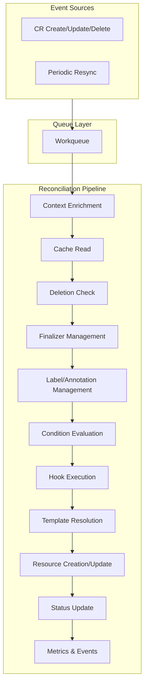

# Reconciler Pipeline (Internals)

This document explains the complete reconciliation flow in Orkestra — from the moment a CR is created or updated, through template resolution and resource creation, to final status updates and metric emission.

---

## Overview

The Orkestra reconciler is the heart of the operator runtime. It processes events from the informer queue and executes the reconciliation logic defined in your Katalog.



---

## 1. Event Enqueueing

When a CR is created, updated, or deleted, the informer receives the event and enqueues it to the workqueue.

```go
// The informer's event handler
inf.AddEventHandler(cache.ResourceEventHandlerFuncs{
    AddFunc:    func(obj interface{}) { f.handleEvent(obj) },
    UpdateFunc: func(_, newObj interface{}) { f.handleEvent(newObj) },
    DeleteFunc: func(obj interface{}) { f.handleEvent(obj) },
})
```

Each enqueued item contains:
- `Key` — namespace/name (e.g., `default/my-website`)
- `GVK` — GroupVersionKind of the resource

```go
type QueueItem struct {
    Key string
    GVK string
}
```

The queue is rate‑limited and deduplicated. Multiple events for the same key are coalesced.

---

## 2. Worker Dispatch

The controller runs a configurable number of workers per CRD. Each worker pulls items from the queue and dispatches to the correct reconciler.

```go
func (c *Controller) runWorkerForGVK(ctx context.Context, gvk string, workerID string) {
    for {
        item, shutdown := c.getQueue(gvk).Get()
        if shutdown {
            return
        }

        reconciler := c.reconcilers[item.GVK]
        reconciler.Reconcile(ctx, item.Key)

        c.getQueue(gvk).Done(item)
    }
}
```

---

## 3. Context Enrichment

Before reconciliation begins, the context is enriched with:

- **Request ID** — unique identifier for tracing
- **CRD name** — for logging context
- **Resource key** — namespace/name of the CR

```go
ctx = logger.WithRequestID(ctx)
ctx = logger.WithCRD(ctx, r.crd.GVK)
ctx = logger.WithResource(ctx, key)
```

This ensures all logs for a single reconciliation share the same request ID.

---

## 4. Cache Read

The reconciler reads the CR from the informer's **local cache**, never from the API server.

```go
raw, exists, err := r.informer.GetIndexer().GetByKey(key)
if err != nil {
    return fmt.Errorf("getting %q from store: %w", key, err)
}

if !exists {
    // Object was deleted — handle cleanup
    return r.handleNotFound(ctx, key)
}

obj := raw.(T).DeepCopyObject().(T)
```

The deep copy ensures the reconciler never mutates the cached object.

---

## 5. Deletion Check

If the CR has a `deletionTimestamp`, it's being deleted.

```go
if obj.GetDeletionTimestamp() != nil {
    logger.FromContext(ctx).Info().
        Str("name", obj.GetName()).
        Msgf("deletion handler called for %s", r.crd.GVK)

    r.event.Eventf(obj, corev1.EventTypeNormal, "Deleting",
        fmt.Sprintf("Deleting %s %s/%s", r.crd.GVK, obj.GetNamespace(), obj.GetName()))

    return r.handleDeletion(ctx, obj)
}
```

---

## 6. Finalizer Management

Finalizers protect the CR from being deleted until cleanup completes.

```go
func (r *GenericReconciler[T]) ensureFinalizers(ctx context.Context, obj T) error {
    if len(r.crd.Finalizers) == 0 {
        return nil
    }

    needsUpdate := false
    for _, f := range r.crd.Finalizers {
        if !ContainsFinalizer(obj, f) {
            needsUpdate = true
            break
        }
    }

    if !needsUpdate {
        return nil
    }

    // Add missing finalizers
    newFinalizers := obj.GetFinalizers()
    for _, f := range r.crd.Finalizers {
        if !ContainsFinalizer(obj, f) {
            newFinalizers = append(newFinalizers, f)
        }
    }

    return r.kube.PatchFinalizers(ctx, obj, r.crd.GVR, newFinalizers)
}
```

---

## 7. Label and Annotation Management

Orkestra adds managed labels and annotations to every CR it controls.

```go
// Ensure managed label
func (r *GenericReconciler[T]) ensureManagedLabel(ctx context.Context, obj T) error {
    labels := obj.GetLabels()
    if labels == nil {
        labels = make(map[string]string)
    }

    if labels["orkestra.konductor.io/managed"] != "true" {
        labels["orkestra.konductor.io/managed"] = "true"
        obj.SetLabels(labels)
        return r.kube.PatchLabels(ctx, obj, r.crd.GVR, labels)
    }

    return nil
}

// Ensure managed annotations
func (r *GenericReconciler[T]) ensureManagedAnnotations(ctx context.Context, obj T, operator string) error {
    annotations := obj.GetAnnotations()
    if annotations == nil {
        annotations = make(map[string]string)
    }

    annotations["orkestra.konductor.io/managed-by"] = operator
    annotations["orkestra.konductor.io/managed-since"] = time.Now().Format(time.RFC3339)

    obj.SetAnnotations(annotations)
    return r.kube.PatchAnnotations(ctx, obj, r.crd.GVR, annotations)
}
```

---

## 8. Condition Evaluation

Before executing templates, Orkestra evaluates `when` conditions. Resources are only created if all conditions match.

```yaml
services:
  - name: "{{ .metadata.name }}-svc"
    when:
      - field: spec.exposePublicly
        equals: "true"
      - field: spec.environment
        equals: "production"
```

The resolver evaluates each condition against the CR:

```go
func (r *Resolver) evaluateConditions(conditions []orktypes.Condition, obj map[string]interface{}) bool {
    for _, cond := range conditions {
        fieldValue := getField(obj, cond.Field)

        switch cond.Operator {
        case "equals":
            if fmt.Sprintf("%v", fieldValue) != cond.Value {
                return false
            }
        case "notequals":
            if fmt.Sprintf("%v", fieldValue) == cond.Value {
                return false
            }
        case "exists":
            if fieldValue == nil {
                return false
            }
        case "notexists":
            if fieldValue != nil {
                return false
            }
        }
    }
    return true
}
```

---

## 9. Hook Execution

If hooks are defined, they run before templates. This allows custom logic to validate, modify, or enrich the CR before resource creation.

```go
if r.hooks.OnReconcile != nil {
    if err := r.hooks.OnReconcile(ctx, obj); err != nil {
        r.event.Eventf(obj, corev1.EventTypeWarning, r.crd.Kind+"ReconcileError",
            fmt.Sprintf("Hook failed: %v", err))
        return err
    }
}
```

Hooks have full access to:
- The CR object (typed or unstructured)
- Kubernetes client
- Template resolver
- Context

---

## 10. Template Resolution

The resolver evaluates Go template expressions against the CR.

```go
resolver, err := orktmpl.NewResolver(ctx, obj)
if err != nil {
    return fmt.Errorf("building resolver: %w", err)
}

// Resolve a single field
image, err := resolver.Resolve("{{ .spec.image }}")
// image = "nginx:1.25"

// Resolve a deployment template
resolved, err := resolver.ResolveDeploymentTemplate(src)
```

The resolver supports:

| Expression | Resolves To |
|------------|-------------|
| `{{ .metadata.name }}` | CR name |
| `{{ .metadata.namespace }}` | CR namespace |
| `{{ .spec.field }}` | Any spec field |
| `{{ .status.field }}` | Any status field |

Missing fields resolve to empty string (no error). This allows optional fields.

---

## 11. Resource Creation/Update

Each resource type has its own runner. The runner determines whether to create or update based on whether the resource already exists.

```go
func runDeployments(ctx context.Context, kube *kubeclient.Kubeclient,
    resolver *orktmpl.Resolver, owner domain.Object,
    srcs []orktypes.DeploymentTemplateSource, update bool) error {

    for i, src := range srcs {
        // Evaluate conditions first
        if src.When != nil && !evaluateConditions(src.When, resolver) {
            logger.Debug().Msgf("conditions not met — skipping deployment[%d]", i)
            continue
        }

        // Resolve template
        resolved, err := resolver.ResolveDeploymentTemplate(src)
        if err != nil {
            return fmt.Errorf("deployment[%d]: %w", i, err)
        }

        spec := orkdeploy.Resolve(resolved, staticReplicas, resolver.OwnerName())

        if update {
            // Drift correction — update if exists, create if not
            if err := orkdeploy.Update(ctx, kube, owner, spec); err != nil {
                return fmt.Errorf("deployment[%d].update: %w", i, err)
            }
        } else {
            // Idempotent create — skip if exists
            if err := orkdeploy.Create(ctx, kube, owner, spec); err != nil {
                return fmt.Errorf("deployment[%d].create: %w", i, err)
            }
        }
    }
    return nil
}
```

---

## 12. Owner References

Every resource created by Orkestra receives an owner reference pointing back to the CR.

```go
func (r *Resolver) OwnerReference() metav1.OwnerReference {
    return metav1.OwnerReference{
        APIVersion:         r.gvk.GroupVersion().String(),
        Kind:               r.gvk.Kind,
        Name:               r.ownerName,
        UID:                r.ownerUID,
        Controller:         pointer.Bool(true),
        BlockOwnerDeletion: pointer.Bool(true),
    }
}
```

This enables Kubernetes garbage collection: when the CR is deleted, all child resources are automatically cleaned up.

---

## 13. Drift Correction

When a template has `reconcile: true`, it runs on **every** reconcile, not just on creation. This corrects any manual changes to the child resources.

```yaml
deployments:
  - image: "{{ .spec.image }}"
    replicas: "{{ .spec.replicas }}"
    reconcile: true  # ← Drift correction enabled
```

The registry compares the desired state with the current state and updates if different:

```go
// orkdeploy.Update checks for drift
func Update(ctx context.Context, kube *kubeclient.Kubeclient, owner domain.Object, spec ResolvedDeploymentSpec) error {
    existing, err := kube.Clientset().AppsV1().Deployments(spec.Namespace).Get(ctx, spec.Name, metav1.GetOptions{})
    if apierrors.IsNotFound(err) {
        return Create(ctx, kube, owner, spec)  // Create if missing
    }

    // Check for drift
    if existing.Spec.Replicas != &spec.Replicas {
        existing.Spec.Replicas = &spec.Replicas
        needsUpdate = true
    }

    if existing.Spec.Template.Spec.Containers[0].Image != spec.Image {
        existing.Spec.Template.Spec.Containers[0].Image = spec.Image
        needsUpdate = true
    }

    if needsUpdate {
        _, err = kube.Clientset().AppsV1().Deployments(spec.Namespace).Update(ctx, existing, metav1.UpdateOptions{})
        return err
    }

    return nil
}
```

---

## 14. Status Update

After reconciliation, the CR's status is updated to reflect the current state.

```go
// The reconciler can update status
obj.Status.Phase = "Ready"
obj.Status.LastReconcile = metav1.Now()
obj.Status.ObservedGeneration = obj.GetGeneration()

_, err := kube.DynamicClient().Resource(r.crd.GVR).Namespace(obj.GetNamespace()).UpdateStatus(ctx, obj, metav1.UpdateOptions{})
```

Status fields are not managed by Orkestra — you control them via hooks or custom reconcilers.

---

## 15. Metrics Emission

Every reconcile produces metrics, regardless of whether the reconciler is generic or custom.

| Metric | Type | Labels |
|--------|------|--------|
| `controller_reconcile_total` | Counter | `crd`, `result` (success/error) |
| `controller_reconcile_duration_seconds` | Histogram | `crd` |
| `controller_resource_count` | Gauge | `crd` |
| `controller_queue_depth` | Gauge | `crd` |
| `controller_workers_active` | Gauge | `crd` |

Metrics are emitted from a single choke point to ensure consistency:

```go
func safeReconcile(ctx context.Context, reconciler domain.Reconciler, key string) error {
    start := time.Now()
    err := reconciler.Reconcile(ctx, key)
    duration := time.Since(start).Seconds()

    gvk := utils.GetGVKFromContext(ctx)
    metrics.ReconcileDuration.WithLabelValues(gvk).Observe(duration)

    if err != nil {
        metrics.ReconcileTotal.WithLabelValues(gvk, "error").Inc()
    } else {
        metrics.ReconcileTotal.WithLabelValues(gvk, "success").Inc()
    }

    return err
}
```

---

## 16. Event Emission

Kubernetes events are emitted for significant actions:

| Event | Type | When |
|-------|------|------|
| `Reconciled` | Normal | Successful reconcile |
| `ReconcileError` | Warning | Reconcile returned an error |
| `FinalizerAdded` | Normal | Finalizer added to CR |
| `FinalizerRemoved` | Normal | Finalizer removed |
| `Deleting` | Normal | CR deletion in progress |
| `Deleted` | Normal | CR deletion completed |

```go
r.event.Eventf(obj, corev1.EventTypeNormal, r.crd.Kind+"Reconciled",
    fmt.Sprintf("Successfully reconciled %s %s/%s",
        r.crd.GVK, obj.GetNamespace(), obj.GetName()))
```

Events appear in `kubectl describe` and `kubectl get events`.

---

## 17. Health Tracking

After each reconcile, the CRD's health state is updated.

```go
if err != nil {
    h.RecordFailure(err, degradeThreshold)
} else {
    h.RecordSuccess()
}
```

Health state is exposed via:

- `/katalog/{crd}/health` endpoint
- `ork status` command
- Prometheus metrics

---

## 18. Error Handling and Retries

If reconciliation returns an error, the item is requeued with exponential backoff.

```go
if err := reconciler.Reconcile(ctx, key); err != nil {
    logger.Error().Err(err).Msg("reconcile failed")
    queue.AddRateLimited(key)  // Exponential backoff
    return true
}
```

Backoff sequence: 5ms, 10ms, 20ms, 40ms, … up to 1000ms.

---

## Summary

The reconciliation pipeline ensures that every CR is processed consistently:

1. **Event enqueued** from informer
2. **Worker dispatches** to correct reconciler
3. **Context enriched** for logging
4. **CR read from cache** (never API)
5. **Deletion check** — handle cleanup if needed
6. **Finalizers added** — protect CR during reconciliation
7. **Labels/annotations managed** — for tracking
8. **Conditions evaluated** — skip resources if conditions not met
9. **Hooks executed** — custom Go logic
10. **Templates resolved** — evaluate Go expressions
11. **Resources created/updated** — idempotent operations
12. **Drift correction** — fix manual changes
13. **Status updated** — reflect current state
14. **Metrics emitted** — for observability
15. **Events emitted** — for kubectl visibility
16. **Health tracked** — for health API
17. **Error handled** — requeue with backoff

All of this happens automatically. You just write the Katalog. 🎼