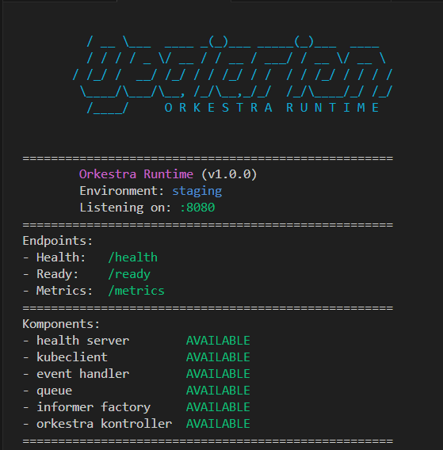
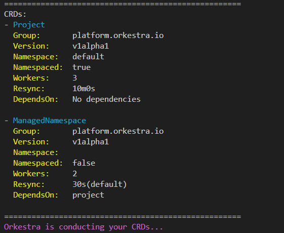
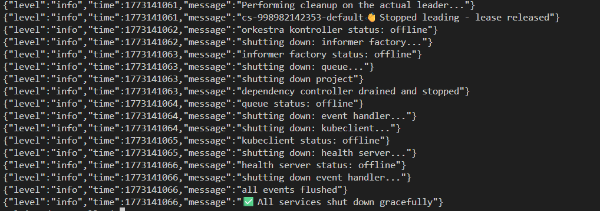

# **Orkestra Startup & Shutdown**

Orkestra is built around a single principle: **every component has a defined lifecycle, a defined order, and a defined responsibility**. Nothing starts before its dependency is ready. Nothing stops before the components that depend on it have stopped first.

This document captures exactly what happens when Orkestra starts and when it shuts down — why the order is the way it is, and what each step guarantees.

---

## **Startup**

### **Phase 1 — Katalog Load & Scheme Registration**

Before any Kubernetes client is built, Orkestra reads the Katalog. The Katalog is the single source of truth for which CRDs exist, how many workers each gets, what resync interval each uses, and which CRDs depend on which.

```
Katalog loaded (Go or YAML mode)
    ↓
Enabled CRDs filtered
    ↓
Dependency graph built (DAG — cycles detected and rejected)
    ↓
Scheme registry built (Go types registered per CRD)
    ↓
CRD clients registered to the provider
```

This phase is entirely in-memory. No API server calls are made yet. If the dependency graph contains a cycle, Orkestra fails fast here before any network connection is opened.

### **Phase 2 — Komponent Startup (in order)**

Orkestra starts each komponent sequentially. Each one must reach `AVAILABLE` before the next begins. The order is fixed and intentional:

```
health server     → receives traffic immediately, reports not-ready until cache sync
kubeclient        → builds rest.Config, clientset, REST clients
event handler     → broadcaster goroutine started, wired to API server Events
queue             → rate-limiting workqueue initialized
informer factory  → SharedInformerFactory started, list-watch streams opened
orkestra kontroller → dependency graph evaluated, CRDs started in topological order
```



Every komponent logs its transition to `AVAILABLE`. If any komponent fails to start, orkestra returns the error immediately and the process exits — there is no partial-start state.

### **Phase 3 — CRD Banner & Dependency Display**

Once the kontroller is available, Orkestra prints the Katalog summary. This shows every enabled CRD with its full configuration and its declared dependencies, resolved at runtime:



The banner makes the dependency relationship explicit before any reconciliation begins. In this example, `ManagedNamespace` declares `DependsOn: project` — Orkestra will start the `Project` informer and workers first, then start `ManagedNamespace`. This ordering is enforced by topological sort of the DAG, not by convention.

`Orkestra is conducting your CRDs...` is the signal that startup is complete and the leader election post-start hook is about to fire.

### **Phase 4 — Leader Election**

Leader election starts as a **post-start hook** — after all komponents are `AVAILABLE` and caches are warm. This is the correct order. Starting leader election before the informer cache is synced means a newly-elected leader could begin reconciling with a stale view of the cluster.

```go
startup.orkestra.AddPostStartHook(leader, func(ctx context.Context) {
    leader.Start(ctx)
})
```

Only the elected leader runs `kontroller.RunOrDie()`. Standby replicas hold warm caches and wait. On leader loss, a standby acquires the lease and begins reconciling immediately — no cold start, no re-list.

The readyz endpoint only returns `200` after leader election succeeds and the first reconcile pass completes. The health server is `AVAILABLE` from the start, but `ready` is a separate and stricter signal.

---

## **Shutdown**

Shutdown is triggered by `SIGINT` or `SIGTERM`. The root context is cancelled, which propagates to every goroutine in the system.

The shutdown sequence is the **reverse of startup**, with dependency-aware ordering enforced:



### **Step-by-step breakdown**

```
SIGINT / SIGTERM received
        ↓
Leader performs cleanup
        ↓
Lease released voluntarily          ← ReleaseOnCancel: true
        ↓
orkestra kontroller: offline
        ↓
informer factory shutting down      ← stops list-watch streams
        ↓
queue shutting down                 ← stops accepting new items
        ↓
project CRD shutdown                ← dependency-aware: dependents shut down first
        ↓
dependency controller drained and stopped
        ↓
queue: offline                      ← all in-flight items processed or dropped
        ↓
event handler shutting down
        ↓
kubeclient shutting down
        ↓
kubeclient: offline
        ↓
health server shutting down         ← stops serving traffic last
        ↓
health server: offline
        ↓
event handler shutting down
        ↓
all events flushed                  ← broadcaster drains before exit
        ↓
✅ All services shut down gracefully
```

### **Why this order matters**

**Lease released before kontroller stops.** `ReleaseOnCancel: true` means the outgoing leader voluntarily gives up the lease rather than waiting for it to expire. A standby can acquire it immediately — typically within one `RetryPeriod` — instead of waiting out the full `LeaseDuration` (usually 15 seconds). This is the difference between a 1-second failover and a 15-second gap.

**Informer factory before queue.** The informer factory opens persistent watch streams to the API server. Closing it first stops new events from entering the system. The queue is then shut down after — no new items can be enqueued once the streams are closed.

**CRDs in reverse dependency order.** `ManagedNamespace` depends on `Project`. On shutdown, `ManagedNamespace` workers drain first, then `Project` workers drain. This mirrors startup order exactly. A child CRD cannot be safely shut down while its parent's workers are still processing items that might affect it.

**kubeclient after informer and queue.** The informer and queue both hold references to the REST client. Shutting them down first ensures no in-flight HTTP calls are dropped mid-request. Only after both are offline is the kubeclient closed.

**Health server second-to-last.** The health server keeps reporting ready until almost the end. Load balancers and readiness probes need time to drain traffic away from the pod. Shutting the health server down too early causes the probe to fail prematurely, which can cause traffic to be routed to the pod during its shutdown window.

**Events flushed last.** The event broadcaster is a buffered channel. `Shutdown()` drains all pending events to the API server before closing. Without this, events emitted during the last reconcile pass are silently dropped. `all events flushed` is the confirmation that every `Eventf()` call that completed before shutdown was committed.

---

## **Guarantees**

| Guarantee | Mechanism |
|---|---|
| No reconcile before cache sync | Informer factory `WaitForCacheSync` in startup phase |
| No leader action before komponents ready | Leader election as post-start hook |
| Instant standby failover | `ReleaseOnCancel: true` on the LeaseLock |
| No new events during shutdown | Informer factory closed before queue |
| CRDs stop in safe order | Reverse topological sort of dependency DAG |
| No dropped API calls on exit | kubeclient closed after informer and queue |
| No dropped events on exit | Broadcaster drained before process exit |
| No partial-start state | Sequential komponent startup, fail-fast on error |

---

## **Configuration**

Startup and shutdown timing is controlled by leader election options:

| Option | Default | Effect |
|---|---|---|
| `LeaseDuration` | `15s` | How long a lease is held before expiry |
| `RenewDeadline` | `10s` | How long the leader tries to renew before giving up |
| `RetryPeriod` | `3s` | How often standbys attempt to acquire the lease |
| `ReleaseOnCancel` | `true` | Whether to release the lease voluntarily on shutdown |

With these defaults, a graceful leader handoff takes at most one `RetryPeriod` (3 seconds) after the outgoing leader releases the lease. A crash (no voluntary release) takes up to `LeaseDuration` (15 seconds) for a standby to take over.