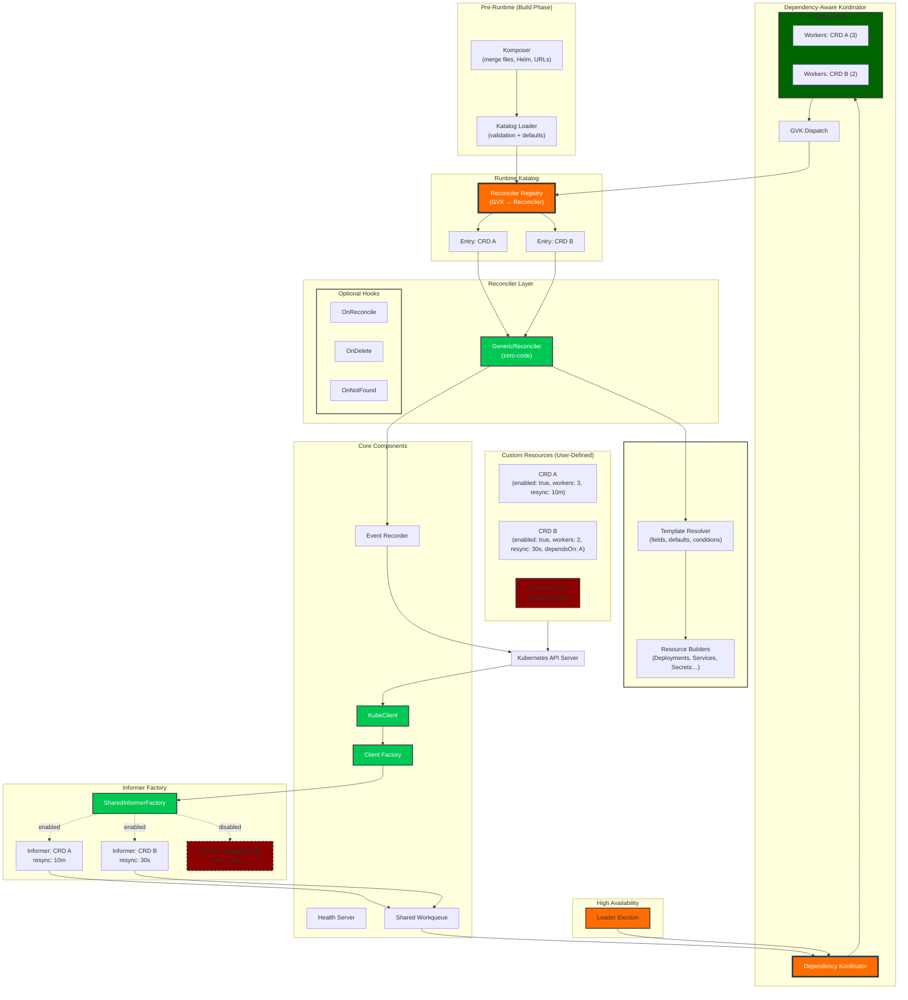

# Full Architecture View

This page provides the complete visual representation of the Orkestra runtime.  
It complements the conceptual explanation in the  
👉 [Architecture Overview](./index.md)

The diagram below shows how Orkestra loads Katalogs, discovers CRDs, initializes informers, manages worker pools, dispatches reconcile events, and applies templates to the Kubernetes API.

---

## Full System Diagram

## What’s Next?

Explore the conceptual explanation:

👉 [Architecture Overview](./index.md)

Or dive into the runtime execution path:

👉 [Runtime Flow](./runtime-flow.md)
