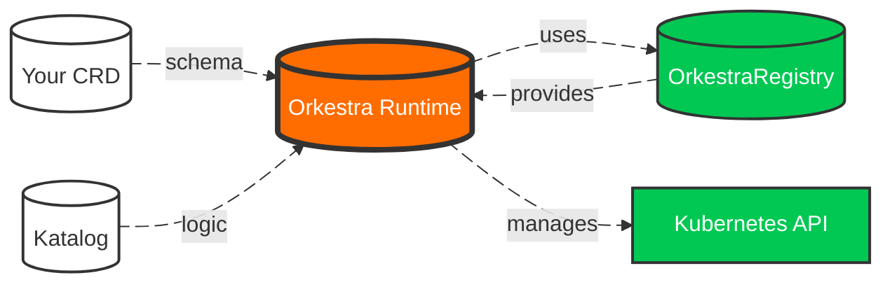

# The Orkestra Onboarding Guide

Welcome to Orkestra — the operator runtime where **your CRD is enough**.

This guide gives you the mental model, the workflow, and your first operator in minutes.

---

<div align="center">

```
   ___       _              _
  / _ \ _  _| |___ _ _  ___| |_ _ _ __ _
 | (_) | || | / -_) ' \/ -_)  _| '_/ _` |
  \___/ \_,_|_\___|_||_\___|\__|_| \__,_|
          O R K E S T R A
```

**CRDs in. Operators out.**

</div>

---

## 1. What Orkestra Is

Orkestra is a **runtime**, not a framework.

You don't write:

- Go  
- Python  
- JavaScript  
- Reconcile loops  
- Controllers  
- Webhooks  
- CRD structs  
- Boilerplate  

You write:

- **A CRD** (the schema)  
- **A Katalog** (the behavior)  

Orkestra does the rest.

---

## 2. The Mental Model

```
CRD → Katalog → Orkestra → Kubernetes
```

- **CRD** defines *what* your resource is  
- **Katalog** defines *how* it should behave  
- **Orkestra** reconciles it  
- **Kubernetes** stores it  

This is the simplest operator model ever created.



---

## 3. Install Orkestra

```bash
# macOS
brew tap iAlexeze/tap
brew install ork

# Linux / macOS
curl -sSL https://raw.githubusercontent.com/iAlexeze/orkestra/main/install.sh | bash
```

Verify:

```bash
ork version
```

For advanced installation options — GPG verification, custom directory, version pinning — see the [Installation Guide](./deployment.md#installation).

---

## 4. Create Your First Operator

```bash
ork init my-operator
cd my-operator
```

This scaffolds a clean operator workspace with examples and a ready‑to‑run Katalog.

---

## 5. Install the CRD

```bash
kubectl apply -f examples/website/website-crd.yaml
```

This tells Kubernetes what a `Website` resource looks like.

---

## 6. Run Orkestra

```bash
ork run --katalog examples/website/website-katalog.yaml
```

Use `--debug` to see every reconcile, event, and template resolution.

---

## 7. Apply a CR

```bash
kubectl apply -f examples/website/website-cr.yaml
```

Orkestra immediately detects the new CR and begins reconciling.

---

## 8. Watch Orkestra Work

```bash
ork status -w
kubectl get deployments
kubectl get services
```

Or explore the built‑in endpoints:

```bash
curl localhost:8080/katalog/website/health | jq
curl localhost:8080/katalog/website | jq
curl localhost:8080/metrics
```

You'll see the operator's health, metrics, and full runtime state.

---

## 9. What Just Happened?

When you applied your CR:

1. Kubernetes notified Orkestra  
2. Orkestra queued the reconcile  
3. The CR was loaded from the informer cache  
4. Finalizers were added  
5. Templates were resolved  
6. Deployments and Services were created  
7. Drift correction was enabled  
8. Metrics and events were emitted  

All from a single YAML file.

---

## 10. Next Steps

- Learn the **[Katalog](./docs/katalog.md)** — declare operator behavior  
- Compose multiple operators with **[Komposer](./docs/komposer.md)**  
- Explore the **[OrkestraRegistry](./docs/orkestra-registry/orkestra-registry-vision.md)**  
- Read the philosophy: **[Your CRD is Enough](./publications/your-crd-is-enough.md)**

---

## Examples

| Example | What it shows | Complexity |
|---------|--------------|------------|
| [Website](./examples/website/README.md) | Deployment + Service from a CR | ⭐ |
| [Platform Namespace](./examples/platform-namespace/README.md) | Secrets, ConfigMaps, ServiceAccounts | ⭐⭐ |
| [Komposer](./examples/komposer/README.md) | Composing Katalogs from files, Helm charts | ⭐⭐⭐ |

---

## Philosophy

Orkestra is built on three principles:

- **Declarative first.** If Kubernetes can express it declaratively, Orkestra should too. Your CRD is enough.

- **Composition over code.** Operators should be assembled from declarations,
not programmed from scratch.

- **Runtime over build-time.** Behavior should be interpreted at runtime, not
baked into binaries.

---

## What Orkestra is NOT

- ❌ Not a replacement for Kubernetes  
- ❌ Not a DSL  
- ❌ Not a templating engine  
- ❌ Not a webhook server  
- ❌ Not a controller framework  
- ❌ Not a policy engine  
- ❌ Not a code generator  

Orkestra is a **runtime** — the missing trusted observer Kubernetes never had.

---

Welcome to the future of operators. 🎼