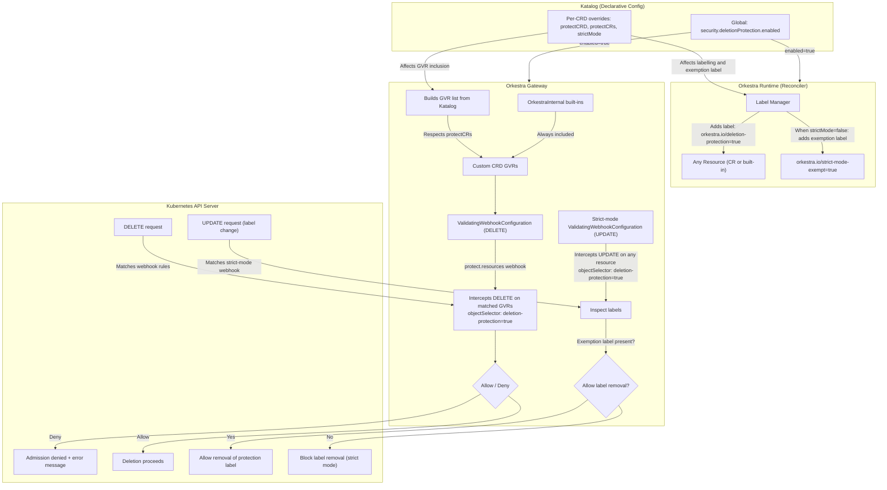

# Orkestra Deletion Protection – Architecture & Design

## Overview

Orkestra provides a **declarative, label‑based deletion protection** system that works for any resource – custom CRDs, built‑in Kubernetes resources, and Orkestra’s own control‑plane components.  

The system is built on three pillars:

1. **Automatic labelling** by the runtime reconciler (when global protection is enabled).  
2. **Admission webhook** (Gateway) that intercepts DELETE requests on all managed resource types and blocks them if the protection label is present.  
3. **Per‑CRD overrides** that allow fine‑grained control over which CRDs and instances are protected, including a label‑based exemption for strict mode.

---

## Architecture



---

## Component Responsibilities

### 1. Katalog (Declarative Configuration)
- **Global switch** `security.deletionProtection.enabled`:  
  - When `true`, the system is active.  
  - When `false`, no labels are added, no webhook is registered (if already present, it may be removed if `cleanupOnShutdown` is true).
- **Global strictMode**:  
  - When `true`, removing the protection label from a protected resource is blocked (treated as a deletion attempt).  
  - Per‑CRD `strictMode` overrides this.
- **Per‑CRD overrides** (inside `spec.crds.<name>.deletionProtection`):  
  - `protectCRD` (default `true`): Should the CRD definition itself be protected from deletion?  
  - `protectCRs` (default `true`): Should instances of this CRD be protected?  
  - `strictMode` (defaults to global `strictMode`): Per‑CRD strict mode.

### 2. Runtime (Reconciler)
- **Always** runs (even when Gateway is absent).  
- Reads the global flag and per‑CRD overrides.  
- For every resource it creates or updates, it adds:  
  - Protection label: `orkestra.io/deletion-protection: "true"` **if** `protectCRs == true` **and** global protection is enabled.  
  - `managed` label and annotations (ownership tracking).  
  - **Exemption label** `orkestra.io/strict-mode-exempt: "true"` **if** effective strict mode for the CRD is `false` (i.e., global strictMode enabled but per‑CRD `strictMode: false`).  
- **Never** removes the protection label – that is considered a change in desired state (see strict mode handling).

### 3. Gateway (Admission Webhook)
- **Only runs** when deployed in‑cluster (not in `ork run` mode).  
- Builds the list of GVRs to protect from two sources:  
  - **Custom CRDs**: includes a GVR only if `protectCRs == true` for that CRD.  
  - **Built‑in resources**: includes all resources marked `OrkestraInternal` (e.g., Deployments, Services, Namespaces, RBAC) – these are always protected by label, no per‑resource opt‑out.
- Registers two `ValidatingWebhookConfiguration` resources:  
  1. **`protect.crds.orkestra.workspace.io`** – intercepts DELETE on `customresourcedefinitions` (CRD type protection).  
  2. **`protect.resources.orkestra.workspace.io`** – intercepts DELETE on all GVRs from the built list, filtered by `objectSelector` that matches `orkestra.io/deletion-protection=true`. Denies deletion if the label is present.  
  3. **`strict-mode.orkestra.workspace.io`** – intercepts **UPDATE** operations on any resource that has the protection label (using the same `objectSelector`). Checks for the presence of the exemption label. If `orkestra.io/strict-mode-exempt: "true"` is present, the update is allowed; otherwise, any removal or change of the protection label is blocked.

### 4. Strict Mode
- **Global** or **per‑CRD** flag that controls whether **removing** the protection label is allowed.  
- Implementation uses a **second admission webhook** that watches UPDATE requests.  
- When effective strict mode is `true` for a resource:  
  - The exemption label is **not** added by the runtime.  
  - The strict‑mode webhook, which sees the protection label, will deny any update that removes or alters that label.  
- When effective strict mode is `false` for a resource:  
  - The runtime adds the exemption label `orkestra.io/strict-mode-exempt: "true"`.  
  - The strict‑mode webhook notices the exemption label and **allows** the update, thereby permitting removal of the protection label.  
- In standalone mode (no runtime), users can manually add or remove the exemption label to opt out of strict mode for individual resources.

---

## Behaviour Matrix (Global Protection Enabled)

| protectCRD | protectCRs | CRD Deletion | Instance Deletion (label present) | Instance Deletion (label removed) |
|------------|------------|--------------|-----------------------------------|-----------------------------------|
| true       | true       | blocked      | blocked                           | blocked if strictMode enabled     |
| true       | false      | blocked      | allowed                           | allowed                           |
| false      | true       | allowed      | blocked (until CRD is deleted)    | allowed (strict mode irrelevant)  |
| false      | false      | allowed      | allowed                           | allowed                           |

- **Note**: When `protectCRD=false` and `protectCRs=true`, a validation warning is issued because instance protection is ephemeral (garbage‑collected with the CRD). The webhook still blocks deletion of existing instances, but the warning alerts the administrator to the mismatch.

---

## Exemption Label Lifecycle

| Scenario | Protection label added? | Exemption label added? | Strict mode enforced? |
|----------|------------------------|------------------------|----------------------|
| Global strictMode = true, per‑CRD strictMode = true (or omitted) | Yes (if protectCRs) | No | Yes – label removal blocked |
| Global strictMode = true, per‑CRD strictMode = false | Yes (if protectCRs) | Yes | No – label removal allowed |
| Global strictMode = false | Yes (if protectCRs) | No (not needed) | No – label removal allowed regardless |

The exemption label is never added when strict mode is globally disabled. It is only added when strict mode is globally enabled but a specific CRD overrides it to `false`, so that the webhook can distinguish the override.

---

## User Experience

### Enabling Protection
```yaml
security:
  deletionProtection:
    enabled: true
    strictMode: true
    cleanupOnShutdown: true
```

### Per‑CRD Override for Strict Mode
```yaml
spec:
  crds:
    database:
      deletionProtection:
        protectCRD: true
        protectCRs: true
        strictMode: false   # instances of Database can be unprotected by removing the label
```

### Validation Output
```
$ ork validate
⚠ cache
    kind: Cache / group: security.orkestra.io / version: v1alpha1 / plural: caches
    protection: ⚠ CRs only (CRD not protected – see warning)
    warning: protectCRs=true is ineffective once the CRD is deleted.
             Consider setting protectCRD=true if you intend to protect instances permanently.

● database
    protection: 🛡️ full (CRD + CRs)
    strictMode: overridden to false (exemption label will be added)

● app
    protection: 🔓 CRD only (CRs not protected)
```

### Attempt to Remove Protection Label (Strict Mode Enforced)
```bash
$ kubectl label database my-database orkestra.io/deletion-protection-
Error from server: admission webhook "strict-mode.orkestra.workspace.io" denied the request:

[Orkestra Security] The Database "my-database" in namespace "default" carries the deletion-protection label.

Removing this label is blocked because strictMode is enabled.

To unprotect this resource:
- Set security.deletionProtection.strictMode: false in the Katalog (or per CRD)
- Redeploy Orkestra Gateway
- Retry the label removal
```

### Allowed Label Removal when Override Active
```bash
$ kubectl label database my-database orkestra.io/deletion-protection-
database.security.orkestra.io/my-database labeled
```

---

## Edge Cases & Guarantees

### 1. No Protection without Gateway

**Problem:**  
If the Orkestra Gateway is not deployed in the cluster (e.g., you only run `ork run` locally), the deletion‑protection webhook does not exist. Consequently, DELETE requests are never intercepted, and resources are deletable regardless of the `orkestra.io/deletion-protection=true` label. The runtime reconciler (running locally) still adds the label (harmless), but it provides no protection.

**Solution:**  
To enable deletion protection, the Gateway **must** be deployed inside the cluster with its webhook active. This is done by installing the [Orkestra Helm Chart](https://artifacthub.io/packages/helm/orkestra/orkestra) with `--set gateway.enabled=true`. Once the Gateway is running, the webhook is registered and will intercept DELETE requests. You may now run `ork run` locally for development or debugging – the reconciler will add labels, and the in‑cluster Gateway will enforce protection.

> **Note:** This is only a development convenience. In production, deploy both `runtime` and `gateway` with the [Orkestra Helm Chart](https://artifacthub.io/packages/helm/orkestra/orkestra).

### 2. Race Conditions

A resource may be created and labelled, then a DELETE arrives before the webhook is fully registered? The webhook is registered before the Gateway starts serving traffic (readiness probe). Standard Kubernetes admission ordering guarantees that once the webhook is ready, it intercepts all matching requests.

### 3. CRD Deletion Cleaning

If a CRD is deleted while its instances are protected, the instances become **inaccessible** via the Kubernetes API but remain in etcd indefinitely. Kubernetes does not automatically garbage‑collect orphaned custom resources. Orkestra does not attempt to clean them up because it can no longer watch the CRD. Administrators should delete all instances before deleting the CRD, or accept that orphaned data will persist.

### 4. Strict Mode Label Removal with Exemption

When global `strictMode` is enabled and a CRD has no override (or `strictMode: true`), the strict‑mode webhook blocks removal of the protection label. To allow removal for a specific CRD, set `strictMode: false` in its per‑CRD override. The runtime will then automatically add the exemption label `orkestra.io/strict-mode-exempt: "true"` to all instances, and the webhook will permit label removal. For standalone mode (no runtime), users can manually add the exemption label to any resource to bypass strict mode enforcement.

---

## Summary

The Orkestra deletion protection system is:

- **Declarative** – all configuration lives in the Katalog.  
- **Generic** – works for any custom or built‑in resource without per‑type code.  
- **Fine‑grained** – per‑CRD overrides for protection levels and strict mode.  
- **Label‑based exemption** – clean separation between global strict mode and per‑CRD opt‑out using a simple exemption label.  
- **Self‑documenting** – `ork validate` shows warnings and override status.  
- **Secure by default** – when enabled, everything is protected unless explicitly opted out.

This design gives cluster administrators a simple, powerful tool to prevent accidental deletion of critical resources, while preserving flexibility for non‑critical workloads.