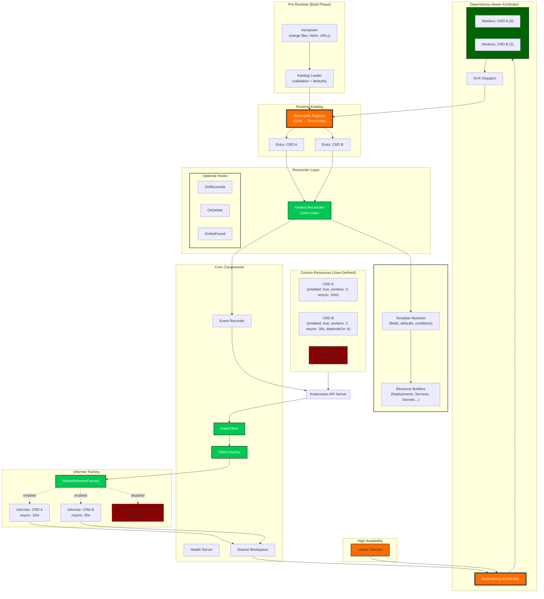

# Orkestra Full Architecture Overview

Orkestra is a **declarative operator runtime**.  
You describe *what* an operator should do in YAML (a **Katalog**), and Orkestra handles *how* to do it.

This document explains the full architecture of the Orkestra runtime: how CRDs are discovered, how workers are started, how reconcile events flow, and how Orkestra remains self‑healing and dependency‑aware.

---

## **1. High‑Level Overview**

Orkestra consists of four major subsystems:

1. **Pre‑Runtime (Komposer + Katalog Loader)**  
   Merges multiple Katalog sources and produces a validated runtime Katalog.

2. **Runtime Core**  
   Informers, workqueues, reconciler registry, template engine.

3. **Dependency‑Aware Kordinator**  
   Starts CRDs in topological order, handles activation/deactivation, manages worker pools.

4. **Reconciler Layer**  
   GenericReconciler + optional Go hooks + template engine.

The diagram below shows the full system:

---

---

## **2. Pre‑Runtime: Komposer + Katalog Loader**

Before Orkestra starts reconciling anything, it builds the **runtime Katalog**:

- Merge multiple files, Helm charts, URLs  
- Apply overrides  
- Validate schema  
- Apply defaults  
- Build dependency graph  
- Register CRDs and reconciler configs  

This produces a complete, normalized operator definition.

---

## **3. Informer Factory**

For each CRD:

- A SharedIndexInformer is created  
- If the CRD exists → informer starts  
- If missing → informer is created but not started  
- When the CRD appears → retry loop activates it  

Informers feed events into per-CRD workqueue.

---

## **4. Dependency‑Aware Kordinator**

The Kordinator:

- Computes startup order (topological sort)
- Waits for dependencies using ready channels
- Starts internal kontroller with worker pools per CRD
- Monitors CRD existence
- Deactivates CRDs when deleted
- Reactivates CRDs when they reappear
- Shuts down in reverse dependency order

This is the heart of Orkestra’s self‑healing model.

---

## 5. **Reconciler Registry**

Each CRD maps to a **Reconciler**:

- GenericReconciler (zero‑code)
- Optional Go hooks (OnReconcile, OnDelete, OnNotFound)
- Template Engine (Deployments, Services, Secrets, ConfigMaps, Jobs…)

The registry dispatches events to the correct reconciler based on GVK.

---

## 6. **Template Engine**

The template engine handles:

- Field resolution (`{{ .spec.image }}`)
- Conditional provisioning (`when:` blocks)
- Resource builders (Deployment, Service, Secret…)
- Drift correction (reconcile: true)
- Owner references
- Idempotency

This is where declarative operator logic becomes real Kubernetes objects.

---

Continue to the **Runtime Flow** to understand how Orkestra handles:

- workers
- informers
- reconciler

👉 [Runtime Flow →](./runtime-flow.md)

