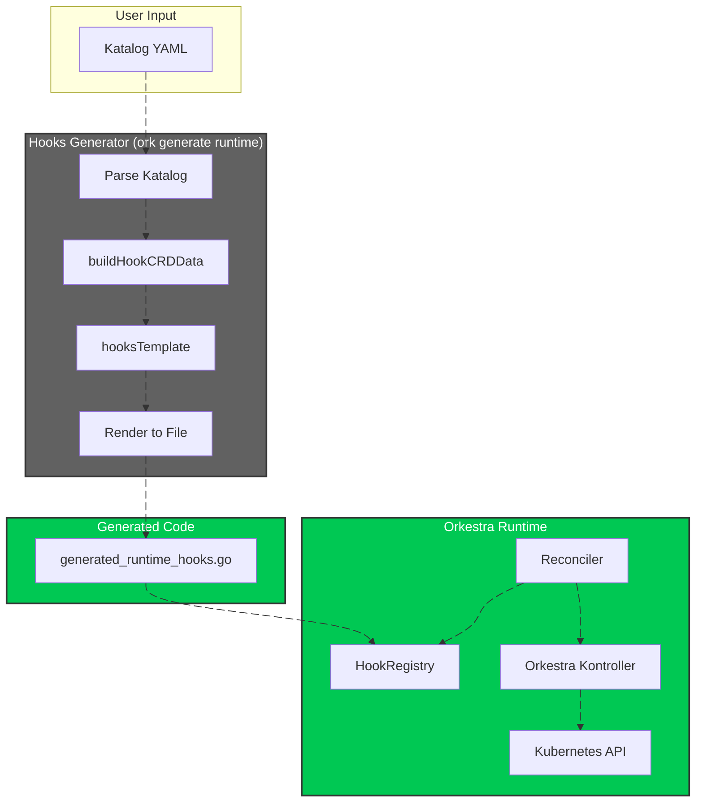
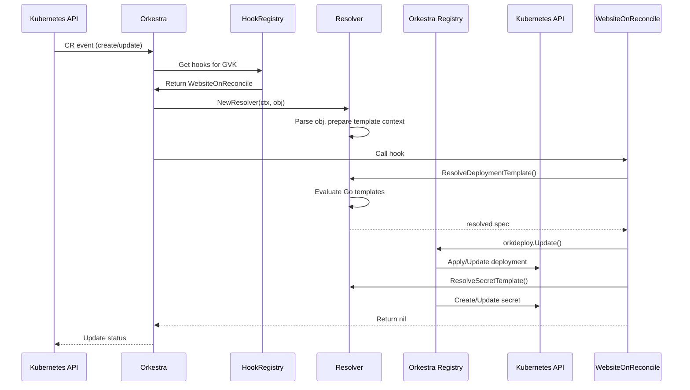

# **ORKESTRA HOOKS GENERATOR — COMPLETE TECHNICAL DOCUMENTATION**

### *From Declarative YAML to Runtime Reconciliation*
---

## **1. What Is the Hooks Generator?**

The Hooks Generator is a **code generation engine** that transforms declarative YAML templates into executable Go reconciliation hooks. It is the bridge between **what users want** (declarative templates) and **how Orkestra delivers it** (runtime reconciliation).

### **Core Responsibilities**

| Function | Description |
|----------|-------------|
| **Parse Katalog** | Reads CRD definitions with declarative templates |
| **Build Data Structures** | Converts YAML into typed Go structures |
| **Apply Generation Rules** | Auto‑creates `onReconcile` hooks from `reconcile: true` templates |
| **Render Templates** | Uses Go `text/template` to generate `generated_runtime_hooks.go` |
| **Register Hooks** | Ensures generated hooks are registered in the Orkestra HookRegistry |

### **The Mental Model**

```
┌─────────────┐     ┌──────────────┐     ┌─────────────────┐     ┌─────────────┐
│   Katalog   │────▶│    Parser    │────▶│  Go Templates   │────▶│   Runtime   │
│    YAML     │     │ buildHookCRD │     │  hooksTemplate  │     │    Hooks    │
└─────────────┘     └──────────────┘     └─────────────────┘     └─────────────┘
       ▲                    │                      │                     │
       │                    ▼                      ▼                     ▼
   User writes        Data becomes           Code is                Orkestra
   declarative        typed structs          generated               executes
   templates                                                         at runtime
```

---

## **2. System Architecture**



---

## **3. The Katalog: User Declarative Templates**

Users define their desired resources declaratively in the Katalog YAML.

### **Example Katalog Entry**

```yaml
crds:
  - name: website
    enabled: true
    group: demo.orkestra.io
    version: v1alpha1
    kind: Website
    plural: websites
    
    reconciler:
      mode: dynamic
      onCreate:
        deployments:
          - name: "{{ .metadata.name }}-web"
            image: "{{ .spec.image }}"
            replicas: "{{ .spec.replicas }}"
            port: "{{ .spec.port }}"
            reconcile: true
            
        services:
          - name: "{{ .metadata.name }}-svc"
            type: "{{ .spec.serviceType }}"
            port: "{{ .spec.port }}"
            reconcile: true
            
        secrets:
          - name: "{{ .metadata.name }}-db"
            fromSecret: "master-db-creds"
            fromNamespace: "platform"
            toNamespaces:
              - "{{ .metadata.namespace }}"
            reconcile: true
```

### **Key Concepts**

| Concept | Description |
|---------|-------------|
| **`onCreate`** | Templates applied when the CR is created |
| **`onReconcile`** | Templates applied on every reconcile (drift correction) |
| **`onDelete`** | Templates applied when the CR is deleted (cleanup) |
| **`reconcile: true`** | Auto‑generates an `onReconcile` entry from the `onCreate` template |
| **`{{ .spec.* }}`** | Go template syntax – resolves to values from the CR spec |

---

## **4. Parsing: `buildHookCRDData()` Deep Dive**

The `buildHookCRDData()` function is the **heart of the generator**. It transforms YAML templates into typed Go structures.

### **Processing Flow**

```go
func buildHookCRDData(crd orktypes.CRDEntry) (hookCRDData, error) {
    // 1. Validate CRD has templates and is in dynamic mode
    if !crd.IsDynamic() {
        return error("declarative templates require reconciler.mode: dynamic")
    }

    // 2. Process onCreate templates
    if rc.OnCreate != nil {
        // Deployments
        deps, err := buildDeploymentData(rc.OnCreate.Deployments)
        data.OnCreateDeployments = deps
        
        // Auto-generate onReconcile from reconcile:true templates
        if rc.OnReconcile == nil {
            for _, src := range rc.OnCreate.Deployments {
                if src.Reconcile {
                    reconcileDeps, _ := buildDeploymentData([]orktypes.DeploymentTemplateSource{src})
                    data.OnReconcileDeployments = append(data.OnReconcileDeployments, reconcileDeps...)
                }
            }
        }
        
        // Same pattern for Services, Secrets, ConfigMaps...
    }

    // 3. Process explicit onReconcile templates (override auto-generated)
    if rc.OnReconcile != nil {
        deps, _ := buildDeploymentData(rc.OnReconcile.Deployments)
        data.OnReconcileDeployments = deps
        // ... etc
    }

    // 4. Process onDelete templates
    if rc.OnDelete != nil {
        jobs, _ := buildJobData(rc.OnDelete.Jobs)
        data.OnDeleteJobs = jobs
        data.HasOnDelete = len(jobs) > 0
    }

    return data, nil
}
```

### **Auto‑Generation Rule**

The generator follows a **smart default** pattern:

| If... | Then... |
|-------|---------|
| `onCreate` has `reconcile: true` | Auto‑generate `onReconcile` hook |
| `onReconcile` is explicitly defined | Use explicit (overrides auto) |
| No `reconcile: true` and no `onReconcile` | No reconciliation for that resource type |

This gives users **progressive disclosure** – start simple, add complexity only when needed.

---

## **5. Template Data Structures**

The generator builds these internal structures to represent templates:

### **Core Types**

```go
type hookCRDData struct {
    Name        string
    FuncSuffix  string          // e.g., "Website" → "Website"
    Group       string
    Version     string
    Kind        string
    HasOnDelete bool

    // Resource collections
    OnCreateDeployments    []deploymentTemplateData
    OnReconcileDeployments []deploymentTemplateData
    OnCreateServices       []serviceTemplateData
    OnReconcileServices    []serviceTemplateData
    OnDeleteJobs           []jobTemplateData
    OnCreateSecrets        []secretTemplateData
    OnReconcileSecrets     []secretTemplateData
    OnCreateConfigMaps     []configMapTemplateData
    OnReconcileConfigMaps  []configMapTemplateData
}
```

### **Resource‑Specific Types**

```go
type deploymentTemplateData struct {
    Index          int
    Name           string   // `"{{ .metadata.name }}-web"`
    Image          string   // `"{{ .spec.image }}"`
    Replicas       string   // `"{{ .spec.replicas }}"`
    Port           string   // `"{{ .spec.port }}"`
    Namespace      string   // `"{{ .metadata.namespace }}"`
    StaticReplicas string   // `"1"` (fallback)
    Labels         []labelGoData
    Annotations    []labelGoData
}

type secretTemplateData struct {
    Index         int
    Name          string
    Namespace     string
    ToNamespaces  []string
    FromSecret    string
    FromNamespace string
    Data          map[string]string
    Type          string
}
```

---

## **6. The Generation Engine**

### **Template Execution**

```go
var hooksTemplate = template.Must(template.New("hooks").Parse(`...`))

func Hooks(katalogPath string, dryRun bool) error {
    // 1. Load and parse Katalog
    data, _ := utils.LoadFile(katalogPath)
    kat, _ := parseKatalog(data)
    
    // 2. Build template data structures
    tmplData := hooksTemplateData{
        Timestamp:        time.Now().UTC().Format(time.RFC3339),
        NeedsDeployments: needsDeployments,
        NeedsServices:    needsServices,
        NeedsSecrets:     needsSecrets,
        NeedsConfigmaps:  needsConfigMaps,
        HookCRDs:         hookCRDs,
    }
    
    // 3. Render to file
    outPath := filepath.Join(RuntimePackage, HooksFile)
    return renderTemplateToFile(hooksTemplate, tmplData, outPath, true, dryRun)
}
```

### **Conditional Imports**

The template intelligently includes only needed imports:

```go
{{ if .NeedsDeployments }} orkdeploy "github.com/ialexeze/orkestra/pkg/orkestra-registry/deployments"
{{ end }}{{ if .NeedsSecrets }} orksecrets "github.com/ialexeze/orkestra/pkg/orkestra-registry/secrets"
{{ end }}
```

This keeps the generated code **lean and dependency‑free**.

---

## **7. Generated Runtime Hooks**

The generator produces a file (`generated_runtime_hooks.go`) that looks like this:

### **Registration Block**

```go
func init() {
    registerTemplateHooksWebsite()
}

func registerTemplateHooksWebsite() {
    orktypes.HookRegistry[schema.GroupVersionKind{
        Group:   "demo.orkestra.io",
        Version: "v1alpha1",
        Kind:    "Website",
    }] = func() domain.AnyReconcileHooks {
        return domain.ReconcileHooks[domain.Object]{
            OnReconcile: WebsiteOnReconcile,
            OnDelete:    WebsiteOnDelete,
        }
    }
}
```

### **Reconciliation Hook**

```go
func WebsiteOnReconcile(ctx context.Context, obj domain.Object) error {
    kube, _ := kubeclient.FromContext(ctx)
    resolver, _ := orktmpl.NewResolver(ctx, obj)

    // Deployment (from onCreate with reconcile:true)
    {
        resolved, _ := resolver.ResolveDeploymentTemplate(orktypes.DeploymentTemplateSource{
            Name:      "{{ .metadata.name }}-web",
            Image:     "{{ .spec.image }}",
            Replicas:  "{{ .spec.replicas }}",
            Port:      "{{ .spec.port }}",
            Namespace: "{{ .metadata.namespace }}",
        })
        spec := orkdeploy.Resolve(resolved, 1, resolver.OwnerName())
        orkdeploy.Update(ctx, kube, obj, spec)
    }

    // Secret (from onCreate with reconcile:true)
    {
        resolved, _ := resolver.ResolveSecretTemplate(orktypes.SecretTemplateSource{
            Name:          "{{ .metadata.name }}-db",
            FromSecret:    "master-db-creds",
            FromNamespace: "platform",
            ToNamespaces:  []string{"{{ .metadata.namespace }}"},
        })
        orksecrets.Update(ctx, kube, obj, resolved)
    }

    return nil
}
```

### **Deletion Hook**

```go
func WebsiteOnDelete(ctx context.Context, obj domain.Object) error {
    kube, _ := kubeclient.FromContext(ctx)
    resolver, _ := orktmpl.NewResolver(ctx, obj)

    // Cleanup job (from onDelete)
    resolved, _ := resolver.ResolveJobTemplate(orktypes.JobTemplateSource{
        Name:      "cleanup-{{ .metadata.name }}",
        Image:     "busybox",
        Namespace: "{{ .metadata.namespace }}",
        Command:   []string{"rm", "-rf", "/data"},
    })
    spec := orkjobs.Resolve(resolved, 3, resolver.OwnerName())
    orkjobs.Create(ctx, kube, obj, spec)

    return nil
}
```

---

## **8. Reconciliation Flow at Runtime**

When a CR is reconciled, this is the execution path:



---

## **9. Secret & ConfigMap Management**

### **Secret Copy Pattern**

```yaml
secrets:
  - name: "{{ .metadata.name }}-db"
    fromSecret: "master-db-creds"
    fromNamespace: "platform"
    toNamespaces:
      - "{{ .metadata.namespace }}"
      - "{{ .metadata.namespace }}-staging"
    reconcile: true
```

**What happens at runtime:**

1. **Resolver** evaluates `{{ .metadata.namespace }}` → `"my-app"`
2. **Registry** copies secret from `platform/master-db-creds`
3. **Creates** copies in:
   - `my-app/db-creds`
   - `my-app-staging/db-creds`
4. **Drift correction** – if source changes, all copies are updated

### **ConfigMap Merge Pattern**

```yaml
configMaps:
  - name: "{{ .metadata.name }}-config"
    fromConfigMap: "base-app-config"
    fromNamespace: "platform"
    data:
      LOG_LEVEL: "{{ .spec.logLevel }}"
      CACHE_SIZE: "{{ .spec.cacheSize }}"
```

**Merge rules:**
- Source ConfigMap provides base data
- Overrides in `data` field take precedence
- Result is applied to target namespace(s)

---

## **10. OnDelete Behavior**

### **With Explicit Templates**

```yaml
onDelete:
  jobs:
    - name: cleanup-{{ .metadata.name }}
      image: busybox
      command: ["rm", "-rf", "/data"]
```

Generated code:
```go
func WebsiteOnDelete(ctx context.Context, obj domain.Object) error {
    resolved := resolver.ResolveJobTemplate(...)
    orkjobs.Create(ctx, kube, obj, resolved)
    return nil
}
```

### **Without Explicit Templates**

```go
func WebsiteOnDelete(ctx context.Context, obj domain.Object) error {
    // No explicit onDelete templates — owner references handle cleanup automatically.
    return nil
}
```

**Why this works:** Kubernetes garbage collection + owner references ensure all child resources are deleted when the parent CR is deleted.

---

## **11. The Orkestra Registry**

The generated hooks don't create resources directly – they delegate to the **Orkestra Registry**:

### **Supported Registry Components**

The following registry components are currently supported:


| Package | Responsibility |
|---------|---------------|
| `orkdeploy` | Deployment lifecycle (create/update/delete) |
| `orksvc` | Service lifecycle |
| `orksecrets` | Secret copy, sync, and management |
| `orkcm` | ConfigMap merge and distribution |
| `orkjobs` | Job creation for cleanup tasks |

### **Registry Pattern**

```go
// All registry functions follow this pattern:
func Create(ctx context.Context, kube *kubeclient.Kubeclient, owner runtime.Object, spec interface{}) error
func Update(ctx context.Context, kube *kubeclient.Kubeclient, owner runtime.Object, spec interface{}) error
```

**Benefits:**
- ✅ Idempotent operations
- ✅ Owner reference management
- ✅ Drift detection and correction
- ✅ Multi‑namespace distribution
- ✅ Source synchronization (for secrets/configmaps)

---

## **12. Developer Guide**

### **Adding a New Resource Type**

1. **Add to `orktypes`** – Define template source struct
2. **Update `buildHookCRDData`** – Parse the new resource
3. **Add to `hooksTemplate`** – Generate hook code
4. **Update Orkestra Registry** – Implement create/update logic

### **Testing Generated Hooks**

```bash
# Generate hooks in dry-run mode
ork generate runtime --katalog my-katalog.yaml --dry-run

# View generated code without writing to disk
cat pkg/runtime/generated_runtime_hooks.go.dry
```

### **Debug Tips**

```go
// Add temporary logging to generated hooks
fmt.Printf("Reconciling %s with spec: %+v\n", obj.GetName(), obj)

// Check registry operations
DEBU orkdeploy.Update: deployment my-app-web exists, checking drift
DEBU orkdeploy.Update: image changed, updating
```

---

## **13. Troubleshooting**

### **Common Issues**

| Symptom | Likely Cause | Fix |
|---------|--------------|-----|
| **Hooks not running** | CRD not in `dynamic` mode | Set `reconciler.mode: dynamic` |
| **Templates not resolving** | Invalid Go template syntax | Check `{{ .spec.field }}` matches CRD |
| **Resources not updating** | Missing `reconcile: true` | Add `reconcile: true` to template |
| **Secrets not copying** | Source secret missing | Verify `fromSecret` exists |
| **ConfigMap merge failing** | Type mismatch in overrides | Ensure override values are strings |

### **Validation Checklist**

```bash
# 1. Validate Katalog syntax
ork validate katalog my-katalog.yaml

# 2. Check CRD exists
kubectl get crd websites.demo.orkestra.io

# 3. View generated hooks
cat pkg/runtime/generated_runtime_hooks.go

# 4. Check logs
kubectl logs -l app=orkestra | grep -i website
```

---

## **14. Summary**

The Hooks Generator is a **compiler from declarative intent to executable runtime code**:

| Stage | What Happens |
|-------|-------------|
| **User writes** | YAML templates in Katalog |
| **Generator parses** | Converts to typed Go structures |
| **Generator applies rules** | Auto‑creates `onReconcile` from `reconcile: true` |
| **Generator renders** | Produces `generated_runtime_hooks.go` |
| **Runtime loads** | Hooks registered in `HookRegistry` |
| **Reconciliation triggers** | Hooks executed per CR event |
| **Registry executes** | Creates/updates Kubernetes resources |

This architecture gives users:
- ✅ **Declarative** – Define what you want, not how
- ✅ **Idempotent** – Safe to run repeatedly
- ✅ **Self‑healing** – Drift correction built‑in
- ✅ **Extensible** – Add new resource types easily
- ✅ **Observable** – Full visibility into operations

**The generator transforms Orkestra from a controller into a platform.**
