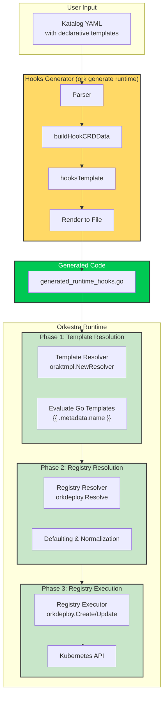
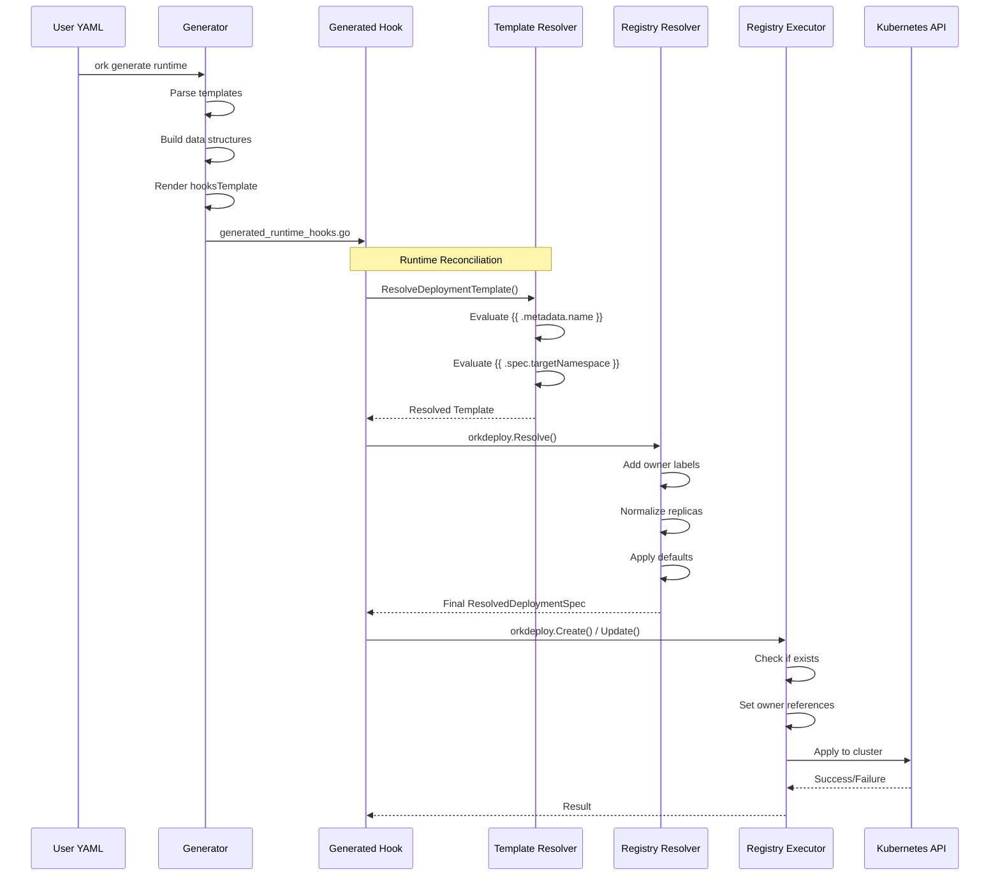
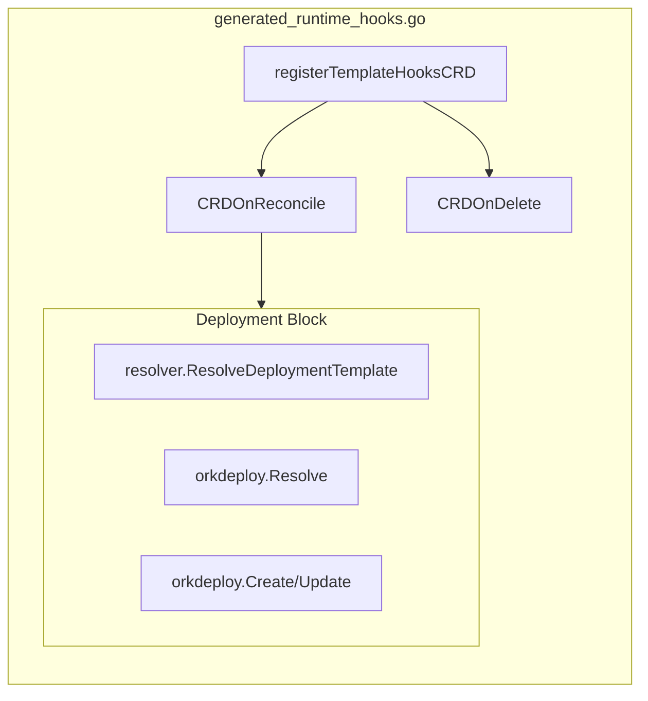
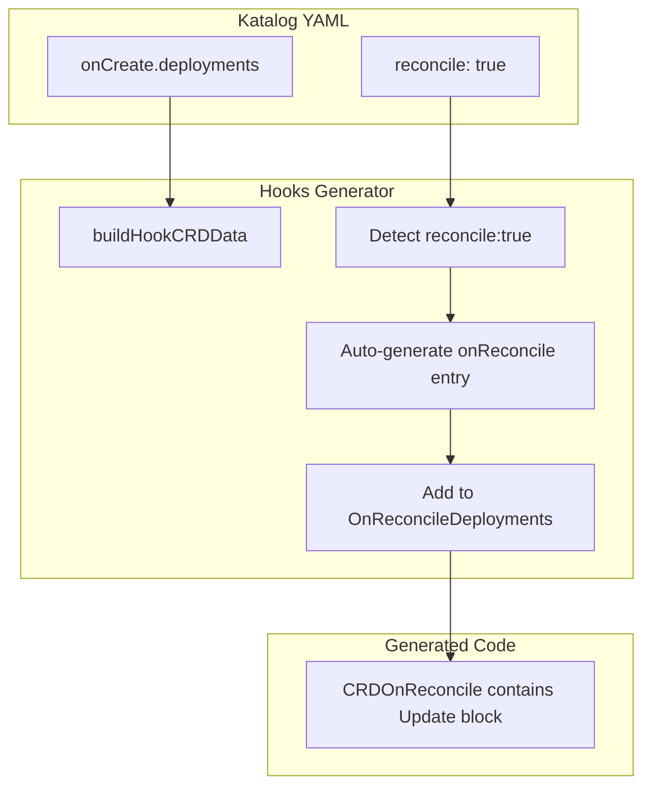
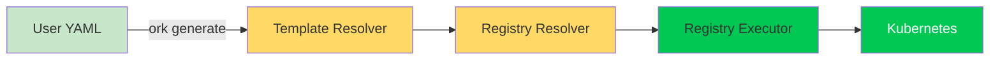

# 📘 **Orkestra Hooks Templating Engine — Technical Documentation**

The Hooks Templating Engine is the subsystem that converts **declarative Katalog templates** into **runtime Go code** that the Orkestra kontroller executes during reconciliation.

It is a *compiler*:

```
Katalog YAML → Template Engine → generated_runtime_hooks.go → Kontroller Runtime
```

The generated hooks are responsible for creating, updating, and deleting Kubernetes resources in a safe, idempotent, declarative way.

Below is a full explanation using **Deployments** as the example.

---

## 🏗️ **1. Architecture Overview**



---

## 🧩 **2. What the Hooks Engine Does**

When a user writes a Katalog like:

```yaml
onCreate:
  deployments:
    - name: "{{ .metadata.name }}-api"
      image: "my-api:latest"
      replicas: "3"
      port: "8080"
      namespace: "{{ .spec.targetNamespace }}"
      labels:
        - key: app
          value: "{{ .metadata.name }}"
      reconcile: true
```

The Hooks Engine:

1. **Parses** the Katalog into Go structs  
2. **Builds template data** (`deploymentTemplateData`)  
3. **Feeds it into a Go text/template**  
4. **Generates Go code** that will run at reconcile time  
5. **Uses the Orkestra Registry** to apply the Deployment safely

The generated code ends up looking like:

```go
resolved, err := resolver.ResolveDeploymentTemplate(...)
spec := orkdeploy.Resolve(resolved, staticReplicas, resolver.OwnerName())
orkdeploy.Create(ctx, kube, obj, spec)
```

This is the core pattern.

---

## 🧬 **3. The Three‑Phase Resolution Pipeline**



---

### **Step 1 — Template Resolution**
The engine calls:

```go
resolver.ResolveDeploymentTemplate(orktypes.DeploymentTemplateSource{...})
```

This evaluates all Go template expressions:

- `{{ .metadata.name }}`
- `{{ .spec.targetNamespace }}`
- `{{ .spec.replicas }}`
- etc.

After this step, all fields are **fully resolved strings**.

But this is still a *template*, not a Kubernetes spec.

---

### **Step 2 — Registry Resolution**
Next:

```go
spec := orkdeploy.Resolve(resolved, staticReplicas, ownerName)
```

This converts the template into a **ResolvedDeploymentSpec**, which includes:

- defaulting  
- owner labels  
- replica normalization  
- resource merging  
- label merging  
- namespace resolution  

This is the *final* spec that the registry understands.

---

### **Step 3 — Registry Execution**
Finally:

```go
orkdeploy.Create(ctx, kube, obj, spec)
```

The registry:

- checks if the Deployment exists  
- creates it if missing  
- sets owner references  
- ensures idempotency  
- logs actions  

If the user marked `reconcile: true`, the engine also generates:

```go
orkdeploy.Update(...)
```

for drift correction.

---

## 🧠 **4. Why the Engine Uses a Two‑Phase Resolve Pattern**

This is intentional and powerful.

### **Phase 1 — Template Resolver**
- Evaluates Go templates  
- Handles user expressions  
- Produces a normalized template struct  

### **Phase 2 — Registry Resolver**
- Applies Orkestra defaults  
- Adds owner labels  
- Normalizes replicas  
- Validates required fields  
- Produces a final spec  

### **Phase 3 — Registry Executor**
- Applies to Kubernetes  
- Ensures idempotency  
- Handles drift correction  
- Handles multi‑namespace copies  
- Handles FromConfigMap / FromSecret sync  

This separation keeps the system:

- predictable  
- testable  
- safe  
- extensible  

---

## 🧱 **5. Generated Code Structure (Deployment Example)**



Inside the generated file:

```go
func <CRD>OnReconcile(ctx, obj) error {
    resolved, err := resolver.ResolveDeploymentTemplate(...)
    staticReplicas, _ := strconv.Atoi("3")
    spec := orkdeploy.Resolve(resolved, staticReplicas, resolver.OwnerName())
    orkdeploy.Create(ctx, kube, obj, spec)
}
```

The Hooks Engine always generates:

- **OnReconcile**  
- **OnDelete** (if jobs defined)  
- **Auto‑generated reconcile blocks** for templates with `reconcile: true`

---

## 🔄 **6. Auto‑Generation Flow for `reconcile: true`**



---

## ⚠️ **7. Common Errors & How to Fix Them**

### **❌ 1. strconv imported but unused**
Happens when:

- Deployments are not present  
- But the template still imports `"strconv"`

**Fix:**  
Only import strconv when `.NeedsDeployments` is true.

---

### **❌ 2. Wrong type passed to registry**
Example error:

```
cannot use resolved (type DeploymentTemplateSource)
as ResolvedDeploymentSpec
```

**Cause:**  
Using:

```go
orkdeploy.Create(ctx, kube, obj, resolved)
```

instead of:

```go
spec := orkdeploy.Resolve(resolved, ...)
orkdeploy.Create(ctx, kube, obj, spec)
```

**Fix:**  
Always call the registry's `Resolve()` before `Create()` or `Update()`.

---

### **❌ 3. Template blocks generated outside functions**
Error:

```
expected declaration, found '{'
```

**Cause:**  
Template blocks placed after:

```go
return nil
}
```

**Fix:**  
Ensure all resource blocks are inside the `OnReconcile` function.

---

### **❌ 4. Missing namespace resolution**
If the user omits `namespace`, the registry resolves it using:

- CR namespace  
- or `"default"`

But if the template engine passes an empty string incorrectly, the registry may misbehave.

**Fix:**  
Ensure `Namespace: goLit(src.Namespace)` is always included.

---

### **❌ 5. Template expressions not validated**
Example:

```
{{ .spec.enviroment }}
```

Typo → silent failure → broken generated code.

**Fix:**  
Add template expression validation during katalog validation.

---

## 🎯 **8. Summary**

The Hooks Templating Engine is a **compiler** that turns declarative Katalog YAML into executable Go code.  
Using Deployments as the example, the pipeline is:



This architecture gives Orkestra:

- ✅ safe idempotent reconciliation  
- ✅ declarative multi‑resource orchestration  
- ✅ template‑driven dynamic behavior  
- ✅ consistent behavior across all resource types  
- ✅ separation of concerns (templates vs. logic)  
- ✅ testability at each phase