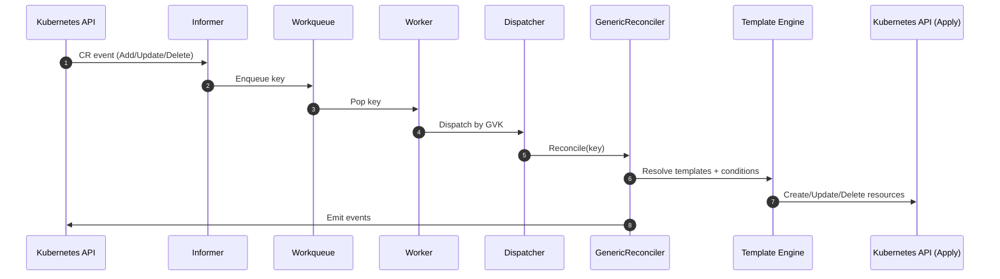

A deep dive into how events move through Orkestra — from Kubernetes → Informers → Workers → Reconciler → Template Engine → Kubernetes.

This document complements the [Architecture Overview](./architecture-overview.md) by showing the **runtime execution path** in detail.

---

## 1. **End‑to‑End Runtime Flow**



---

## 2. **Informer → Workqueue**

Every CRD has:

- its own informer  
- its own queue  
- its own worker pool  

Informers watch the API server and enqueue keys on:

- Add  
- Update  
- Delete  

Orkestra uses **SharedIndexInformers**, so all workers share a warm cache.

---

## 3. **Worker Execution**

Workers pop keys from the queue and call:

```
safeReconcile(key)
```

This wrapper:

- catches panics  
- handles retries  
- prevents worker crashes  
- ensures at‑least‑once semantics  

---

## **4. Dispatch by GVK**

The KontrollerRegistry maps:

```
GVK → Reconciler
```

This allows Orkestra to support:

- dynamic CRDs  
- typed CRDs  
- custom reconcilers  
- hooks  
- zero‑code templates  

All through the same dispatch layer.

---

## **5. GenericReconciler**

The GenericReconciler handles:

- finalizers  
- managed labels  
- managed annotations  
- deletion  
- reconcile implementation  

Priority:

1. Go hooks  
2. Declarative templates  
3. No‑op  

---

## **6. Template Engine**

The template engine performs:

- field resolution (`{{ .spec.image }}`)
- conditional provisioning (`when:` blocks)
- resource building (Deployments, Services, Secrets…)
- drift correction (reconcile: true)
- owner references
- idempotency

This is where declarative operator logic becomes real Kubernetes objects.

---

## **7. Status + Events**

Every reconcile emits:

- Kubernetes events  
- Prometheus metrics  
- CRD health updates  

---

## **What’s Next?**

Continue to the **CRD Lifecycle** to understand how Orkestra handles:

- missing CRDs  
- deleted CRDs  
- reappearing CRDs  
- dependency‑aware activation  

👉 [CRD Lifecycle →](./crd-lifecycle.md)