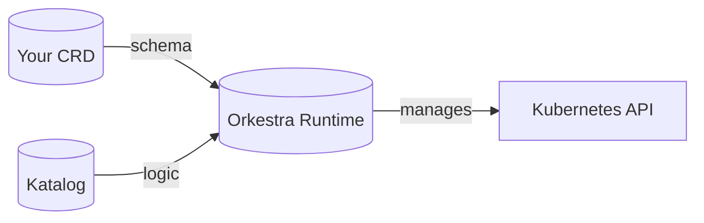

This section explains the core ideas that define how Orkestra works. Each concept builds on the others, forming a coherent model for building declarative operators.

---

## The Big Picture

Orkestra turns CRDs into operators. You write a **Katalog** — a YAML file that declares what you want. Orkestra handles the rest: create, reconcile, drift‑correct, delete.

The concepts below describe each piece of this model in detail.

---

## Core Concepts

### [Katalog](./katalog.md)

The Katalog is the single source of truth for your operator. It declares the CRDs you want to manage and the resources they should create. A Katalog is a YAML file that Orkestra interprets at runtime — no compilation, no code generation.

- Declare CRDs with `apiTypes`
- Define templates for resources (Deployments, Services, Secrets, etc.)
- Configure per‑CRD workers, resync intervals, and queue depth

### [Komposer](./komposer.md)

A Komposer composes multiple Katalogs into one runtime. Where a Katalog declares CRDs, a Komposer declares where to find them — from files, Helm charts, remote URLs, or OCI registries.

- Load Katalogs from multiple sources
- Override fields for different environments
- Merge sources and resolve conflicts

### [Templating](./templating.md)

Templates are the bridge between your CR spec and the resources Orkestra creates. Values like `{{ .spec.image }}` are resolved at reconcile time against the live CR object.

- Go `text/template` syntax
- Access any field in the CR (`.metadata`, `.spec`, `.status`)
- Conditional provisioning with `when` blocks

### [Dependency Model](./dependency-model.md)

CRDs can declare dependencies using `dependsOn`. Orkestra starts CRDs in topological order and shuts them down in reverse order.

- Declarative dependencies
- Missing CRDs are retried in the background
- Dependents block until dependencies are ready

---

## Reconciliation & Runtime

### [Reconciler Model](./reconciler-model.md)

The reconciliation flow is the heart of Orkestra. This document walks through every step — from event enqueueing to final metrics emission.

- Context enrichment
- Finalizer and label management
- Condition evaluation
- Template resolution
- Resource creation and drift correction

### [Runtime](./runtime.md)

Orkestra runs as a single process that manages all your CRDs. Each CRD gets its own informer, workqueue, and worker pool — isolated but sharing a single control plane.

- Per‑CRD isolation
- Leader election for high availability
- Graceful shutdown

### [Health Subsystem](./health-subsystem.md)

Every CRD automatically exposes health endpoints. Orkestra tracks reconcile success, errors, and degradation.

- `/katalog/{crd}/health`
- Degradation thresholds
- Consecutive failure tracking

### [Observability](./observability.md)

Orkestra emits Prometheus metrics for every CRD and the conversion webhook. No custom instrumentation required.

- Reconcile counts and latency
- Queue depth
- Worker utilization
- Conversion metrics

---

## Advanced Features

### [Versioning](./versioning.md)

Orkestra supports multiple API versions for the same CRD. You declare conversion rules in the Katalog — no Go code, no separate webhook.

- Declarative conversion rules
- Built‑in conversion webhook
- `ork get --version` shows the original version

### [Conditional Provisioning](./conditional-provisioning.md)

Create resources only when certain conditions are met. Use `when` blocks to control resource creation based on CR spec fields.

- Conditions evaluate at reconcile time
- Supports `equals`, `notequals`, `exists`, `notexists`
- Combine multiple conditions

### [Hooks](./hooks.md)

Hooks are Go functions that run before or after reconciliation. They give you a way to add custom logic without writing a full reconciler.

- `OnReconcile`, `OnDelete`, `OnNotFound`
- Access to the Kubernetes client and template resolver
- Optional — implement only what you need

### [Constructors](./constructors.md)

For advanced use cases, you can write custom reconcilers in Go. Constructors give you full control over reconciliation when declarative templates aren't enough.

- Register custom reconcilers
- Access to Kubernetes client
- Full control over reconcile logic

### [Typed CRDs](./typed-crds.md)

While Orkestra works with any CRD dynamically, you can also use compiled Go types for type safety. Typed CRDs require a generation step but offer stronger guarantees.

- Generate code with `controller-gen`
- Reference `apiTypes.location` in the Katalog
- Use Go hooks and custom constructors

---

## The Orkestra Registry

### [Registry](./registry.md)

The Orkestra Registry is a library of reusable operator patterns. Patterns are published as OCI artifacts and can be imported directly into your Komposer.

- Discover patterns via Artifact Hub
- Import with `sources.oci`
- Override fields inline
- Versioned with declarative conversion

### [Registry Sources](./registry-sources/index.md)

Patterns can be consumed from various sources:

- Local files
- Remote URLs
- Helm charts
- OCI registries
- Environment variables with authentication

---

## Architecture & Components

### [Komponent](./komponent.md)

Orkestra is composed of discrete komponents — each with a single responsibility, a defined startup order, and a clean shutdown path.

- HealthServer
- Kubeclient
- EventRecorder
- QueueRegistry
- SharedInformerFactory
- DependencyKontroller
- KonductorElection

### [CRD Runtime Health](./crd-runtime-health.md)

How Orkestra tracks the health of each CRD reconciler at runtime. Understand the difference between `started`, `healthy`, and `degraded` states.

- Reconcile counters
- Error rates
- Consecutive failures

### [Conditional Webhooks](./conditional-webhooks.md)

Advanced pattern for conditionally creating validation or mutation webhooks based on CR spec fields.

---

## Where to Start

If you are new to Orkestra, begin with:

1. **[Katalog](./katalog.md)** — the foundation
2. **[Komposer](./komposer.md)** — composition
3. **[Templating](./templating.md)** — how templates work
4. **[Reconciler Model](./reconciler-model.md)** — what happens during reconciliation

For a hands‑on introduction, see the [Getting Started guide](../../getting-started/index.md).

---

**Each concept document builds on the others, but they can be read independently. Use the navigation sidebar to explore.** 🎼